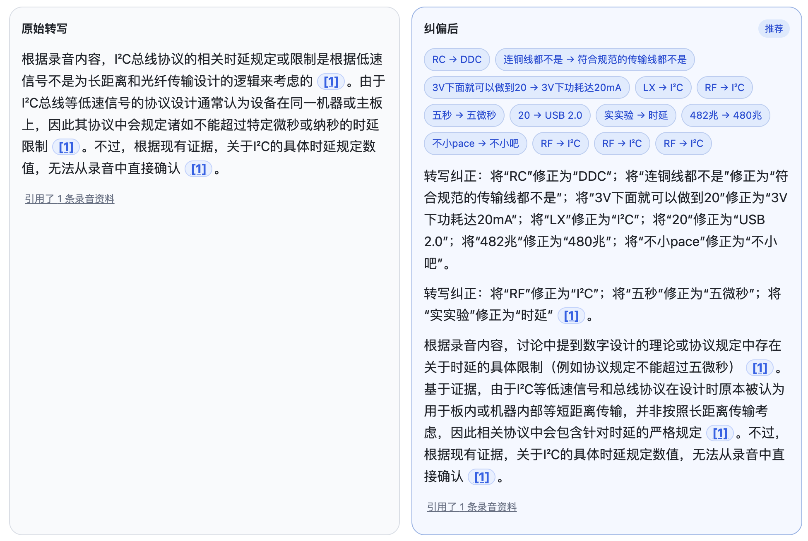
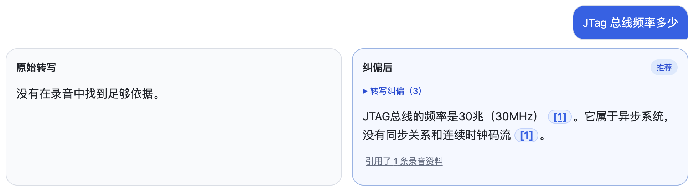
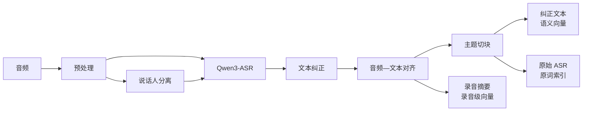
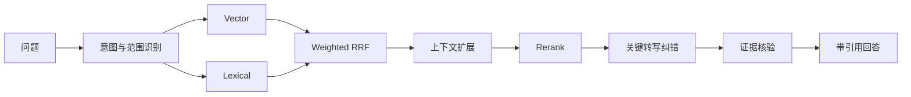
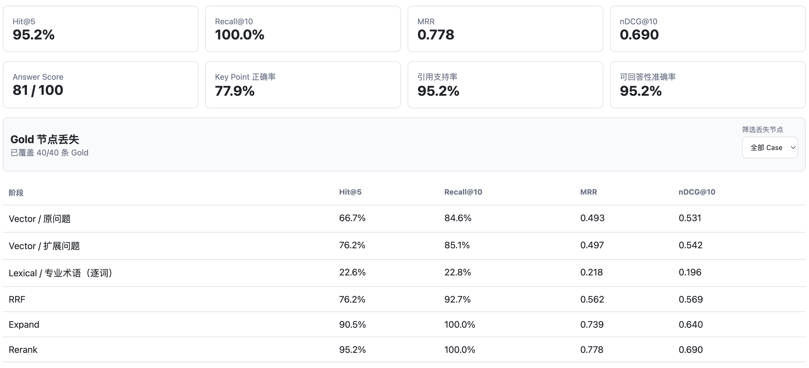
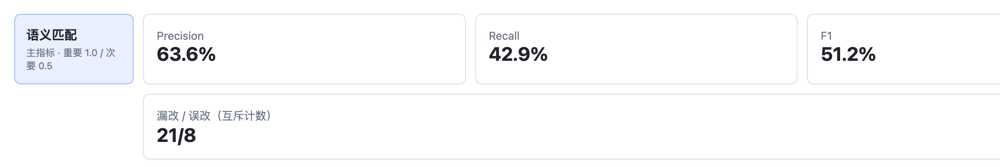
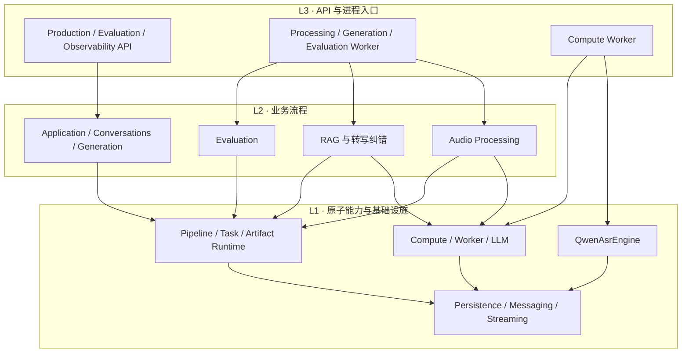

# AIRecordSummary

## 项目简介

AIRecordSummary 是一个面向历史录音的知识检索应用，让录音内容可以搜索、可以提问，也可以从回答回到原音核对。

录音上传后会经过说话人分离、Qwen3-ASR 转写、文本纠正和时间对齐，再生成专门面向 RAG 的检索片段。用户用自然语言提问时，系统通过混合检索找到相关录音，生成带有录音来源和时间点的回答。

针对录音中常见的专业术语、数字和单位识别错误，系统还会在回答前检查已经召回的录音片段，必要时恢复并核验关键表达，同时保留原始转写供用户对照。

## Demo

### 回答前录音转写纠错

下面的例子中，录音里的 `I²C` 被识别成了 `RF`，`5 微秒` 被识别成了 `五秒`。点击图片可以观看 23 秒演示。

[](./pics/rag-asr-correct.mp4)

答案中的引用可以跳回录音时间点，查看原始转写：


另一个例子中，系统从原本不足以回答的录音片段中恢复并核验了 `JTAG 30 MHz`：



纠错只影响本次回答，不会覆盖数据库中的原始转写或检索文本。模型能够提出候选和研究方向，但搜索次数、循环次数和自动采用门槛由代码控制。

## 核心实现

### 为 RAG 准备录音



这里的 Audio Processing 不只是生成一篇 Transcript，而是直接为后面的检索服务：

- 根据说话人时间段准备 ASR 语音窗口，并将文本重新对齐到音频，保证引用能够跳回准确时间点。
- 按主题切分连续对话，并为片段补充原文能够支持的标准术语和简短上下文，减少口语省略、指代对检索的影响。
- 纠正后的文本用于语义向量，原始 ASR 文本单独用于原词检索，避免文本润色抹掉用户可能直接搜索的表达。
- 除片段索引外，还为录音摘要建立向量，使 RAG 可以先定位相关录音，再召回录音内部的具体证据。

### 从检索到回答



事实查询、录音元数据查询和范围总结分别走不同的 LangGraph 路径。事实查询使用向量、原词和录音级召回，经 Weighted RRF 融合后补齐相邻上下文，再用 Cross-encoder 重排。

对于涉及半导体技术表达的问题，系统会检查重排后的少量证据，结合录音上下文和受限外部检索恢复可疑表达。原始证据和纠错证据会分别经过充分性判断；如果录音不足以支持答案，系统直接拒答。

每条引用都保留录音、时间范围和说话人信息，可以从答案直接回到对应的原音片段。

## 评测

RAG 评测复用生产使用的同一条检索链路，并保存 Vector、Lexical、RRF、上下文扩展和 Rerank 各阶段的排名。当前项目评测快照中，最终阶段达到 **Hit@5 95.0%、Recall@10 85.0%、MRR 0.772、nDCG@10 0.705**。



回答前转写纠错也单独维护人工标注：每个错误片段包含可接受的正确表达，再统计系统是否改对、漏改或误改。当前快照为 **Precision 63.6%、Recall 42.9%、F1 51.2%**。



这些数字用于比较本项目不同 Pipeline 版本，不是公开数据集 Benchmark。

## 架构

后端按照 `L3 → L2 → L1` 单向依赖组织：



L3 负责 HTTP、依赖装配和独立进程；L2 负责录音处理、RAG、纠错和评测流程；L1 提供可独立复用的 `QwenAsrEngine`、模型调用契约和通用运行时。Qwen 模型的加载、推理与资源释放位于 L1，L2 只负责准备语音窗口和消费推理结果。

## 技术栈

- Next.js 15、React 19、TypeScript、Zustand
- Python 3.14、FastAPI、Pydantic、SQLAlchemy、LangGraph
- Qwen3-ASR、pyannote.audio、Qwen Forced Aligner、pycorrector
- Sentence Transformers、pgvector、HNSW、PostgreSQL `pg_trgm`、Cross-encoder Rerank
- PostgreSQL、Redis Streams、Docker Compose
- Pytest、Ruff、Pyright strict、TypeScript typecheck

## 项目结构

```text
AIRecordSummary/
├── app/                         # Next.js 页面与客户端 SDK
├── components/                  # 录音、对话、评测和监控 UI
├── backend/packages/
│   ├── l1_foundation/           # ASR 原子推理与通用基础能力
│   ├── l2_core/                 # Audio Processing、RAG 与评测
│   └── l3_app/                  # API 和 Worker 入口
├── backend/tests/
├── sql/
├── docs/
└── pics/
```

## 本地运行

环境要求：Node.js 20+、Python 3.14.4、Docker/Colima，以及运行本地音频模型所需的计算资源。

安装依赖：

```bash
npm install
scripts/install_audio_dependencies.sh
```

公共开发配置位于 `.env`，密钥和机器相关配置写入被 Git 忽略的 `.env.local`。使用 pyannote 需要配置 Hugging Face Token；当前已验证的在线 LLM 为 Gemini 和 Qwen。

初始化基础设施和数据库：

```bash
npm run infra:up
npm run db:init
npm run db:init:evaluation
```

> `npm run db:init` 会重建开发数据库的 `public` schema，请勿对需要保留数据的数据库执行。

分别启动 Web、API 和 Worker：

```bash
npm run dev
npm run dev:production-api
npm run dev:compute-worker
npm run dev:processing-worker
npm run dev:generation-worker
npm run dev:outbox-relay
npm run dev:observability-api
npm run dev:observability-worker
npm run dev:evaluation-api
npm run dev:rag-evaluation-worker
```

常用页面：

- 录音管理：<http://localhost:3000/recordings>
- 录音问答：<http://localhost:3000/chat>
- RAG 评测：<http://localhost:3000/rag-evaluation>
- RAG 监控：<http://localhost:3000/admin/rag-observability>

质量检查：

```bash
npm run typecheck
backend/.venv/bin/ruff check backend/packages backend/tests backend/scripts
backend/.venv/bin/pyright
backend/.venv/bin/pytest
```

默认单元测试不会加载真实音频模型。完整端到端验证需要先启动基础设施、Processing Worker 和 Compute Worker，并确保模型已下载到 `model-cache/`。

## 设计文档

- [回答前录音转写纠错](./docs/rag-asr-evidence-adjudication-agent-design.md)
- [RAG 离线评测](./docs/rag-offline-evaluation-platform-design.md)
