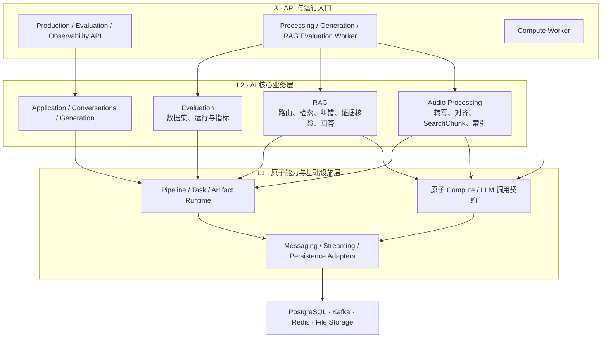
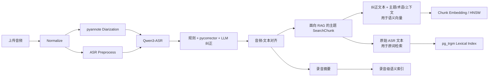
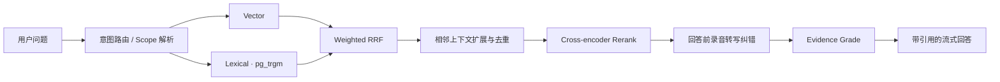

# AIRecordSummary

> 一个面向历史录音的、可追溯且可评测的 AI 知识检索系统：从音频理解、说话人分离和语义切块，到混合检索、回答前录音转写纠错、带引用回答，再到离线评测闭环。

这个项目关注的不是“把音频交给大模型总结”，而是一个更难也更贴近生产的问题：**当录音很多、转写并不完美时，怎样让用户仍然能找到正确证据，并判断 AI 的回答是否可信。**

## 30 秒看懂项目

- **完整 AI 应用链路**：音频上传 → 预处理 → 说话人分离 → ASR → 文本纠正与对齐 → 语义切块 → 向量索引 → RAG 问答。
- **可验证的 RAG**：Vector、Lexical、RRF、上下文扩展和 Rerank 共用生产检索链路，并通过离线评测逐阶段观察收益。
- **回答前录音转写纠错**：系统只检查最终答案真正依赖的录音片段；发现关键术语或数字可能听错时，先核验再回答，并始终保留原始转写。
- **离线评测闭环**：支持不可变数据集版本和可复现实验，分别衡量“能否找到正确录音片段”和“能否修正关键转写错误”。
- **面向生产的异步架构**：Kafka 承载命令和过程事实，Redis 承载实时状态与 SSE 续传，PostgreSQL 保存最终业务结果和可观测性投影。

## 效果展示

### 1. 召回正确，但转写中的关键事实错了怎么办？

例如用户询问 `I²C` 的时延，原始 ASR 将录音中的 `I²C` 识别成了 `RF`，并把 `5 微秒` 识别成 `五秒`。系统保留原始回答，同时给出基于录音上下文和外部证据裁决后的纠偏版本；每个答案仍然引用具体录音片段。

#### 23 秒演示

点击下图查看从用户提问、ASR 疑点分析到生成纠偏答案的流程。

[](./pics/rag-asr-correct.mp4)

用户可以点击引用回到原始录音时间点，查看被高亮的原始转写：


同一链路也能处理“召回到了相关片段，但原始文本不足以直接回答”的场景。下图中 Agent 根据上下文恢复并验证了 `JTAG 30 MHz` 这一关键表达：


这套机制有三条安全边界：

1. 当前只在 `fact_lookup` 且问题涉及半导体技术表达时触发；
2. 自动修正必须通过代码中的置信度、搜索次数、候选数量和循环次数上限；
3. 修正只用于生成本次答案，不会改写数据库中的原始转写、发言片段或检索文本。

### 2. 检索优化不是“凭感觉调参数”

项目内置 RAG 离线评测工作台，将人工标注的 Query 和标准 Evidence 冻结为不可变版本，并保存每个检索阶段的有序结果。

当前项目评测快照中，最终 Rerank 阶段达到 **Hit@5 95.0%、Recall@10 85.0%、MRR 0.772、nDCG@10 0.705**。从逐阶段数据可以看到，RRF 提升多路召回覆盖，上下文扩展改善首个相关结果的位置，Rerank 再将正确证据推到前列。


系统还会单独评测“回答前录音转写纠错”能力：人工标出录音片段中的错误表达及可接受的正确表达，再检查系统是否改对、漏改或误改。当前快照为 **Precision 63.6%、Recall 42.9%、F1 51.2%**，其中有 21 条漏改和 8 条误改，可直接回到具体失败样本继续优化。


> 上述结果来自仓库当前本地评测集快照，用于比较本项目 Pipeline 版本，不代表公开数据集或行业 Benchmark。

## 系统架构



- **L3** 只负责 HTTP、进程入口、依赖装配和 Worker 运行，不承载 RAG 或音频处理算法。
- **L2** 实现录音处理、检索问答、回答前转写纠错和离线评测等业务流程。
- **L1** 提供无业务语义的原子调用契约、Pipeline Runtime、消息、流和存储适配，依赖方向固定为 `L3 → L2 → L1`。

数据职责被刻意拆开：

| 组件 | 主要职责 |
| --- | --- |
| Kafka | 命令、生命周期事件、至少一次投递、重试与 DLQ |
| Redis | 活跃任务状态、生成/ASR 流、SSE 断线续传、取消快速检查 |
| PostgreSQL | 用户与录音业务数据、最终结果、评测数据、Observability 查询投影 |
| File / Artifact Storage | 原始音频、标准化音频、模型文件和大型中间产物 |

涉及业务写入的录音处理和 Generation 命令使用 **Transactional Outbox**，避免“数据库成功但消息丢失”。Worker 侧按稳定任务 ID、终态检查和 Stage Artifact Cache 实现幂等，适配 Kafka 的 at-least-once 语义。

## 两条核心 AI 工作流

### 离线录音理解 Pipeline



- **双文本检索视图**：纠正后的文本连同主题、标准术语和上下文说明生成 Embedding；原始 ASR 文本单独进入 Lexical Index，避免文本润色抹掉用户可能直接搜索的原词。
- **面向语义检索切块**：先识别连续对话的主题边界，再受 Token 数、时间长度和片段数量约束生成 SearchChunk；无法可靠识别主题时回退到确定性切块。
- **将口语上下文显式化**：每个 Chunk 可附带主题、最多 8 个原文可支持的标准术语，以及一句消除指代和省略的检索上下文，但禁止补充原文不存在的事实。
- **保留音频定位信息**：SearchChunk 同时携带录音 ID、起止时间和说话人信息，让检索结果和答案引用可以直接跳回原音。
- **增加录音级召回入口**：录音摘要被压缩成独立检索文档并生成向量，RAG 可以先找到主题相关的录音，再在录音内部召回具体 Chunk。

### 在线 RAG 与纠偏 Pipeline



检索不是单一向量 Top-K：

- **Vector** 负责语义召回；
- **Lexical** 使用 PostgreSQL `pg_trgm` 的 exact match 与 `word_similarity`，补充专有名词、数字和相近字符串（这里不是 BM25）；
- **Weighted RRF** 融合原问题、扩展问题与词法结果；
- **Context Expansion** 补齐候选片段的相邻对话，并合并来自同一录音的重叠时间窗；
- **Rerank** 基于扩展后的完整证据重排；
- **Evidence Grade** 在生成前判断录音证据是否足以回答；证据不足时直接拒答，避免模型依靠常识补全。

## 回答前录音转写纠错：为什么这样设计

这是项目中最具探索性的部分。核心矛盾是：RAG 可能召回了正确主题，但关键数字、单位或专有名词已经被 ASR 损坏；让回答模型自行“脑补”会破坏可追溯性。

项目采用一个**流程确定、决策受限**的 LangGraph 子图：

```text
风险分类 → 审查 Rerank 后的录音证据 → 构造候选 → 受限外部检索
        → 判断候选是否可信 → 生成原始/纠错两种证据视图
        → 分别核验证据是否足够 → 生成可对照的回答
```

关键取舍：

- Agent 只检查经过召回、上下文扩展和 Rerank 后留下的证据，而不是扫描整段录音或全部候选，以控制延迟和 Token。
- 模型可以提出候选和下一步研究动作，但代码决定工具、预算、循环上限和自动通过门槛。
- 纠错只形成回答阶段使用的文本视图，不覆盖原始转写；界面同时保留原始答案，便于比较纠错带来的变化。
- 每项修正记录原表达、修正表达、录音时间范围和外部来源，最终答案仍可回到原音复核。

## 离线评测闭环

### RAG Retrieval Evaluation

- 人工维护 Query、Scope、Answerability、标签与一个或多个标准 Evidence；
- 分离“可编辑草稿”和“不可变 Dataset Version”；
- 冻结 Corpus Snapshot、Pipeline 参数与 Git Commit，保证实验可比较；
- 生产问答与离线评测复用同一个 LangGraph Retrieval Pipeline；
- 记录 Vector、Lexical、RRF、Expand、Rerank 每阶段的排名、延迟和失败 Case；
- 指标包括 Hit@K、Recall@K、MRR、nDCG@K，以及无答案问题的错误证据率。

### 录音转写纠错评测

- 对每条 Evidence 标注错误 Span、可接受修正表达和重要性权重；
- 同时支持严格匹配与语义/模糊匹配；
- 将漏改与误改互斥计数，便于判断下一轮应该优先提升 Recall 还是压低误修正。

## AI 工程设计亮点

### Audio Processing：把音频变成可检索、可回放的证据

| 设计 | 作用 |
| --- | --- |
| **Diarization 与 ASR 联合处理** | pyannote 先提供说话人时间段，ASR 按语音窗口推理，随后再做音频—文本对齐，避免把“谁说的”和“说了什么”割裂开。 |
| **为 RAG 保留双文本视图** | 纠正文本负责语义向量召回，原始 ASR 文本负责原词检索；两者分开索引，兼顾可读性和专业术语召回。 |
| **主题与检索上下文增强** | 切块时显式生成主题、标准术语和消歧上下文，让口语中的省略与指代更容易被 Query 命中，同时用规则约束禁止引入新事实。 |
| **可定位的 SearchChunk** | Chunk 在满足 Embedding Token 限制的同时保留毫秒级音频范围和说话人信息，直接服务于 RAG 引用和原音回放。 |
| **Chunk 级 + 录音级索引** | 除具体对话片段外，还为录音摘要建立语义索引，支持“先定位相关录音，再检索内部证据”的两级召回。 |

### RAG：从“召回相似文本”到“生成可核验答案”

| 设计 | 作用 |
| --- | --- |
| **按问题类型选择策略** | LangGraph 将请求路由到事实查询、录音元数据查询或范围总结，避免所有问题都走相同的 Chunk Top-K。 |
| **混合召回与重排** | Vector、原词 Lexical、查询扩展和录音级召回经 Weighted RRF 融合，再补齐相邻语境并通过 Cross-encoder 把真正相关的证据排到前面。 |
| **回答前证据核验** | 生成答案前先判断录音证据是否足够；证据不足时拒答，而不是让模型依靠自身常识补全。 |
| **可回放引用** | 每条 Evidence 保留 Recording、Chunk、说话人和毫秒级时间范围，答案引用可以直接跳回原音复核。 |
| **回答前录音转写纠错** | 只检查最终答案依赖的录音片段；通过受限 Agent 恢复并核验关键技术表达，生成纠错版本，同时保留原始转写供用户对照。 |
| **生产链路即评测链路** | 离线评测直接复用生产 Retrieval Graph，并记录 Vector、Lexical、RRF、Expand、Rerank 各阶段排名，能定位一次改动究竟改善或损伤了哪里。 |

## 技术栈

- **Frontend**：Next.js 15、React 19、TypeScript、Zustand
- **Backend**：Python 3.14、FastAPI、Pydantic、SQLAlchemy、LangChain、LangGraph
- **Audio / ASR**：Qwen3-ASR、pyannote.audio、文本对齐、pycorrector
- **Retrieval**：Sentence Transformers、pgvector `halfvec`、HNSW、PostgreSQL `pg_trgm`、RRF、Cross-encoder Rerank
- **Infrastructure**：PostgreSQL、Kafka（KRaft）、Redis Streams、Docker Compose
- **Evaluation**：不可变 Dataset Version、Corpus Snapshot、Hit@K / Recall@K / MRR / nDCG、纠偏 Precision / Recall / F1
- **Quality**：Pytest、Ruff、Pyright strict、TypeScript typecheck

## 项目结构

```text
AIRecordSummary/
├── app/                         # Next.js 页面与 SDK
├── components/                  # 录音、对话、评测和可观测性 UI
├── backend/
│   ├── packages/
│   │   ├── l1_foundation/       # DB、消息、流、LLM、Worker 等基础能力
│   │   ├── l2_core/             # 音频处理、RAG 与评测等业务核心
│   │   └── l3_app/              # API 与独立 Worker 进程装配
│   └── tests/                   # 单元、边界与集成测试
├── sql/                         # 业务 Schema 与评测 Schema
├── docs/                        # 架构决策和专项设计文档
├── scripts/                     # 基础设施、数据库、模型与备份脚本
└── pics/                        # README 演示与评测截图
```

## 本地运行

### 环境要求

- Node.js 20+
- Python 3.14.4
- Docker / Colima
- 支持 `pgvector` 与 `pg_trgm` 的 PostgreSQL
- 运行本地音频模型所需的模型文件与计算资源

### 1. 安装依赖

```bash
npm install
scripts/install_audio_dependencies.sh
```

项目公共开发配置位于 `.env`。密钥和机器相关配置写入被 Git 忽略的 `.env.local`，其值会覆盖 `.env`。使用 pyannote 时需要配置 Hugging Face Token；当前已验证的在线 LLM 为 Gemini 和 Qwen。

### 2. 初始化基础设施和数据库

```bash
npm run infra:up
npm run db:init
npm run db:init:evaluation
```

> `npm run db:init` 会重建开发数据库的 `public` schema，请勿对需要保留数据的数据库执行。

### 3. 启动应用

以下进程建议分别在独立终端启动：

```bash
npm run dev
npm run dev:production-api
npm run dev:compute-worker
npm run dev:processing-worker
npm run dev:generation-worker
npm run dev:outbox-relay
npm run dev:observability-api
npm run dev:observability-worker
npm run dev:evaluation-api
npm run dev:rag-evaluation-worker
```

常用页面：

- 录音管理：<http://localhost:3000/recordings>
- 录音问答：<http://localhost:3000/chat>
- RAG 评测：<http://localhost:3000/rag-evaluation>
- RAG 可观测性：<http://localhost:3000/admin/rag-observability>

### 4. 质量检查

```bash
npm run typecheck
backend/.venv/bin/ruff check backend/packages backend/tests backend/scripts
backend/.venv/bin/pyright
backend/.venv/bin/pytest
```

默认单元测试不会加载真实音频模型。真实端到端验证需要先启动 Kafka、Redis、Processing Worker 和 Compute Worker，并确保模型已下载到 `model-cache/`。

## 当前边界

- 当前以本地单机开发和单 GPU 调度为主，尚未提供 Kubernetes 部署配置；
- ASR 纠偏当前聚焦半导体会议中的技术术语、关系、数字与单位，不处理法律、医疗等高风险事实；
- 外部证据研究是可选能力，私有事实不会通过互联网“猜测”；
- 评测集来自项目场景，需要继续扩大规模和问题分布后才能评估泛化能力；

## 延伸阅读

- [Kafka-first 与 Redis 实时投影](./docs/redis-kafka-architecture-refactor.md)
- [回答前录音转写纠错 Agent 设计](./docs/rag-asr-evidence-adjudication-agent-design.md)
- [RAG 离线评测平台](./docs/rag-offline-evaluation-platform-design.md)
- [Python 分层 Monorepo](./docs/python-backend-layered-monorepo-architecture-design.md)
