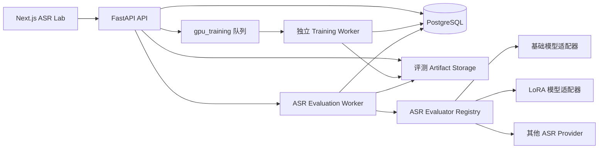
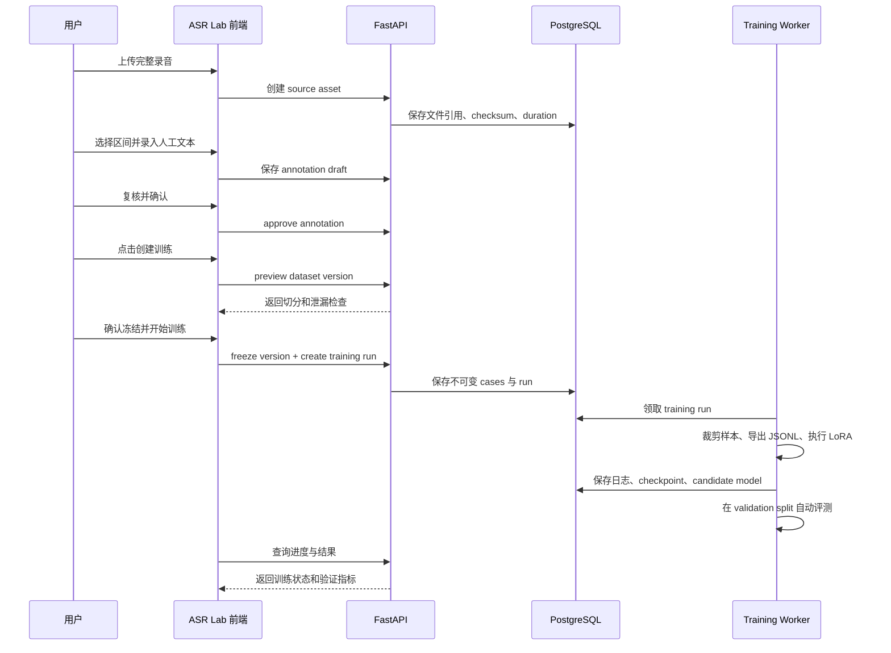
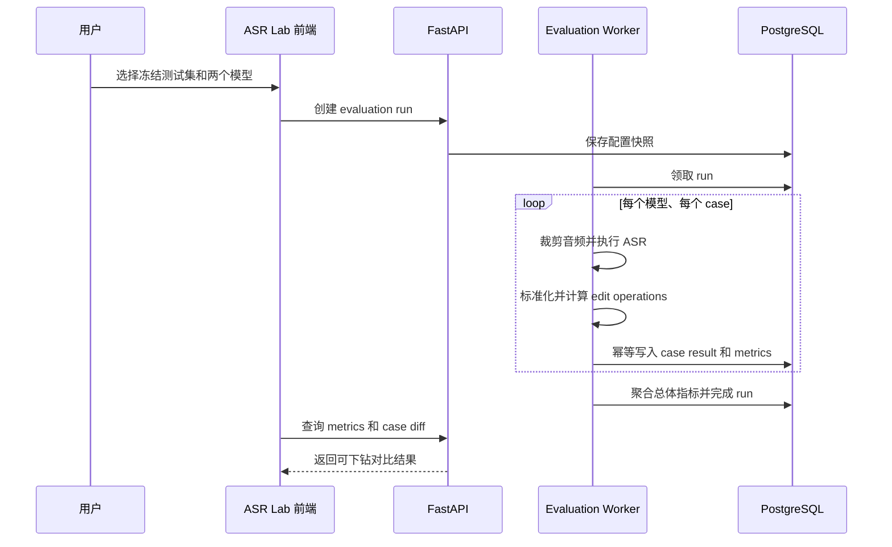

# ASR Lab 评测与训练平台设计

## 1. 文档目标

本文档描述一个面向 ASR 的轻量数据、评测和训练平台。第一阶段解决以下问题：

1. 在前端上传完整录音；
2. 在录音时间轴上选择或输入起止区间；
3. 为区间录入、复核并确认人工参考文本；
4. 将已确认数据冻结为可复现的数据集版本；
5. 使用安全预设一键发起 Qwen3-ASR LoRA 训练；
6. 在相同测试集上比较训练前后或任意两个 ASR 模型；
7. 展示总体 CER/WER，并能下钻到单条录音区间查看文本差异。

平台先聚焦 ASR，但底层的 Dataset、Run、Artifact、Metric 和 Model Version 使用通用命名和契约，为后续接入 RAG、摘要和全链路评测预留扩展能力。

## 2. 核心结论

### 2.1 代码与部署边界

- 前端继续放在当前 Next.js 项目中，新增 `app/asr-lab`；
- 后端继续放在 `backend/src`，新增通用 `evaluation` 和 ASR 专用 `asr_lab`；
- API、鉴权、PostgreSQL 和对象存储复用现有基础设施；
- 训练执行器必须与线上 API、ASR 推理 worker 分进程部署；
- 第一版不新建独立仓库或独立微服务。

建议目录：

```text
app/asr-lab/
├── layout.tsx
├── datasets/
│   └── page.tsx
├── evaluations/
│   └── page.tsx
└── training-runs/
    └── page.tsx

components/asr-lab/
├── audio-segment-editor.tsx
├── annotation-editor.tsx
├── dataset-version-panel.tsx
├── training-run-drawer.tsx
├── metric-comparison.tsx
└── transcript-diff.tsx

app/sdk/asr-lab/
├── client.ts
├── types.ts
└── store.ts

backend/src/evaluation/
├── __init__.py
├── contracts.py
├── datasets.py
├── artifacts.py
├── runs.py
├── metrics.py
└── registry.py

backend/src/asr_lab/
├── __init__.py
├── annotation.py
├── dataset_builder.py
├── normalization.py
├── evaluators.py
├── qwen_dataset.py
├── training.py
└── model_registry.py

backend/src/api/routes/
├── evaluation_datasets.py
├── evaluation_runs.py
├── training_runs.py
└── model_versions.py
```

### 2.2 “一键训练”的准确含义

“一键训练”不是使用当前正在编辑的一条区间立即训练，而是：

1. 收集当前数据集中 `approved` 且 `train_allowed=true` 的标注；
2. 按录音或业务分组生成 train/validation/test 切分；
3. 冻结一个不可变的数据集版本；
4. 验证训练集和测试集不存在分组泄漏；
5. 使用经过审核的 LoRA 训练预设创建训练任务；
6. 训练完成后自动在 validation 集运行评测；
7. 生成候选模型版本，等待人工批准，不自动发布生产。

高级训练参数可以放在折叠区域中，但默认入口只暴露基础模型、数据集版本、训练预设和候选模型名称。

## 3. 范围与非目标

### 3.1 第一阶段范围

- 上传完整音频或导入已有 `recording_id`；
- 音频播放、跳转和区间循环播放；
- 通过拖动时间轴或输入毫秒级时间创建区间；
- 人工参考文本的草稿、复核和确认；
- 训练、评测和敏感数据用途标记；
- 数据集冻结与 train/validation/test 切分；
- Qwen3-ASR LoRA 训练任务；
- 训练进度、日志、checkpoint 和失败信息展示；
- 模型注册与候选状态管理；
- 两个模型在同一测试集上的 CER/WER 对比；
- 单条 case 的音频回放、原始输出和字符级差异展示。

### 3.2 第一阶段不做

- 通用低代码评测工作流编辑器；
- RAG、摘要和全链路评测页面；
- 在线流量自动采样和自动回归；
- 多人复杂审批流；
- 自动将候选模型发布到生产；
- QLoRA、多训练框架和分布式训练平台；
- 精细波形标注、频谱图和逐字时间戳编辑；
- 使用未经人工确认的 LLM 修正文案作为 ground truth；
- 训练任务与生产 `gpu_high`、`gpu_normal` 队列混跑。

## 4. 总体架构



运行时边界：

```text
Web/API 进程
  负责上传、标注、冻结版本、创建任务、读取结果

Evaluation worker
  负责调用指定模型推理、计算指标、持久化 case result

Training worker
  负责构造 Qwen 数据、执行 LoRA 训练、保存 checkpoint、触发验证
```

训练 worker 第一阶段可以部署在单独机器上，通过数据库任务表或专用 `gpu_training` 队列领取任务。它不得占用生产录音处理的 GPU worker。

## 5. 领域模型

### 5.1 可编辑标注与不可变版本分离

标注区用于持续编辑：

```text
draft -> reviewed -> approved
          \-> draft
approved  \-> draft（修改文本或区间后必须重新审核）
```

数据集版本用于复现实验：

```text
building -> frozen
```

冻结后不允许修改 case、参考文本、切分和用途。需要修正时，应编辑原标注并创建下一个数据集版本。

### 5.2 主要实体

#### `evaluation_datasets`

表示一个长期维护的数据集合。

建议字段：

```text
id                  uuid
workspace_id        uuid
name                text
description         text nullable
task_type           text           # 第一版为 asr
status              text           # active / archived
created_by_user_id  uuid
created_at          timestamptz
updated_at          timestamptz
```

#### `evaluation_source_assets`

保存独立于生产 pipeline 生命周期的源音频引用。

```text
id                  uuid
workspace_id        uuid
recording_id        uuid nullable   # 导入现有录音时使用
artifact_uri        text nullable   # ASR Lab 独立上传时使用
checksum            text
file_name           text
mime_type           text
file_size_bytes     bigint
duration_ms         bigint
metadata            jsonb
created_by_user_id  uuid
created_at          timestamptz
```

`recording_id` 和 `artifact_uri` 至少存在一个。Lab 独立上传的音频不能仅依赖现有 `artifacts` 表，因为现有 artifact 关联 `pipeline_runs`，删除 pipeline run 时可能级联删除，不适合作为长期训练数据来源。

#### `annotations`

保存可编辑的人工作业。

```text
id                       uuid
dataset_id               uuid
source_asset_id          uuid
start_ms                  bigint
end_ms                    bigint
reference_text            text
language                  text nullable
status                    text       # draft / reviewed / approved
train_allowed             boolean
evaluation_allowed        boolean
contains_sensitive_data   boolean
group_key                 text
revision                  integer
reviewed_by_user_id       uuid nullable
approved_by_user_id       uuid nullable
created_by_user_id        uuid
created_at                timestamptz
updated_at                timestamptz
```

约束：

- `0 <= start_ms < end_ms <= duration_ms`；
- `reference_text` 去除首尾空白后不能为空；
- 修改区间或文本时，状态自动退回 `draft`；
- `approved` 必须记录批准人和时间；
- 未经人工确认的数据不得进入训练和评测；
- LLM 或现有 ASR 输出只能作为编辑提示，不能自动成为 `approved` 参考文本。

`group_key` 默认使用源录音 ID。后续可改为说话人、节目系列、客户、时间批次等更严格的业务分组。

#### `evaluation_dataset_versions`

```text
id                   uuid
dataset_id           uuid
version_number       integer
status               text       # building / frozen
normalization_name   text
normalization_version text
split_strategy       jsonb
case_count           integer
checksum             text
created_by_user_id   uuid
frozen_at            timestamptz nullable
created_at           timestamptz
```

#### `evaluation_cases`

冻结时从已批准标注物化出的不可变快照。

```text
id                    uuid
dataset_version_id    uuid
source_annotation_id  uuid
source_asset_id       uuid
start_ms              bigint
end_ms                bigint
reference_text_raw    text
reference_text_normalized text
language              text nullable
split                  text       # train / validation / test
group_key              text
train_allowed          boolean
evaluation_allowed     boolean
metadata               jsonb
created_at             timestamptz
```

冻结版本后禁止更新或删除其中的 case。删除数据集采用归档或受控清理，不直接级联删除仍被训练/评测 run 引用的版本。

#### `evaluation_runs`

```text
id                    uuid
workspace_id          uuid
dataset_version_id    uuid
evaluator_type        text       # asr
status                text       # queued/running/succeeded/failed/cancelled
model_version_ids     uuid[]
split                 text       # 通常为 test 或 validation
config_snapshot       jsonb
code_commit           text nullable
started_at            timestamptz nullable
finished_at           timestamptz nullable
error_message         text nullable
created_by_user_id    uuid
created_at            timestamptz
updated_at            timestamptz
```

#### `evaluation_case_results`

每个 `evaluation_run + model_version + case` 一条结果。

```text
id                         uuid
evaluation_run_id          uuid
model_version_id           uuid
evaluation_case_id         uuid
hypothesis_text_raw        text
hypothesis_text_normalized text
inference_duration_ms      integer nullable
status                     text
error_message              text nullable
details                    jsonb
created_at                 timestamptz
```

唯一约束：

```text
(evaluation_run_id, model_version_id, evaluation_case_id)
```

#### `evaluation_metric_values`

支持 run、model、case 等不同粒度的指标。

```text
id                    uuid
evaluation_run_id     uuid
model_version_id      uuid nullable
evaluation_case_id    uuid nullable
metric_name           text
metric_version        text
value                 numeric
sample_count          integer nullable
details               jsonb
created_at            timestamptz
```

#### `training_runs`

```text
id                    uuid
workspace_id          uuid
dataset_version_id    uuid
base_model_version_id uuid
status                text
training_method       text       # lora
preset_name           text
config_snapshot       jsonb
code_commit           text nullable
environment_snapshot  jsonb
output_uri            text nullable
started_at            timestamptz nullable
finished_at           timestamptz nullable
error_message         text nullable
created_by_user_id    uuid
created_at            timestamptz
updated_at            timestamptz
```

建议状态：

```text
queued
  -> preparing
  -> training
  -> validating
  -> succeeded

任意运行状态 -> failed / cancelled
```

#### `model_versions`

```text
id                    uuid
workspace_id          uuid
model_family          text       # qwen3_asr
name                  text
version               text
base_model_name       text
adapter_uri           text nullable
merged_model_uri      text nullable
training_run_id       uuid nullable
status                text       # candidate/validated/approved/deployed/retired
runtime_config        jsonb
metadata              jsonb
created_by_user_id    uuid
created_at            timestamptz
updated_at            timestamptz
```

基础模型也应注册为 `model_versions`，这样评测页可以用统一 ID 比较基础模型与 LoRA 模型。

## 6. 数据集切分与防泄漏

### 6.1 切分原则

不得随机打散音频区间后再切分。来自同一完整录音的多个区间高度相关，如果分别进入训练集和测试集，会导致指标虚高。

第一版按照 `group_key` 切分：

```text
group_key 默认值 = source_asset_id
```

同一个 `group_key` 的所有 case 必须进入同一个 split。推荐默认比例：

```text
train       80%
validation  10%
test        10%
```

当数据量较少时，页面必须展示每个 split 的录音组数、片段数和总时长，允许用户调整分组，但不允许同组跨 split。

### 6.2 用途约束

- `train_allowed=false` 的 case 不得进入 train；
- `evaluation_allowed=false` 的 case 不得进入 validation/test；
- `contains_sensitive_data=true` 的数据需要满足 workspace 权限与训练环境策略；
- test 集只用于最终对比，不参与训练和 checkpoint 选择；
- checkpoint 选择只使用 validation 指标；
- 一个训练 run 必须引用已经冻结的数据集版本。

### 6.3 版本可复现信息

冻结版本至少记录：

- case ID、音频 checksum、区间和参考文本；
- split 及 split strategy；
- 文本标准化名称和版本；
- 整个数据集版本 checksum；
- 创建人和冻结时间。

## 7. 文本标准化与指标

### 7.1 同时保留原始和标准化指标

每次评测保存：

- `reference_text_raw`；
- `reference_text_normalized`；
- `hypothesis_text_raw`；
- `hypothesis_text_normalized`。

页面默认展示标准化 CER/WER，同时允许查看严格原始指标。标准化逻辑必须版本化，禁止修改旧版本规则后重新解释历史 run。

中文第一版可提供：

```text
strict_v1
  只统一 Unicode，保留标点、大小写和空格差异

zh_asr_v1
  NFKC
  统一大小写
  规范连续空白
  按明确配置决定是否忽略标点
  不做同义词替换
  不使用 LLM 改写
```

### 7.2 第一版指标

必须实现：

- CER；
- WER；
- 总字符数、替换数、删除数、插入数；
- 空白输出率；
- case 失败率；
- 平均和 P95 推理耗时。

建议同时预留：

- 业务术语错误率；
- 人名、地名、型号和数字准确率；
- 长音频分桶指标；
- 信噪比分桶指标；
- 语言或场景分桶指标。

总体 CER 必须使用全量编辑次数除以全量参考字符数进行 micro aggregation，不能简单平均每条 case 的 CER。

## 8. 后端模块设计

### 8.1 `evaluation` 通用底座

`backend/src/evaluation` 不依赖具体 ASR 模型：

```text
contracts.py
  DatasetVersionRef、EvaluationCase、EvaluationResult、MetricValue

datasets.py
  创建数据集、冻结版本、切分校验、版本 checksum

artifacts.py
  评测源文件和输出文件的稳定引用、checksum、metadata

runs.py
  创建 run、状态机、幂等执行、失败恢复

metrics.py
  通用指标接口和聚合约定

registry.py
  evaluator_type -> evaluator factory
```

建议接口：

```python
class Evaluator(Protocol):
    evaluator_type: str

    def evaluate_case(
        self,
        case: EvaluationCase,
        model: ModelVersion,
        config: EvaluationConfig,
    ) -> EvaluationCaseResult:
        ...
```

未来 RAG 可注册 `evaluator_type="rag_retrieval"`、`"rag_answer"` 或 `"rag_e2e"`，无需改变 run 和 metric 表。

### 8.2 `asr_lab` 领域模块

```text
annotation.py
  校验区间、文本、状态流转和审批权限

dataset_builder.py
  将 approved annotations 冻结成 evaluation_cases

normalization.py
  ASR 文本标准化和版本注册

evaluators.py
  裁剪音频、调用模型、保存原始输出、计算 CER/WER

qwen_dataset.py
  将冻结 train/validation case 导出为 Qwen 训练 JSONL

training.py
  训练预设、训练任务执行、checkpoint 和验证衔接

model_registry.py
  基础模型、adapter、合并模型及状态管理
```

### 8.3 音频区间处理

完整音频只存一份。标注阶段只保存区间引用。训练或评测 worker 读取 case 时再临时裁剪：

```text
source_asset + start_ms + end_ms -> temporary audio sample
```

临时文件使用任务级临时目录并在任务结束后清理。为了保证复现，case 必须保存完整音频 checksum；worker 读取时校验 checksum。

如果训练框架需要提前物化短音频，可在冻结版本后生成带 checksum 的 dataset artifact，但它属于该数据集版本，不反向修改原始标注。

### 8.4 训练预设

第一版只提供经过测试的 LoRA 预设，例如：

```text
lora_safe_v1
  目标模块、rank、alpha、dropout
  batch size、gradient accumulation
  learning rate、warmup、epoch
  mixed precision
  checkpoint interval
  early stopping
```

实际数值应在完成训练脚本和显存验证后确定，不在前端写死。每个 training run 必须完整保存：

- 基础模型及 revision；
- 数据集版本；
- LoRA 配置；
- 随机种子；
- 超参数；
- 代码 commit；
- Python、CUDA/MPS、PyTorch 和关键依赖版本；
- 训练日志、checkpoint、adapter manifest；
- validation 评测结果。

### 8.5 幂等与恢复

- 创建 run 使用客户端 idempotency key，避免重复点击创建两个任务；
- case result 使用唯一约束支持断点续跑；
- worker 更新状态时使用乐观锁或合法状态转换；
- training run 失败后保留日志和最后一个可用 checkpoint；
- evaluation run 可以只重跑失败 case；
- 取消任务只发送取消请求，worker 在安全点结束并更新状态。

## 9. API 设计

所有接口均要求 workspace 鉴权。下列路径省略现有 API 前缀。

### 9.1 数据集和音频

```http
POST   /evaluation/datasets
GET    /evaluation/datasets
GET    /evaluation/datasets/{dataset_id}

POST   /evaluation/datasets/{dataset_id}/assets
POST   /evaluation/datasets/{dataset_id}/assets:import-recording
GET    /evaluation/datasets/{dataset_id}/assets
GET    /evaluation/assets/{asset_id}/audio

POST   /evaluation/datasets/{dataset_id}/annotations
PATCH  /evaluation/annotations/{annotation_id}
POST   /evaluation/annotations/{annotation_id}:review
POST   /evaluation/annotations/{annotation_id}:approve
DELETE /evaluation/annotations/{annotation_id}
```

音频读取接口应支持 HTTP Range，前端才能快速跳转和循环播放长录音。

创建标注示例：

```json
{
  "source_asset_id": "019...",
  "start_ms": 728200,
  "end_ms": 736500,
  "reference_text": "我们计划下周三正式发布这个版本。",
  "language": "zh",
  "train_allowed": true,
  "evaluation_allowed": true,
  "contains_sensitive_data": false
}
```

更新标注必须携带 `revision`。revision 不匹配时返回冲突，防止两个页面互相覆盖。

### 9.2 数据集版本

```http
POST /evaluation/datasets/{dataset_id}/versions:preview
POST /evaluation/datasets/{dataset_id}/versions:freeze
GET  /evaluation/dataset-versions/{version_id}
GET  /evaluation/dataset-versions/{version_id}/cases
```

`preview` 返回：

- 会进入版本的 case 数和总时长；
- train/validation/test 的组数、case 数和时长；
- 未批准、缺失用途或区间非法的数据；
- 是否存在 group 泄漏；
- normalization 版本。

只有 preview 通过后才能 freeze。

### 9.3 训练

```http
GET  /training-presets?model_family=qwen3_asr
POST /training-runs
GET  /training-runs
GET  /training-runs/{training_run_id}
POST /training-runs/{training_run_id}:cancel
GET  /training-runs/{training_run_id}/logs
```

创建训练示例：

```json
{
  "dataset_version_id": "019...",
  "base_model_version_id": "019...",
  "training_method": "lora",
  "preset_name": "lora_safe_v1",
  "candidate_model_name": "qwen3-asr-customer-v1",
  "idempotency_key": "client-generated-uuid"
}
```

### 9.4 模型

```http
GET  /model-versions?model_family=qwen3_asr
GET  /model-versions/{model_version_id}
POST /model-versions/{model_version_id}:approve
POST /model-versions/{model_version_id}:retire
```

第一版不提供自动 deploy API。部署生产属于后续单独审批流程。

### 9.5 评测

```http
POST /evaluation/runs
GET  /evaluation/runs
GET  /evaluation/runs/{evaluation_run_id}
GET  /evaluation/runs/{evaluation_run_id}/metrics
GET  /evaluation/runs/{evaluation_run_id}/cases
POST /evaluation/runs/{evaluation_run_id}:retry-failed
POST /evaluation/runs/{evaluation_run_id}:cancel
```

创建双模型对比示例：

```json
{
  "dataset_version_id": "019...",
  "split": "test",
  "evaluator_type": "asr",
  "model_version_ids": ["base-model-id", "lora-model-id"],
  "normalization_name": "zh_asr",
  "normalization_version": "v1",
  "idempotency_key": "client-generated-uuid"
}
```

## 10. 前端页面设计

### 10.1 导航

新增一级入口：

```text
ASR Lab
├── 数据标注
├── 模型评测
└── 训练记录
```

数据标注和模型评测是第一版主页面。训练记录可以先实现成主页面中的 Tab；当任务量增加后再独立页面。

### 10.2 数据标注页

路由：

```text
/asr-lab/datasets
```

页面线框：

```text
┌──────────────────────────────────────────────────────────────────────┐
│ ASR Lab   数据标注 | 模型评测 | 训练记录                              │
├──────────────────────────────────────────────────────────────────────┤
│ 数据集：客服录音第一批          草稿 18  已确认 126                    │
│ 版本：v3 frozen / 工作区有 5 条新修改                                 │
│                                                                      │
│ [上传完整录音] [导入已有录音]        [预览数据集] [创建训练任务]       │
├──────────────────────┬───────────────────────────────────────────────┤
│ 录音列表              │ meeting-0728.wav                              │
│                      │                                               │
│ ● meeting-0728.wav   │ ▶ 00:05:23.100 / 01:20:14.000                 │
│   已确认 12 段        │ ────────▓▓▓▓────────▓▓──────────────          │
│                      │         当前区间 00:12:08.200–00:12:16.500     │
│ ○ customer-01.wav    │                                               │
│   已确认 8 段         │ 开始 [00:12:08.200] 结束 [00:12:16.500]       │
│                      │ [从当前播放位置设为开始] [设为结束] [循环播放] │
│ ○ interview.wav      │                                               │
│   未标注              │ 手工校验文本                                  │
│                      │ ┌─────────────────────────────────────────┐   │
│                      │ │ 我们计划下周三正式发布这个版本。          │   │
│                      │ └─────────────────────────────────────────┘   │
│                      │                                               │
│                      │ 用途  ☑允许训练  ☑允许评测                    │
│                      │ 敏感  ☐包含敏感数据                           │
│                      │ 状态  ●草稿  ○已复核  ○已确认                 │
│                      │                     [保存] [保存并新增下一段]   │
├──────────────────────┴───────────────────────────────────────────────┤
│ 已标注区间                                                          │
│ 00:01:02–00:01:09 “今天主要讨论发布计划……”       已确认 [播放][编辑] │
│ 00:12:08–00:12:16 “我们计划下周三……”             已确认 [播放][编辑] │
└──────────────────────────────────────────────────────────────────────┘
```

关键交互：

- 上传完成后读取音频 duration；
- 点击时间轴定位，拖动选择区间；
- 开始、结束时间支持键盘精确输入到毫秒；
- 区间播放结束后自动跳回开始位置，支持循环；
- 保存时校验区间重叠，但第一版允许重叠并给出提示；
- 切换录音或离开页面前提示未保存修改；
- 审批后修改区间或文本，状态自动回到草稿；
- 前端展示草稿、复核、确认和用途统计；
- 上传、转码或 duration 解析失败时给出可重试状态。

第一版可以先使用原生 `<audio>` 和轻量时间轴，不以复杂波形库作为上线前置条件。波形图后续作为体验增强。

### 10.3 数据集预览抽屉

```text
┌──────────────── 数据集版本预览 ────────────────┐
│ 将创建：客服录音第一批 v4                       │
│ 标准化：zh_asr_v1                               │
│                                                 │
│             录音组       片段       总时长       │
│ Train          20         101       2.8 小时     │
│ Validation      3          25       0.6 小时     │
│ Test            4          30       0.7 小时     │
│                                                 │
│ 排除：18 条草稿、2 条不允许训练的数据            │
│ 检查：同一录音没有跨 split                 ✓     │
│                                                 │
│                          [取消] [冻结为 v4]       │
└─────────────────────────────────────────────────┘
```

### 10.4 创建训练抽屉

```text
┌────────────── 创建 LoRA 训练任务 ──────────────┐
│ 基础模型    Qwen3-ASR-1.7B                    │
│ 数据集版本  客服录音第一批 v4（已冻结）         │
│                                                 │
│ 训练集      101 段 / 2.8 小时                  │
│ 验证集       25 段 / 0.6 小时                  │
│ 测试集       30 段（不会参与训练）              │
│                                                 │
│ 训练预设    [LoRA 标准配置 ▼]                  │
│ 模型名称    [qwen3-asr-customer-v1        ]    │
│ 高级参数    [展开]                              │
│                                                 │
│                              [取消] [开始训练]   │
└─────────────────────────────────────────────────┘
```

若工作区存在新标注但当前选择的是旧冻结版本，页面必须明确提示这些修改不会进入本次训练。

### 10.5 模型评测页

路由：

```text
/asr-lab/evaluations
```

页面线框：

```text
┌──────────────────────────────────────────────────────────────────────┐
│ ASR 模型评测                                                         │
├──────────────────────────────────────────────────────────────────────┤
│ 评测集 [客服测试集 v4 ▼]                                             │
│ 基准模型 [Qwen3-ASR-1.7B ▼]   对比模型 [customer-lora-v1 ▼]          │
│ 标准化 [zh_asr_v1 ▼]                                   [开始评测]    │
├──────────────────────────────────────────────────────────────────────┤
│                    基准模型              LoRA 模型          变化      │
│ CER                  12.81%                8.34%           ↓ 4.47pp  │
│ WER                  18.20%               12.65%           ↓ 5.55pp  │
│ 空白输出率             1.20%                0.80%           ↓ 0.40pp  │
│ 平均推理耗时           2.10s                 2.24s           ↑ 0.14s   │
├──────────────────────────────────────────────────────────────────────┤
│ 筛选 [全部] [对比模型变好] [变差] [推理失败]   搜索 [              ] │
├──────────────────────────────────────────────────────────────────────┤
│ customer-01 · 00:10:02–00:10:08                    [播放] [查看差异] │
│ 人工文本：明天下午三点进行项目验收                                   │
│ 基准模型：明天下午三点进行项目延收                    CER 7.1%       │
│ 对比模型：明天下午三点进行项目验收                    CER 0.0%       │
│                                                                      │
│ meeting-07 · 00:21:10–00:21:15                     [播放] [查看差异] │
│ 人工文本：请联系张伟确认报价                                         │
│ 基准模型：请联系张伟确认报价                          CER 0.0%       │
│ 对比模型：请联系张维确认报价                          CER 5.8%       │
└──────────────────────────────────────────────────────────────────────┘
```

页面行为：

- 只能选择已经冻结且包含可评测 case 的版本；
- 基准和对比模型不能相同；
- 已存在相同配置的成功 run 时提示复用结果或明确重新运行；
- 运行中展示完成 case 数、失败数和预计进度；
- 总体指标使用 micro aggregation；
- 指标变化用百分点 `pp`，避免把绝对差值误写成相对百分比；
- 默认优先展示“对比模型变差”的 case，便于回归分析；
- case 列表支持按录音、语言、时长和标签过滤；
- 每条 case 都能直接播放对应音频区间。

### 10.6 文本差异抽屉

```text
┌──────────────── 文本差异 ──────────────────────┐
│ meeting-07.wav · 00:21:10.000–00:21:15.200     │
│ [▶ 播放区间] [循环]                             │
│                                                 │
│ 人工文本：请联系张伟确认报价                    │
│ 基准模型：请联系张伟确认报价                    │
│ 对比模型：请联系张[维]确认报价                  │
│                       伟 → 维                    │
│                                                 │
│ 基准：S=0 D=0 I=0 CER=0%                       │
│ 对比：S=1 D=0 I=0 CER=5.8%                     │
│                                                 │
│ [查看原始文本] [查看标准化文本]                 │
└─────────────────────────────────────────────────┘
```

diff 需要按评测实际使用的字符或词 token 展示，不能使用另一套前端临时算法计算指标。后端返回编辑操作序列，前端只负责渲染。

### 10.7 训练记录

路由：

```text
/asr-lab/training-runs
```

第一版展示：

- run 状态和当前阶段；
- 基础模型、数据集版本和训练预设；
- 已运行时间和最近日志；
- checkpoint 列表；
- validation CER/WER；
- 失败原因和重试入口；
- 训练成功后生成的候选模型；
- “去评测对比”快捷入口。

## 11. 前后端完整流程

### 11.1 标注到训练



### 11.2 双模型评测



## 12. 权限、安全和审计

- 所有实体必须带 workspace 边界；
- 用户只能读取有权限的录音和 Lab asset；
- 原始音频下载和 Range 播放接口复用现有鉴权；
- 日志不得打印人工文本全文、音频 URL、访问 token 或敏感 metadata；
- 训练 worker 通过短期凭证读取允许的数据；
- `contains_sensitive_data` 必须进入训练 run 的策略检查；
- approve、freeze、create training、approve model 都写审计事件；
- 删除源音频前检查是否仍被冻结数据集、评测或训练引用；
- 第一版只允许受信任角色创建训练任务和批准模型。

## 13. 可观测性

所有 run 日志采用结构化字段：

```text
event
run_id
workspace_id
dataset_version_id
model_version_id
case_id
stage
status
duration_ms
error_type
```

不得在普通日志中写入完整 reference/hypothesis 文本。文本仅进入受权限控制的 case result。

建议指标：

- training/evaluation queue latency；
- run 成功率和失败类型；
- case throughput；
- GPU 利用率和显存；
- 单小时音频训练/评测耗时；
- artifact 存储增长；
- 不同模型的推理延迟。

## 14. 测试策略

### 14.1 后端

- annotation 区间、状态转换和 revision 冲突测试；
- 冻结版本只包含符合用途的 approved 标注；
- 同一 group 不跨 split；
- 冻结版本不可修改；
- checksum 和 normalization version 稳定；
- CER/WER 的替换、删除、插入及空字符串测试；
- micro aggregation 测试；
- training/evaluation run 合法状态转换测试；
- case result 幂等和断点续跑测试；
- workspace 越权测试；
- 音频 HTTP Range 测试；
- 测试集不会被 Qwen 数据导出器写入训练 JSONL。

### 14.2 前端

- 时间输入与毫秒转换；
- 区间循环播放；
- 未保存离开提示；
- approved 标注修改后回到 draft；
- 数据集 preview 的阻断错误展示；
- 重复点击创建任务只产生一个 run；
- run 轮询和终态停止；
- 指标百分点展示；
- transcript diff 的替换、删除、插入渲染；
- 长列表分页和失败 case 筛选。

### 14.3 端到端

最小验收场景：

1. 上传一条短录音；
2. 创建并批准多个区间；
3. 冻结数据集版本；
4. 发起一个使用 mock trainer 的训练 run；
5. 注册一个候选模型；
6. 在固定 test split 对基础模型和候选模型运行 mock evaluation；
7. 页面正确展示总体指标和单条差异；
8. 修改原标注后，历史版本和历史 run 结果保持不变。

## 15. 分期实施

### Phase 1：数据标注

- 数据库：dataset、source asset、annotation；
- API：上传、导入、播放、标注 CRUD、审核确认；
- 前端：数据标注页、原生 audio、区间输入和循环播放；
- 权限、审计和基础测试。

完成标准：可以稳定生成一批人工确认的音频区间与参考文本。

### Phase 2：数据集与 ASR 评测

- 冻结 dataset version；
- group 级切分和泄漏检查；
- ASR normalization；
- evaluation run、case result 和 metric；
- 基础模型注册；
- 双模型评测页、CER/WER 和 case diff。

完成标准：任何两个已注册 ASR 模型能在同一不可变测试集上可复现地比较。

### Phase 3：LoRA 训练

- Qwen JSONL 导出；
- LoRA 训练预设；
- 独立 training worker；
- training run、日志、checkpoint；
- validation 自动评测；
- 候选 model version；
- 数据标注页的一键训练入口。

完成标准：从冻结数据集创建训练任务，产出候选 adapter，并自动获得 validation 指标。

### Phase 4：模型管理与发布前验证

- candidate、validated、approved 状态；
- 基线与候选模型回归门槛；
- 人工审批；
- 训练和评测 run 的对比历史；
- 后续再设计生产部署流程。

## 16. 后续扩展到全链路评测

ASR 第一版完成后，可以在不修改通用底座的前提下增加：

```text
backend/src/rag/evaluators.py
  route filter accuracy
  retrieval recall@k / MRR
  evidence precision
  answer groundedness

backend/src/evaluation/
  继续复用 dataset version
  evaluation run
  case result
  metric values
  artifact
```

全链路 case 可以同时保存：

- 原始音频；
- 人工参考转写；
- ASR 输出；
- 人工问题和期望过滤条件；
- 期望 evidence；
- 参考答案或评分 rubric。

这样可以分别运行：

```text
人工转写 -> RAG
ASR 转写 -> RAG
```

两者的差异能量化 ASR 错误对 route、retrieval 和最终回答的影响，而不需要再建立另一套评测平台。

## 17. 第一版推荐交付边界

第一版不要同时实现所有 Phase。推荐按以下顺序提交：

1. 数据库和后端标注 API；
2. 前端上传、区间标注和人工确认；
3. 冻结数据集与防泄漏切分；
4. ASR 基线评测和模型对比页面；
5. 最后接入 LoRA training worker 和一键训练。

其中第 1 至第 4 步先形成可靠的人工数据和质量基线，第 5 步再开始真实训练。这样训练得到的提升可以立即在冻结测试集上验证，而不是只凭少量样例主观判断。
