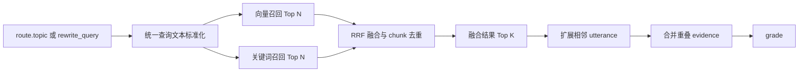

# Python 后端 RAG 混合搜索技术方案

## 1. 目标与边界

本方案只改造 RAG 的 `chunk_search` 检索方式，将当前单路向量检索升级为：

```text
向量召回 + 关键词召回 + RRF 融合
```

目标是同时覆盖两类检索需求：

- 向量检索负责语义相近但字面表达不同的内容；
- 关键词检索负责行业术语、英文缩写、产品型号、人名、数字和 ASR 近似文本。

本次改造不包含：

- reranker 模型；
- RAG 评测系统；
- GraphRAG；
- query decomposition；
- 新的外部搜索服务；
- `scope_summary` 改造；
- 前端协议改造。

混合搜索仍然输出现有 `Evidence`，后续的 `grade -> rewrite -> answer_plan -> answer` 保持不变。

## 2. 当前基础

项目已经具备混合搜索需要的大部分基础：

- `recording_search_chunks.embedding` 保存 Qwen embedding；
- PostgreSQL 已安装 `vector` 和 `pg_trgm` 扩展；
- `recording_search_chunks.normalized_text` 保存标准化文本；
- 已存在 `normalized_text gin_trgm_ops` 索引；
- 录音、时间、人物、地点和说话人过滤已经集中在 `RagRetriever`；
- `chunk_search` 已经能够在最终 evidence 上扩展相邻 utterance。

当前 `chunk_search` 只执行：

```text
route.topic
  -> query embedding
  -> pgvector HNSW Top K
  -> 相邻 utterance 扩展
  -> Evidence
```

主要问题是行业术语、缩写、型号等精确文本只能依赖 embedding 命中，数据库中已经存在的 `normalized_text` 和 trigram 索引没有参与实际检索。

## 3. 目标链路



执行顺序必须是先召回、后融合、最后扩展上下文。不能分别在向量和关键词分支中提前扩展相邻 utterance，否则会增加无效数据库查询，并造成大量重复上下文。

## 4. 模块设计

将当前 `backend/packages/l2_core/rag/retrieval.py` 收敛为一个检索模块：

```text
backend/packages/l2_core/rag/retrieval/
├── __init__.py
├── contracts.py
├── filters.py
├── normalization.py
├── vector.py
├── lexical.py
├── fusion.py
├── context.py
└── service.py
```

各模块职责如下。

### 4.1 `contracts.py`

定义检索内部使用的候选类型。候选对象只表达召回和融合过程，不直接作为前端 source。

```python
RetrievalMatchType = Literal["vector", "lexical"]


class RetrievalCandidate(BaseModel):
    chunk_id: UUID
    recording_id: UUID

    vector_rank: int | None = None
    vector_score: float | None = None

    lexical_rank: int | None = None
    lexical_score: float | None = None

    fused_score: float = 0.0
    match_types: set[RetrievalMatchType] = Field(default_factory=set)
```

向量和关键词查询只返回轻量候选以及生成 `Evidence` 所需的 chunk 元数据，不在这个阶段加载相邻发言。

### 4.2 `filters.py`

route 和 scope 解析只执行一次。它们生成的 `ResolvedFilters` 由向量和关键词两路召回共同复用，包括：

- 当前用户允许访问的 recording IDs；
- route 推断出的 recording IDs；
- `recordings.status = 'completed'`；
- 人名；
- 地点；
- speaker profile IDs；
- `target_person_only`；
- `created_from / created_to`。

尤其是用户授权范围、“最近 N 条”解析出来的 recording IDs、相对时间换算结果和历史 source 范围，不能在两个检索分支中分别解析。

`filters.py` 将同一份 `ResolvedFilters` 转换为可复用的 SQL 条件和参数：

```python
class RetrievalSqlFilter(BaseModel):
    clauses: tuple[str, ...]
    parameters: dict[str, object]


class RetrievalFilterBuilder:
    def build(self, filters: ResolvedFilters) -> RetrievalSqlFilter:
        ...
```

调用关系为：

```text
route + resolve_scope
  -> ResolvedFilters
  -> RetrievalSqlFilter
       ├── vector SQL
       └── lexical SQL
```

这里复用的是解析完成的过滤范围、SQL 条件和绑定参数，不是某一路查询得到的候选数据。向量和关键词两路的候选集合不同，因此两条 SQL 必须分别应用同一组 `WHERE` 条件：

```text
vector SQL:
  WHERE <shared filters>
  ORDER BY embedding distance

lexical SQL:
  WHERE <shared filters>
  ORDER BY trigram distance
```

不能先执行向量查询，再让关键词查询只搜索向量候选；反向执行也不可以。否则第二路只能给第一路的结果重新排序，无法补回第一路漏掉的 chunk。

同样禁止先把所有符合范围的 chunk 查询到 Python 内存，再分别执行搜索。这样会绕过 HNSW 和 trigram 索引，并增加网络、内存和权限泄漏风险。

因此过滤范围只解析一次，但两路召回必须在各自的 SQL 查询阶段应用一次完全相同的权限和业务条件。禁止先检索全库数据，再在 Python 中过滤。

### 4.3 `normalization.py`

提供统一的查询和索引文本标准化函数：

```python
def normalize_search_text(value: str) -> str:
    ...
```

标准化规则为：

- 使用 Unicode NFKC；
- 英文字母转换为小写；
- 全角字符转换为半角；
- 连续空白合并为单个空格；
- 删除首尾空白；
- 保留中文、英文、数字和原始词序。

`RecordingProjectionService` 写入 `normalized_text` 和 RAG 查询关键词时必须调用同一个函数，不能分别维护两套规则。原始 `text` 不做修改。

### 4.4 `vector.py`

保留现有 Qwen embedding 和 pgvector 查询，默认扩大第一阶段候选数量：

```text
vector candidate limit = 30
```

向量查询返回：

- chunk ID；
- recording ID；
- cosine score；
- 向量分支中的 rank；
- chunk 的基础元数据。

向量分支不再调用相邻 utterance 扩展。

### 4.5 `lexical.py`

使用 PostgreSQL `pg_trgm` 对 `normalized_text` 做关键词召回：

```sql
select
    chunks.id as chunk_id,
    chunks.recording_id,
    word_similarity(:query, chunks.normalized_text) as lexical_score
from recording_search_chunks chunks
join recordings on recordings.id = chunks.recording_id
where
    -- filters.py 生成的统一过滤条件
order by :query <<-> chunks.normalized_text
limit :limit
```

默认候选数量：

```text
lexical candidate limit = 30
```

使用 `word_similarity` 而不是整段 `similarity`，因为查询通常比 chunk 短，需要衡量查询与 chunk 中某一段连续内容的相似程度。

关键词召回不设置固定的业务相关度阈值。它只负责产生有限数量的候选，最终顺序由 RRF 决定，证据充分性仍由现有 `grade` 判断。`lexical_score <= 0` 的候选直接丢弃。

### 4.6 `fusion.py`

融合层按 `chunk_id` 合并两路候选，并使用 Reciprocal Rank Fusion 计算统一分数：

```text
fused_score =
    vector_weight  / (rrf_k + vector_rank)
  + lexical_weight / (rrf_k + lexical_rank)
```

某个分支未命中该 chunk 时，不计算对应项。

初始参数：

```text
rrf_k = 60
vector_weight = 1.0
lexical_weight = 1.0
```

不能直接使用下面的方式融合：

```text
vector_score * 0.7 + lexical_score * 0.3
```

cosine score 与 trigram score 的分布和含义不同，直接相加会让融合结果依赖具体模型和数据分布。RRF 只依赖各分支中的相对排名。

融合层完成：

1. 按 `chunk_id` 合并重复候选；
2. 保存各分支 rank 和原始 score；
3. 计算 `fused_score`；
4. 按 `fused_score desc` 排序；
5. 返回融合后的 Top K。

初始融合候选上限：

```text
fused candidate limit = 20
```

最终进入上下文扩展和 `grade` 的数量仍使用当前请求的 `limit`，最大值继续由服务端限制。

### 4.7 `context.py`

只对融合后的最终候选加载相邻 utterance。

扩展完成后，如果同一录音中的多个 evidence 时间范围相交或相邻扩展内容发生重复，需要合并为一条 evidence，避免相同发言被多次送给模型。

合并后的 evidence：

- `start_ms` 取最小值；
- `end_ms` 取最大值；
- utterance 按 `utterance_index` 排序并去重；
- speaker labels 保持首次出现顺序并去重；
- source chunk IDs 仅保留在服务端内部；
- 对外 URL 指向合并后最早的 `start_ms`。

### 4.8 `service.py`

`HybridRetrievalService` 负责协调：

```text
标准化 query
  -> 并行执行 vector / lexical
  -> RRF
  -> 截取最终候选
  -> 上下文扩展
  -> 生成 Evidence
```

`RagGraph` 不感知内部检索实现，只调用：

```python
evidence = await retriever.retrieve_chunks(
    query=query,
    filters=filters,
    limit=limit,
)
```

## 5. 资源调度

当前 `RagGraph` 将整个 `retrieve_chunks()` 提交到 GPU 队列。混合搜索接入后需要缩小 GPU 资源边界：

```text
vector 分支：
  GPU_NORMAL -> 加载 embedding 模型并生成 query embedding
  DB         -> pgvector 查询

lexical 分支：
  CPU/DB     -> pg_trgm 查询
```

向量和关键词召回相互独立，可以并行执行：

```python
vector_candidates, lexical_candidates = await asyncio.gather(
    vector_retriever.retrieve(...),
    lexical_retriever.retrieve(...),
)
```

其中：

- embedding 推理作为 GPU 任务提交给 `ResourceScheduler`；
- 同步 PostgreSQL 查询作为 CPU 任务执行，不能阻塞 Web 事件循环；
- RRF 只处理几十个候选，可以直接在当前协程中完成；
- embedding 模型仍按现有策略在查询向量生成完毕后释放。

关键词查询不能占用 GPU queue，数据库查询也不应在等待期间继续持有 GPU 资源。

## 6. Evidence 与 source

将 `Evidence.match_type` 从：

```python
Literal["vector", "scope"]
```

扩展为：

```python
Literal["vector", "lexical", "hybrid", "scope"]
```

映射规则：

- 只被向量分支命中：`vector`；
- 只被关键词分支命中：`lexical`；
- 同时被两路命中：`hybrid`；
- `scope_summary` 结果：`scope`。

`Evidence.score` 对混合搜索保存 `fused_score`。向量原始分数、关键词原始分数和各自 rank 只用于服务端日志和问题排查，不写入前端标准 source。

source 继续只持久化：

- recording；
- chunk 时间范围；
- speaker labels；
- 最终融合分数；
- match type；
- 录音详情 URL。

不在 source 中恢复保存 chunk 全文。

## 7. 数据库变更

保留现有 GIN trigram 索引，并新增适合 Top N 距离排序的 GiST 索引：

```sql
create index if not exists recording_search_chunks_text_trgm_gist_idx
    on recording_search_chunks
    using gist (normalized_text gist_trgm_ops(siglen=64));
```

现有索引继续保留：

```sql
create index if not exists recording_search_chunks_text_trgm_idx
    on recording_search_chunks
    using gin (normalized_text gin_trgm_ops);
```

本次不新增搜索表，不复制 chunk 文本，不修改 embedding 数据结构，也不增加新的 pipeline stage。

由于标准化逻辑将从内联代码抽成共享函数，已有 `normalized_text` 需要在数据库初始化或一次性维护逻辑中重新生成，保证它和新查询标准化规则一致。重新生成关键词文本不要求重新计算 embedding。

## 8. 配置

在 `Settings` 增加：

```python
rag_hybrid_search_enabled: bool = True
rag_vector_candidate_limit: int = 30
rag_lexical_candidate_limit: int = 30
rag_fused_candidate_limit: int = 20
rag_rrf_k: int = 60
rag_vector_weight: float = 1.0
rag_lexical_weight: float = 1.0
```

约束：

- candidate limit 必须大于零；
- `rag_fused_candidate_limit` 不得大于两路候选数量之和；
- `rag_rrf_k` 必须大于零；
- 两个 weight 必须大于等于零，且不能同时为零。

`rag_hybrid_search_enabled=false` 时退回当前向量检索，作为部署和故障回退开关。

## 9. 失败与降级

混合搜索允许单路失败：

| 向量分支 | 关键词分支 | 处理方式 |
|---|---|---|
| 成功 | 成功 | RRF 融合 |
| 成功 | 失败 | 使用向量候选 |
| 失败 | 成功 | 使用关键词候选 |
| 成功但为空 | 成功 | 使用关键词候选 |
| 成功 | 成功但为空 | 使用向量候选 |
| 失败 | 失败 | 检索失败并结束本次 generation |

单路失败必须记录异常栈，但不能把内部错误返回给前端。降级后仍然执行现有 `grade`，不能因为存在关键词候选就直接进入回答。

权限过滤构建失败不属于可降级错误。无法形成可信权限范围时，两路检索都必须停止。

## 10. 日志

混合搜索增加一条汇总日志：

```text
rag hybrid retrieval completed:
query_chars=12
vector_candidates=30
lexical_candidates=18
overlap=7
fused_candidates=20
evidence_count=10
recording_ids=[...]
elapsed_ms=...
```

分支日志记录：

- query embedding 耗时；
- vector SQL 耗时；
- lexical SQL 耗时；
- RRF 耗时；
- context expansion 耗时；
- 单路降级原因。

日志不打印 chunk 全文、embedding、用户无权访问的 recording ID 或完整 source 内容。

## 11. 接入步骤

1. 抽出 `normalize_search_text()`，让索引写入和查询复用。
2. 抽出向量和关键词共享的 SQL filters。
3. 增加 GiST trigram 索引。
4. 定义 `RetrievalCandidate`。
5. 将当前向量检索迁移到 `vector.py`，移除分支内部的上下文扩展。
6. 实现 `lexical.py`。
7. 实现 RRF 融合和 chunk 去重。
8. 将上下文扩展移动到融合结果之后。
9. 在 `service.py` 中并行调度两路召回。
10. 将 `RagGraph.chunk_search` 接入新的混合检索服务。
11. 增加 feature flag、日志和单路失败降级。

上述改动不改变前端请求、Generation 消息流、conversation message 或 source 的总体协议。
