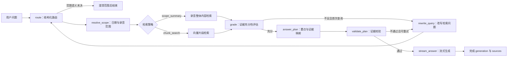

# Python 后端 RAG 迁移方案

## 1. 目标与边界

将旧 Node 链路中的录音问答迁移到 Python 后端，并以 **LangChain + LangGraph** 实现可观测、可校验、可重试的 RAG 工作流。

目标不是把一次 `query embedding -> topK -> answer` 调用搬到 Python，而是保留并完善旧 `lib/search/graph.ts` 的业务能力：先理解问题，再确定检索范围与策略，检索并评估证据，必要时改写问题重试，最后基于已确认的证据生成答案。

本方案的用户可见输出只有：

- 标准 Generation 消息流中的回答文本；
- 最终回答所依据的录音和片段范围（sources）。

路由策略、模型推断的过滤条件、检索分数、改写后的 query、模型内部推理和调试日志均不发送给前端。

本方案暂不实现账号、权限、多轮长期记忆或跨进程消息总线。

## 2. 基本原则

### 2.1 过滤条件由路由模型推断

前端只提交用户问题、结果数量和幂等键：

```json
{
  "query": "上周张三在上海的会议里提到了哪些交付风险？",
  "limit": 10,
  "idempotency_key": "..."
}
```

前端不提交通用 `filters`。地点、人名、目标人物、时间范围、最近第几条录音和检索话题，都由路由模型根据问题推断。

若未来产品在某条录音详情页提供“仅询问当前录音”的入口，可传递受控的 `scope`。它是产品明确给定的硬边界，只能与路由结果取交集、缩小查询范围，不能替代或覆盖模型推断的条件，也不称为 `filters`。

### 2.2 模型不直接操作数据库

模型可以输出结构化检索计划，但不能生成或猜测数据库记录。特别是：

- 不得编造 recording ID、speaker profile ID、chunk ID 或引用编号；
- 相对时间不由模型计算为日期；
- 实际录音范围、片段范围与 source 只由后端查询结果生成。

`今天`、`上周`、`最近三天` 等表达由 Python 按 `Asia/Shanghai` 确定性归一化为时间范围。

### 2.3 时间语义由模型识别，时间边界由后端计算

route 模型负责理解用户表达的时间语义，但不负责计算最终用于数据库查询的时间边界。职责链路为：

```text
用户自然语言时间
  -> route 提取原文与结构化时间语义
  -> resolve_scope 根据当前日期和 Asia/Shanghai 确定性计算
  -> created_from / created_to
```

例如，用户问“最近三个月的录音讲了什么”时，route 可以输出：

```json
{
  "time_range": {
    "text": "最近三个月",
    "kind": "relative_duration",
    "unit": "month",
    "value": 3,
    "offset": null
  }
}
```

用户问“上周的会议讲了什么”时，route 可以输出：

```json
{
  "time_range": {
    "text": "上周",
    "kind": "calendar_period",
    "unit": "week",
    "value": null,
    "offset": -1
  }
}
```

route 只判断“这是向过去回溯三个月”或“这是偏移量为 -1 的自然周”，不能自行生成最终 ISO 起止时间。`resolve_scope` 使用服务端可信的当前日期、时区和日历规则完成换算，因此跨月、跨年、夏令时和自然周边界都能被确定性测试。

明确的绝对日期仍保留用户原始表达，并由后端解析和校验。数据库范围统一采用左闭右开区间 `[created_from, created_to)`。例如查询 2026 年 7 月 15 日，最终范围应为：

```text
created_from = 2026-07-15T00:00:00+08:00
created_to   = 2026-07-16T00:00:00+08:00
```

不允许 route 模型根据“今天”自行推算“上周”的日期，也不允许把模型生成的未经验证的 ISO 时间直接用于 SQL。无法识别或后端暂不支持的时间表达应进入澄清分支，不能悄悄忽略时间条件后扩大检索范围。

### 2.4 生成只基于证据

回答模型只能看到本次检索得到的证据包和经过校验的回答计划。未检索到足够证据时，回答固定为“没有在录音中找到足够依据”，不让模型自由补充常识或猜测。

## 3. 技术选型

| 组件 | 选择 | 职责 |
|---|---|---|
| Prompt、ChatModel、结构化输出 | LangChain | 统一提示词、Pydantic 输出解析和模型调用边界。 |
| 工作流 | LangGraph | 编排有条件分支、重试上限和类型化 state。 |
| 向量检索 | PostgreSQL + pgvector | 保存 `recording_search_chunks`，并执行带元数据约束的相似度检索。 |
| embedding | Qwen/Qwen3-Embedding-4B | 查询向量生成；沿用当前本地模型缓存。 |
| 回答模型 | 本地 llama.cpp 模型 | 路由、证据评估、回答计划与最终流式回答。 |
| 消息流 | 既有 GenerationService | 事件持久化、HTTP SSE 续传、刷新恢复及前端 SDK。 |

LangChain 不作为黑盒 agent 使用。业务节点仍是可独立测试的 Python 函数；LangGraph 只负责节点串联、条件边和状态传递。

本地模型通过 LangChain ChatModel 适配器接入现有 `llama_cpp` 运行时。模型加载、Metal/GPU 参数、单模型并发锁、首 token 统计和流式 delta 都收敛在该适配器及共享运行时内，不再通过子进程调用旧 `lib/` 脚本。

## 4. 类型模型

路由模型的输出使用严格的 Pydantic 模型校验：

```python
class InferredFilters(BaseModel):
    person_names: list[str] = Field(default_factory=list)
    locations: list[str] = Field(default_factory=list)
    target_person_only: bool = False
    recording_ids: list[UUID] = Field(default_factory=list)
    speaker_profile_ids: list[UUID] = Field(default_factory=list)


class TimeRange(BaseModel):
    text: str
    kind: Literal["relative_duration", "calendar_period", "absolute_range"]
    unit: Literal["day", "week", "month", "quarter", "year"] | None = None
    value: int | None = Field(default=None, ge=1)
    offset: int | None = None


class RagRoute(BaseModel):
    status: Literal["resolved", "ambiguous", "unresolved"]
    strategy: Literal["chunk_search", "scope_summary"] | None = None
    topic: str | None = None
    recording_limit: int | None = Field(default=None, ge=1, le=10)
    recording_rank: int | None = Field(default=None, ge=1, le=10)
    time_range: TimeRange | None = None
    inferred_filters: InferredFilters = Field(default_factory=InferredFilters)
    error_code: Literal["ambiguous_recording_scope", "unresolved_query", "unsupported_time_expression"] | None = None
    reason: str = ""
```

时间条件只接受 `time_range`，不再兼容旧 `time_expression` 或 `date_range`。`text` 保留用户原话，其他字段只表达时间语义，最终日期范围仍由 `resolve_scope` 计算。`relative_duration` 必须同时提供 `unit` 和 `value`；`calendar_period` 必须提供 `unit`，`offset` 缺省时表示当前周期；`absolute_range` 只接受原始 `text`。字段组合不合法时 route 校验失败并停止，不回退到字符串关键词匹配。

由于本地 GGUF 模型不一定稳定支持原生 tool/function calling，路由使用 LangChain 的 `ChatPromptTemplate` 与 Pydantic JSON 输出解析器。`status` 是程序控制字段：只有 `resolved` 可以进入检索；`ambiguous` 和 `unresolved` 必须带机器可识别的 `error_code`，不能再借用自由文本 `reason` 控制流程。若模型没有返回可校验的 route（空输出、非法 JSON、缺失合法 strategy，或 `chunk_search` 缺少 topic），RAG 在 route 后立即结束：不检索、不调用回答模型，只返回“请换一种更明确的说法”的用户可见响应。绝不能把原问题静默降级为 `chunk_search(query)`，因为这会制造看似正常、实际不可解释的回答。

## 5. LangGraph 工作流



### 5.1 `route`

使用本地 LLM 将用户问题转成 `RagRoute`。

- 明确话题问题走 `chunk_search`；
- 询问某批录音整体内容的问题走 `scope_summary`；
- 既有限定范围又有具体话题时，仍优先走 `chunk_search`，范围仅作为检索约束；
- 路由输出保留模型推断的人名、地点、时间和目标人物限制。
- 对话历史中的 assistant 消息会按问答顺序附带其持久化的录音 source；route 上下文仅提取 `recording_id`、标题和时间范围，不使用 chunk 原文。模型自行判断用户的范围是延续历史 source，还是在问录音库按创建时间排序的记录；前者将 source 的既有 ID 写入 `inferred_filters.recording_ids`，后者使用 `recording_limit` / `recording_rank`。
- history source 是此前回答实际引用过的可信录音事实，可用于判断当前问题延续的录音范围；但 route 不能仅凭 source 的 ID、标题或时间范围推断录音具体内容，最终回答仍须重新检索证据。
- 用户表达的范围既可能来自对话上下文，也可能来自录音库排序、时间、人物、地点或其他条件。route 根据完整语义自行判断，不对“最近的录音”等固定短语编写特殊分支。
- 若存在多个同样合理的范围解释且无法唯一确定，模型返回 `status=ambiguous` 和 `error_code=ambiguous_recording_scope`，不填写猜测性的范围字段。RAG 立即返回澄清问题，不检索也不调用回答模型。
- 服务端验证 `recording_ids` 必须仍在当前授权范围内。历史 source 是模型获得既有 ID 的主要上下文；用户也可以在当前问题中直接指定自己有权限的录音，模型不能编造或越权选择任意 ID。

### 5.2 `resolve_scope`

将路由结果转换为实际数据库约束：

- 根据 route 提取的 `time_range`、服务端当前日期和 `Asia/Shanghai` 时区，将相对时长、自然日历周期及明确绝对日期转换为左闭右开的 `created_from / created_to`；
- 不信任或直接使用模型计算的最终 ISO 时间；无法解析的时间条件进入澄清分支，不能忽略条件后继续检索；
- “最近 N 条”“倒数第 N 条”先查询出录音 ID；
- 若请求带受控 `scope`，与这些录音 ID 取交集；
- 没有命中范围时直接结束，不加载 embedding 或回答模型。

### 5.3 `retrieve`

`scope_summary` 从命中录音读取其连续发言内容或已有总结，用于“上周会议都讲了什么”一类问题。

`chunk_search` 使用 `route.topic` 生成 query embedding，从 `recording_search_chunks` 执行 pgvector 检索，并应用模型推断的人名、地点、时间、目标人物和录音范围约束。

检索结果统一为 `Evidence`，其内容包括录音信息、chunk 文本、起止时间、说话人标签、匹配类型、相关度和可定位 URL。

### 5.4 `grade` 与 `rewrite_query`

先执行确定性检查：命中数、分数阈值、请求范围覆盖度、最近 N 条录音是否齐全；再由结构化 LLM 判断证据是否覆盖问题并给出改写后的检索问题。

证据不足时最多改写并重试一次。图 state 中保存 `retrieval_attempt`，避免无限循环。

### 5.5 `answer_plan` 与 `validate_plan`

回答不能先流式输出、之后才发现引用无效。因此先生成不面向用户的结构化回答计划：每个回答要点必须关联实际 `Evidence` 编号。

程序验证计划中所有证据编号存在，且不违反当前录音范围。验证失败时最多重新检索或重建计划一次。该计划、路由和评估结果仅写服务端日志，不发送到前端。

### 5.6 `stream_answer`

验证通过后，最终回答节点以已批准的计划和证据调用 LangChain ChatModel 的异步流式接口。每个文本增量通过既有 `StreamEmitter.text()` 写入标准 `content.delta` 事件。

前端只展示文本 block；模型 route、检索计划、grading 结果和思考过程不产生用户可见事件。

## 6. Generation、source 与 SSE

RAG 问答复用现有 Generation 基础设施，不新增 `ragClient`，也不增加独立的 `GenerationKind.RAG_ANSWER`。所有文本生成统一使用 `GenerationKind.TEXT`。

### 6.1 source 的持久化决策

source 在一次 generation 完成时确定，当前没有按 source 反向检索、统计或外键级联的业务需求。因此 **不新建 `generation_sources` 表**。

最终 source 直接写入现有 `generation_runs.output_payload`：

```json
{
  "notEnoughEvidence": false,
  "message": null,
  "sources": [
    {
      "recordingId": "recording-id",
      "recordingTitle": "周会录音",
      "chunkId": "chunk-id",
      "startMs": 12000,
      "endMs": 24800,
      "score": 0.86,
      "matchType": "vector"
    }
  ]
}
```

同一份 `sources` 也放入最终 `output.final` 事件，确保 SSE 连接、断线续传和 `GET /api/generations/{run_id}` 返回的快照一致。文本 delta 仍 append 到 `generation_events`，完整文本快照仍保存在 `output_blocks`。

将来仅在确实需要“查询一个录音被哪些问答引用”“按来源聚合统计”或需要 source 级外键约束时，才考虑拆分 `generation_sources` 表。

### 6.2 前端协议

前端继续使用唯一的 `GenerationStreamClient` 和 Zustand store：

1. `POST /api/rag/queries` 返回 `generation_run_id`；
2. client 连接 `GET /api/generations/{run_id}/events`；
3. `content.delta` 追加文本 block；
4. `output.final` 或 generation snapshot 提供 `sources`；
5. 页面刷新时先接收快照中完整 `blocks` 和 `sources`，再续传新事件。

前端不接收 `route`、`filters`、检索 query、grade 或内部日志。

## 7. 执行与资源调度

RAG generation 不能通过 FastAPI `BackgroundTasks` 直接在请求处理函数中执行。RAG 工作流在自身的 `RagWorkflowRunner` 中运行，模型与 embedding 节点再提交到和录音处理共用的内存资源调度器。

问答属于交互式任务，优先级高于后台总结；但单 GPU 上已经开始的 llama.cpp 推理不可安全抢占。UI 在资源等待时显示“等待模型资源”，不要伪装成“正在生成”。

资源运行时只负责通用任务协议，不理解 LangGraph state、录音节点或业务表：

```text
RAG LangGraph / PipelineCoordinator
          │ submit(queue, callable)
          ▼
ResourceScheduler
          ▼
CPU Runner / GPU Runner
          ▼
Future 结果 → 原工作流恢复并推进下一步
```

RAG 的 `route`、查询 embedding、`grade`、`plan` 和最终流式回答节点各自在需要模型资源时提交 callable。纯状态转换、SQL 结果整理和条件分支仍留在 LangGraph node 内直接执行，避免为每一个轻量函数制造队列往返。

共享资源运行时负责：

- 本地模型单例加载；
- GPU/Metal 初始化参数；
- 同一模型的并发锁；
- 首 token、总耗时和失败原因日志；
- 在 generation 取消请求后，于 token 或 chunk 边界优雅退出。

## 8. 代码结构

```text
backend/src/
  rag/
    contracts.py       # Pydantic 路由、证据、答案计划模型
    state.py           # LangGraph TypedDict state 与 reducer
    prompts.py         # route / grade / plan / answer 提示词
    model.py           # LangChain ChatModel 与本地共享模型运行时
    scope.py           # 相对日期、最近 N 条和受控 scope 合成
    retrieval.py       # scope 与 pgvector 检索
    validation.py      # 证据充分性、计划及 source 校验
    graph.py           # LangGraph StateGraph 和条件边
    service.py         # 创建 generation、提交 RAG 工作流资源任务、写入 StreamEmitter
    operations.py      # RAG 提供给通用资源运行时的执行能力
  task_runtime/
    scheduler.py       # 内存 CPU/GPU 队列、优先级、Future 与优雅关闭
    resources.py       # 资源队列与重试策略公共类型
  api/routes/rag.py    # HTTP 输入校验与 generation 创建
```

现有临时的 `application/rag.py`、`application/rag_router.py` 在迁移完成后删除，不应与新图并存为两套路由实现。

## 9. 实施与验证顺序

1. 在 `backend/pyproject.toml` 引入 LangChain、LangGraph 及本地 llama.cpp 的 LangChain 适配依赖。
2. 实现 contracts、Prompt 和路由节点，使用固定模型响应做单元测试。
3. 实现 scope 归一化与两种 retrieval，并覆盖数据库筛选、日期、最近 N 条和空范围测试。
4. 实现 grade、query rewrite、answer plan 和计划校验的图分支测试，验证最大重试次数。
5. 接入现有 GenerationService，验证 delta、`output_payload.sources`、SSE 续传和页面刷新恢复。
6. 将 RAG 执行从 `BackgroundTasks` 迁移到 generation worker，验证与录音总结并发时的 GPU 排队行为。
7. 使用真实录音做端到端手工验证：范围总结、话题问答、人名/地点/时间约束、无证据回答、断线重连和取消。
