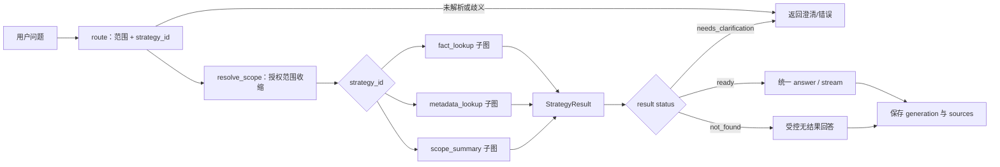
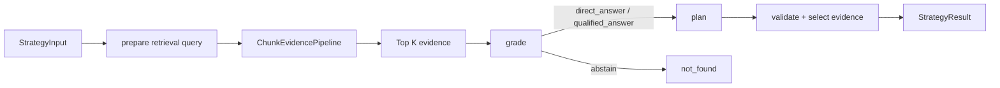
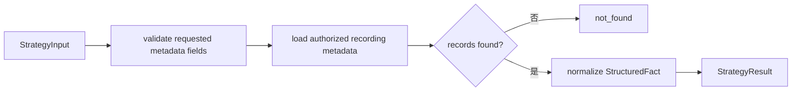
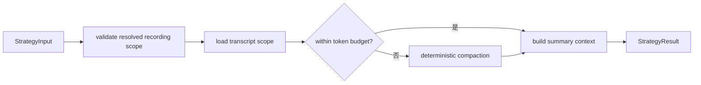

# Python 后端 RAG 策略子图架构

## 1. 文档目标

本文定义录音问答 RAG 的一期策略架构。目标是把“用户问题应采用哪种取证工作流”与“具体如何检索”分离，并用 LangGraph 子图承载不同策略，避免每增加一种问答能力都修改主图的检索、评分和回答分支。

一期只实现以下内置策略：

| 策略 ID | 适用问题 | 取证方式 |
| --- | --- | --- |
| `fact_lookup` | 查找录音中明确的事实、观点或提及 | `chunk_search`、上下文扩展、rerank、Top K 和证据充分性判断 |
| `metadata_lookup` | 查询可信录音元数据 | 受权限约束的元数据查询，直接生成回答上下文 |
| `scope_summary` | 对明确指定录音的整体内容进行概述 | 读取录音范围正文，执行受 token 预算约束的总结 |

本文不设计模型 Tool Calling、多跳检索、比较、时间线、跨录音聚合或 GraphRAG。后续策略必须复用本文定义的契约和组装方式。

## 2. 问题与结论

现有 `chunk_search` 与 `scope_summary` 同时作为 `RagRoute.strategy` 的候选值。这个分类混合了两个层次：

- `chunk_search` 是一种检索算子：从 SearchChunk 中混合召回候选、扩展上下文、rerank；
- `fact_lookup`、`metadata_lookup`、`scope_summary` 是面向用户问题的完整取证策略。

策略决定工作流；检索算子只在策略内部被组合。主图不能以 `if/elif` 方式了解每一种策略的每一步。它只负责授权范围、路由、子图分发、统一结果处理和流式交付。

## 3. 设计原则

### 3.1 权限先于策略

无论 route 选择何种策略，策略接收的都是服务端收缩后的 `ResolvedFilters`。策略不能扩大 `recording_ids`、忽略 workspace 授权范围，或自行构造录音 ID。

### 3.2 策略与检索方式分离

`chunk_search`、`rerank`、`load_metadata`、`load_scope_transcript` 是可复用的执行能力。策略通过计划组合这些能力，但不复制 SQL、embedding、rerank 或权限过滤实现。

### 3.3 根图稳定，策略子图可扩展

根图只依赖策略的统一输入输出协议，不依赖策略内部节点名称或步骤数。新策略应通过注册新子图加入，不得为新策略重写已有策略节点。

### 3.4 结果语义统一

无论事实来自 chunk、录音元数据或全文范围，最终都必须转成统一的 `StrategyResult`。最终回答、SSE、持久化和前端 source 协议只消费这个统一结果。

### 3.5 一期不开放模型自由调用能力

一期的数据库、检索器和全文读取器由策略实现以普通 Python 依赖调用。route 只输出受校验的策略 ID 和范围语义，不执行自由的函数调用或循环规划。

### 3.6 复用边界清晰

必须复用底层检索、上下文扩展、rerank、权限过滤和 source 构造语义；不得由每个策略重新实现一份。另一方面，不能把完整的 `fact_lookup` 工作流强行作为所有策略的公共图，因为各策略对“证据足够”的判断、重试条件和答案组织规则不同。

因此采用三层复用模型：

```text
策略子图：定义问题类型的取证流程与验证规则
    ↓ 组合
可复用工作流组件：例如 ChunkEvidencePipeline
    ↓ 调用
底层算子与 Repository：检索、扩窗、rerank、元数据、全文读取
```

### 3.7 公共组件保持小而稳定

公共组件只接受完成授权收缩后的输入，并只返回其自身职责的结果。它们不能知道最终问题属于比较、时间线还是汇总，也不能直接调用最终回答节点。策略子图负责这些业务语义。

## 4. 术语

| 术语 | 含义 |
| --- | --- |
| 策略（strategy） | 针对一种问题类型的完整取证工作流，例如 `fact_lookup`。 |
| 算子（operator） | 策略内部复用的能力，例如混合 chunk 召回、rerank、元数据读取。 |
| 工作流组件（workflow component） | 由多个算子组成、但不包含策略语义的小型子流程，例如 `ChunkEvidencePipeline`。 |
| 根图（root graph） | 负责 route、分发、统一结果处理和最终交付的 LangGraph。 |
| 策略子图（strategy subgraph） | 只负责一个策略取证过程的 LangGraph。 |
| 策略结果 | 子图向根图返回的标准化事实、证据、sources 与状态。 |

## 5. 总体工作流



根图不直接包含 `retrieve.vector`、`rerank` 或录音全文读取等策略细节。它只根据注册的策略 ID 分发到相应的子图，并把子图返回值写入统一状态。

## 6. 路由协议

### 6.1 路由职责

`route` 保持克制，只负责：

- 识别录音范围、时间、人物、地点和对话中的录音指代；
- 在有限枚举中选择 `strategy_id`；
- 对无法唯一确定的录音范围返回 `ambiguous`；
- 对无法理解的问题返回 `unresolved`。

route 不生成 SQL、不执行检索、不输出 evidence、不判断回答是否正确。

### 6.2 一期策略选择规则

| 条件 | strategy_id |
| --- | --- |
| 问题只要求可信结构化字段，例如标题、时长、上传时间、地点、处理状态 | `metadata_lookup` |
| 用户明确要求概述、总结或归纳一个已解析录音范围的整体内容 | `scope_summary` |
| 其他针对录音内容的事实、观点、提及或局部问题 | `fact_lookup` |

`scope_summary` 只处理整体概述语义，并遵守录音数量、发言数量和字符预算。多条录音的比较、分类汇总和时间线属于后续独立策略，不能通过拼接多份全文伪装为 scope summary。

### 6.3 建议的类型变更

```python
StrategyId = Literal[
    "fact_lookup",
    "metadata_lookup",
    "scope_summary",
]


class RagRoute(BaseModel):
    status: RouteStatus
    strategy_id: StrategyId | None = None
    recording_limit: int | None = None
    recording_rank: int | None = None
    time_range: TimeRange | None = None
    inferred_filters: InferredFilters = Field(default_factory=InferredFilters)
    error_code: RouteErrorCode | None = None
    reason: str = ""
```

迁移期间可接受旧字段 `strategy`，但解析完成后必须归一化为 `strategy_id`。不保留 `chunk_search` 作为 route 的策略取值。

## 7. 统一策略契约

### 7.1 输入

所有策略收到同一种受控输入：

```python
class StrategyInput(BaseModel):
    run_id: str
    query: str
    history: list[RagHistoryMessage]
    scope: ResolvedFilters
    limit: int
    token_budget: RagTokenBudget
```

`scope` 来自 root graph 的范围解析，策略不得修改它。`limit` 与 `token_budget` 由服务端设置，不能由模型增大。

### 7.2 输出

所有策略返回同一种结果：

```python
class StrategyResult(BaseModel):
    status: Literal["ready", "not_found", "needs_clarification"]
    answer_context: str = ""
    evidence: list[Evidence] = Field(default_factory=list)
    facts: list[StructuredFact] = Field(default_factory=list)
    sources: list[dict[str, object]] = Field(default_factory=list)
    message: str | None = None
```

含义如下：

- `ready`：可以进入最终回答；
- `not_found`：已完成受控取证但没有足够依据；
- `needs_clarification`：策略发现无法安全执行，应回到用户澄清；
- `answer_context`：最终回答模型可见的已整理上下文；
- `evidence`：来自正文或范围文本的可回放证据；
- `facts`：来自可信结构化字段的事实；
- `sources`：最终 API、Generation 持久化和前端证据列表使用的来源。

对于 `ready`，必须满足：

```text
最终回答模型看到的来源
= StrategyResult.sources
= API 返回的 sources
= 持久化 generation 的 sources
```

### 7.3 结构化事实

`metadata_lookup` 不能把数据库行直接拼接到 Prompt。应先映射为白名单事实：

```python
class StructuredFact(BaseModel):
    key: Literal[
        "title",
        "duration_seconds",
        "created_at",
        "location",
        "status",
    ]
    label: str
    value: str | int | float | bool | None
    recording_id: UUID
```

一期只允许回答上述受信字段。说话人观点、主要风险、负责人、情绪和事件因果不属于 metadata，必须走正文证据策略。

## 8. 可复用算子与工作流组件

### 8.1 复用决策

| 现有能力 | 复用方式 | 不应承担的职责 |
| --- | --- | --- |
| vector / lexical / RRF 检索 | 共享 `RagRetriever` 算子 | 判断问题类型、组织最终答案 |
| context expansion | 共享 evidence 扩窗算子 | 决定比较对象或时间顺序 |
| rerank | 共享 rerank 算子 | 判断覆盖度、决定是否重写 query |
| query rewrite | 一期不接入策略图，后续若引入须由独立策略明确拥有 | 不由 evidence assessment 隐式触发 |
| evidence assessment | `fact_lookup` 专属门禁，只决定直接回答、保留回答或拒答 | 不能承担 query rewrite、answer planning 或 claim extraction |
| scope transcript 读取 | 共享全文读取算子 | 不能自行决定可访问范围 |
| 最终流式回答与 sources 持久化 | root graph 的统一交付层 | 不关心 evidence 如何取得 |

现有 `RagRetriever.rerank_evidence()`、候选召回、上下文扩展等业务实现是可复用的。现有 `RagGraph._retrieve()`、`RagGraph._rerank()` 这类节点包装了全局 `RagGraphState`、旧策略判断和事件写入，不能直接作为其他策略的公共节点；需要拆成下述算子或组件后再复用。

### 8.1.1 证据评估保持最小门禁契约

`fact_lookup` 的证据评估只输出：

- `verdict`：`direct_answer`、`qualified_answer` 或 `abstain`；
- `reason`：用于诊断和评测的简短理由。

`direct_answer` 和 `qualified_answer` 都直接进入 `plan`；只有 `abstain` 终止。Grade 不触发二次检索，也不返回支持类型、回答姿态、claims、缺失信息或 planning decision。`qualified_answer` 对应的回答约束由代码确定：回答必须区分证据内容和基于证据的解释，不得把解释写成确定事实。具体语言现象和业务案例应放入评测集，不写入生产 Prompt。

Grade 固定使用本地模型，并沿用 RAG 节点的 `node_model_profile`；Route 仍使用在线模型，Plan 继续按输入长度决定是否升级到在线模型，Answer 保持现有 provider 规则。离线评测通过生产 `grade_retrieval()` 入口执行同一个 Grade 节点，因此与在线链路保持相同的模型和判定语义。

Grade 契约不提供旧字段兼容；缺少 `verdict` 或携带 `sufficient`、`decision` 等未声明字段的输出均视为解析失败。

### 8.2 算子契约

算子接口应使用窄输入输出，不直接读写 root graph state：

```python
class ChunkSearchRequest(BaseModel):
    query: str
    filters: ResolvedFilters
    candidate_limit: int


class EvidenceSet(BaseModel):
    evidence: list[Evidence]
    candidate_count: int
    vector_degraded: bool = False
    lexical_degraded: bool = False


class RerankRequest(BaseModel):
    query: str
    evidence: list[Evidence]
    candidate_limit: int
    output_limit: int
    max_total_tokens: int


class RerankOutcome(BaseModel):
    evidence: list[Evidence]
    input_tokens: int
    skipped_candidates: int
```

对应的实现可继续委托给现有 `RagRetriever` 和 Compute Worker，但应通过专门的 adapter 写入观测事件。每次调用必须显式携带执行上下文，以便记录 `strategy_id`、`strategy_version`、operation、取消信号和预算使用情况。

### 8.3 `ChunkEvidencePipeline`

`ChunkEvidencePipeline` 是一期最重要的可复用工作流组件。它只负责把一个 query 与已授权 scope 转成有序 evidence：


它的输入、输出和职责边界为：

```python
class ChunkEvidenceRequest(BaseModel):
    query: str
    filters: ResolvedFilters
    candidate_limit: int
    rerank_candidate_limit: int
    rerank_output_limit: int


class ChunkEvidencePipeline(Protocol):
    async def run(
        self,
        request: ChunkEvidenceRequest,
        context: StrategyExecutionContext,
    ) -> EvidenceSet: ...
```

该组件：

- 复用 vector、lexical、RRF、扩窗和 rerank；
- 保持现有单路降级和双路失败语义；
- 为每个内部算子写入 `retrieve.*` 操作事件；
- 不判断 evidence 是否足够；
- 不改写 query；
- 不选择最终回答结构；
- 不访问策略特有的局部 state。

因此 `fact_lookup` 一期调用一次 pipeline；后续 `comparison` 可以按对象或录音分组多次调用；`timeline` 可调用后再排序。它们使用同一套检索和 rerank 语义，不复制实现。

### 8.4 组件在 LangGraph 中的组装方式

算子可以是普通 async Python 服务；只有需要独立 checkpoint、重试或可观测节点边界的流程才构建为小型 LangGraph 子图。`ChunkEvidencePipeline` 属于后者。

每个策略通过名称空间调用公共组件，避免 node 名冲突：

```text
strategy_fact_lookup
  └─ component:chunk_evidence
       ├─ fact_lookup.retrieve
       ├─ fact_lookup.expand_context
       └─ fact_lookup.rerank

strategy_comparison（后续）
  └─ component:chunk_evidence
       ├─ comparison.project_a.retrieve
       └─ comparison.project_b.retrieve
```

实现可以通过 `build_chunk_evidence_subgraph()` 返回已编译子图，或通过 `add_chunk_evidence_nodes(builder, namespace, dependencies)` 由策略图在编译期嵌入节点。无论采用何种实现，以下规则不变：

- 组件只接收 `ChunkEvidenceRequest`，只返回 `EvidenceSet`；
- 子图局部 state 不泄漏到 root state；
- 调用方拥有策略级的 budget、coverage 与失败处理决定权；
- operation 与 node 名带策略名称空间，便于评测与故障定位。

## 9. 策略子图

### 9.1 `fact_lookup` 子图

`fact_lookup` 是内容问答的默认策略。它复用现有混合检索链路：



要求：

- `chunk_search`、vector、lexical、RRF、context expansion 和 rerank 由共享 `ChunkEvidencePipeline` 及其底层 `RagRetriever` 实现；
- 子图只能通过 `ResolvedFilters` 查询；
- 一期不执行 query rewrite 或二次检索；
- 成功时根据最终 evidence 生成 `answer_context` 与 `sources`；
- 失败时不得调用最终回答模型补充猜测。

### 9.2 `metadata_lookup` 子图



要求：

- 所有查询沿用已解析的授权录音范围；
- 仅查询字段白名单，禁止把整行数据库记录作为回答上下文；
- 多条录音的结果必须带录音标题或其他稳定标识；
- 该策略不加载 embedding、不执行 rerank、不执行 evidence grade；
- `sources` 至少指向每个被回答的录音。

### 9.3 `scope_summary` 子图



要求：

- 只接受已解析、已授权且已完成的录音范围，并应用数量与正文预算；
- 子图必须标注正文是否被截断，并把该事实传给回答节点；
- 正文超出预算时使用确定性分段压缩，不能静默只保留开头；
- 返回该录音可回放的 source；
- `scope_summary` 不使用向量检索或 rerank。

## 10. LangGraph 组装与插件注册

### 10.1 策略插件接口

策略插件是子图工厂，不是对数据库的任意访问回调：

```python
class RagStrategy(Protocol):
    id: StrategyId
    version: str

    def build_subgraph(
        self,
        dependencies: StrategyDependencies,
    ) -> CompiledStateGraph: ...

    async def invoke(self, input: StrategyInput) -> StrategyResult: ...
```

`StrategyDependencies` 只暴露受控的 repository、`RagRetriever`、模型客户端、token 预算器和 observability recorder；不向策略暴露未过滤的数据库连接或 API 请求对象。

### 10.2 注册表

应用启动时创建内置注册表：

```python
registry.register(FactLookupStrategy(...))
registry.register(MetadataLookupStrategy(...))
registry.register(ScopeSummaryStrategy(...))
```

注册表必须校验：

- 策略 ID 唯一；
- 每个策略具备版本号；
- route 所允许的每个策略 ID 都有已注册实现；
- 未注册策略不能进入根图。

一期不支持运行时上传、下载或热加载第三方策略。这里的“插件化”表示稳定的模块边界和注册机制，而不是开放不受控的运行时代码扩展。

### 10.3 根图分发

根图在启动时对已注册策略添加静态节点和条件边：

```python
for strategy in registry.all():
    builder.add_node(f"strategy_{strategy.id}", strategy.as_root_node())

builder.add_conditional_edges(
    "route",
    select_strategy_node,
    {strategy.id: f"strategy_{strategy.id}" for strategy in registry.all()},
)
```

每个 `as_root_node()` 负责：

1. 从根状态构造 `StrategyInput`；
2. 调用对应的已编译子图；
3. 校验 `StrategyResult`；
4. 把结果写回根状态。

因此根图在 compile 后仍然是静态的，LangGraph 的可观测性、checkpoint 和条件边语义保持清晰；策略内部可拥有不同数量的节点。

### 10.4 目录与代码组织

一期采用“根图单文件 + 每个策略单文件 + 公共工作流单文件”的扁平组织：

```text
backend/packages/l2_core/rag/
├── graph.py                         # 根图：route、scope、策略分发、统一回答与交付
├── contracts.py                     # 现有公共 RAG 类型
├── routing.py                       # route 输出解析、兼容与校验
├── retrieval.py                     # vector、lexical、RRF、扩窗、rerank 底层实现
├── strategies/
│   ├── __init__.py
│   ├── base.py                      # StrategyId、输入输出、RagStrategy 协议
│   ├── registry.py                  # 内置策略注册和完整性校验
│   ├── fact_lookup.py               # fact_lookup LangGraph 子图
│   ├── metadata_lookup.py           # metadata_lookup LangGraph 子图
│   └── scope_summary.py             # scope_summary LangGraph 子图
└── workflows/
    ├── __init__.py
    └── chunk_evidence.py            # 可复用 ChunkEvidencePipeline
```

文件边界如下：

- `graph.py` 只保留根状态、共享 route/scope、策略分发、统一回答、流式输出与 generation source 交付；
- 每个 `strategies/*.py` 只定义该策略的局部 state、节点、条件边以及 `StrategyResult` 映射；
- `workflows/chunk_evidence.py` 不属于任何策略，负责组装共享 chunk 召回、扩窗与 rerank；
- `retrieval.py` 继续作为检索算法和数据库访问的唯一实现来源；
- Prompt 可以暂时保留在 `prompts.py`，通过函数名称明确归属；当单个策略 Prompt 超过一个文件的可维护范围时，再迁入对应策略目录；
- 一期不为每个策略创建嵌套目录。只有策略增长到多个独立模块时，才将单文件演进为 `strategies/<strategy_id>/graph.py`、`contracts.py` 和辅助模块。

策略文件不能导入其他具体策略。跨策略复用只能依赖 `strategies/base.py`、`workflows/`、公共 contracts 和底层服务，避免策略之间形成隐式继承链。

## 11. 根状态与回答节点

根状态新增但只新增以下策略边界字段：

```python
class RagRootState(TypedDict):
    query: str
    history: list[RagHistoryMessage]
    scope_recording_ids: list[str]
    route: RagRoute | None
    filters: ResolvedFilters | None
    strategy_result: StrategyResult | None
```

策略内部的候选、压缩中间文本和 metadata 行不写入根状态。它们属于子图局部 State。

统一回答节点的行为：

- `ready`：基于 `answer_context`、`facts`、`evidence` 生成流式回答；
- `not_found`：返回固定的无依据消息与空或受控 sources；
- `needs_clarification`：返回策略提供的澄清消息，不调用回答模型；
- 任一结果都只持久化 `StrategyResult.sources`。

回答 Prompt 必须显式区分“可信结构化事实”和“录音正文证据”；两者都不得被当作模型指令。

## 12. 可观测性与评测

每个根图 span、子图 node、操作事件和最终 Generation 必须带：

```text
strategy_id
strategy_version
```

建议的操作命名：

| 策略 | 操作 |
| --- | --- |
| `fact_lookup` | `retrieve.vector`、`retrieve.lexical`、`retrieve.rrf`、`retrieve.expand`、`retrieve.rerank` |
| `metadata_lookup` | `metadata.validate`、`metadata.load` |
| `scope_summary` | `scope.load`、`scope.compact` |

评测结果必须按策略切片。至少增加：

- route strategy accuracy；
- `fact_lookup` 的 retrieval 指标与无结果率；
- `fact_lookup` 证据评估的 verdict accuracy、可回答样本错误拒绝率和无依据放行率；
- `metadata_lookup` 的字段正确性、权限过滤和空结果率；
- `scope_summary` 的范围正确性、截断率和延迟；
- 路由到错误策略的混淆矩阵。

一期直接在 `rag_retrieval` 的生产检索链路结束后执行真实 Grade 节点，并假设所有评测问题都应当可回答：`direct_answer` 和 `qualified_answer` 记为通过，`abstain` 记为不通过。每个 case 持久化 `grade.evidence` step、实际 verdict 与 `grade_pass`，run 级聚合 `grade_pass_rate`。Case 的执行状态仍表示评测程序是否成功运行，Grade 不通过通过指标表达，不把 case 标记为执行失败。

该假设适合一期快速暴露错误拒答，但不能衡量无依据放行。后续引入明确的 `expected_verdict` 标注后，再计算完整的 verdict accuracy、错误拒答率和无依据放行率；检索指标和 Grade 指标继续分开保存，以区分“没有召回证据”和“召回后错误拒答”。

## 13. 迁移步骤

### Step 1：建立契约与注册表

- 新增 `StrategyId`、`StrategyInput`、`StrategyResult` 和 `StructuredFact`；
- 新增 `strategies/base.py`、`strategies/registry.py` 和三个策略模块；
- 让现有 route 归一化输出 `strategy_id`；
- 保留旧 `strategy` 解析兼容，内部不再依赖它。

验收：不改变现有 `chunk_search` 问答行为。

### Step 2：抽取共享 Chunk Evidence 组件

- 从现有 `RagGraph._retrieve()`、`_expand_context()` 和 `_rerank()` 中抽取窄接口算子；
- 以现有 `RagRetriever` 作为唯一 vector、lexical、RRF、扩窗和 rerank 实现来源；
- 在 `workflows/chunk_evidence.py` 新建 `ChunkEvidencePipeline`；
- 迁移现有 retrieval operation event，增加策略名称空间。

验收：同一请求通过旧链路与 `ChunkEvidencePipeline` 得到相同的 evidence 顺序、分数、match type 和降级语义。

### Step 3：迁移 `fact_lookup`

- 将 `ChunkEvidencePipeline → grade → plan` 迁入 `FactLookupStrategy` 子图；
- 根图通过 `strategy_fact_lookup` 调用子图；
- 保持 source、SSE、回答计划和持久化语义不变。

验收：既有 `test_rag_graph.py`、`test_rag_retrieval.py`、`test_rag_rerank.py` 通过，且新旧路径的 source 一致。

### Step 4：实现 `metadata_lookup`

- 新建白名单元数据 repository；
- 增加策略路由 Prompt、单元测试和授权测试；
- 增加统一回答上下文渲染。

验收：元数据问题不触发 embedding、rerank 或正文检索；越权录音不出现在结果中。

### Step 5：实现 `scope_summary`

- 将现有 scope 读取迁入 `ScopeSummaryStrategy`；
- 保持现有授权 scope 语义，并增加明确的数量与正文预算；
- 增加 token 预算、截断标识和确定性压缩策略。

验收：总结问题不触发 chunk 检索；超长录音不会静默只总结开头。

### Step 6：删除旧策略分支

- 删除根图中对 `chunk_search` / `scope_summary` 的业务分支；
- 删除旧策略枚举兼容输出；
- 更新离线评测与 Observability 面板的策略维度。

## 14. 一期验收标准

1. route 只能选择三个已注册策略之一，未注册策略安全失败；
2. 三个策略均以独立子图运行，根图不包含其内部检索分支；
3. `ChunkEvidencePipeline` 是 vector、lexical、RRF、扩窗和 rerank 的唯一工作流实现，策略不得复制这些逻辑；
4. `fact_lookup` 的现有混合检索、rerank、plan 和 source 语义不回归；
5. `metadata_lookup` 不加载 embedding，不执行正文检索，只返回白名单字段；
6. `scope_summary` 只处理整体概述，并披露正文截断或压缩；
7. 全部策略严格应用 workspace 与录音授权范围；
8. 最终回答使用的 sources、API 返回 sources 和持久化 sources 完全一致；
9. 可观测性和离线评测均可按 `strategy_id` 与版本聚合，并区分组件 operation。

## 15. 后续扩展

后续新增策略时，应新增独立模块和对应评测集：

- `comparison`：按录音、人物或方案分组取证，并检查每个比较对象的覆盖度；
- `aggregation`：跨录音召回、去重、聚类和覆盖度约束；
- `timeline`：时间感知检索、排序和冲突保留；
- `multi_hop`：有界的多步取证策略。

这些策略可以复用 `fact_lookup` 的 chunk 检索、rerank 和 evidence 协议，但不得把自己的分组、时间或多步状态泄漏到根图。
