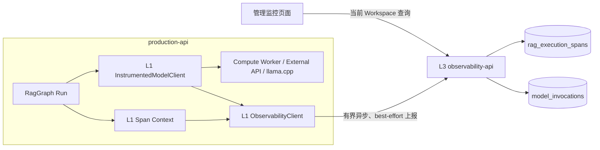

# Python 后端 RAG Token 与执行链路监控技术方案

> 文档状态：数据模型与指标定义继续有效；统计事件投递方式已调整。目标架构不再使用进程内 bounded queue + HTTP ingestion，而是由 Kafka 承载 `rag.execution-events` 与 `model.invocation-events`，Observability Worker 持续批量消费并幂等 UPSERT 查询投影。参见 [`redis-kafka-architecture-refactor.md`](./redis-kafka-architecture-refactor.md)。

## 1. 文档目标

本文档定义录音问答 RAG 的 Token、模型费用和节点执行链路监控方案。方案需要满足：

- 记录一次 RAG Run 中每个节点的执行状态、耗时、重试和关键业务指标；
- 记录每次模型调用的输入 Token、输出 Token、模型、Provider 和估算费用；
- 新增 RAG 节点时不修改数据库固定列，也不要求前端发布新版本才能展示；
- 同时支持本地 llama.cpp 和外部大模型 API；
- 失败、取消和中途重试的调用也必须保留实际消耗；
- 普通录音问答页面不展示 Token 细节；监控能力放在独立管理页面；
- 第一版暂时允许所有已登录的当前 Workspace 成员访问，后续收紧为 Workspace `owner/admin`。

本方案同时实现 Run 级 Token 软上限；暂不增加费用告警、Prompt 全文审计或 LangGraph 分布式 checkpoint。

## 2. 当前基础与缺口

### 2.1 已有基础

项目已经具备：

- `LlmGenerateResult` 中的 `prompt_tokens`、`completion_tokens`、`provider`、`model`、`request_id` 和 `finish_reason`；
- 智谱、Gemini 等外部 Provider 对 API usage 的解析；
- Compute Worker 将非流式和流式终态 usage 返回给调用方的能力；
- RAG 的 `node_started`、`node_completed`、`node_failed`、`transition` 和 `graph_completed` 结构化日志；
- `generation_runs`、`generation_events` 和 `run_id` 全链路关联；
- `generation_runs.first_token_at` 和节点耗时日志。

### 2.2 当前缺口

当前 `RagGraph._complete()` 只返回 `result.text`，丢弃 `LlmGenerateResult` 中的 usage；流式回答也没有保留 `execute_streaming()` 返回的终态结果。因此外部 Provider 已经返回的 Token 尚不能关联到 RAG 节点和 Generation Run。

本地 llama.cpp Provider 当前没有填充 Token usage。即使本地模型没有按 Token 计费，Token 仍直接影响：

- Prompt evaluation 延迟；
- KV Cache 占用；
- GPU/CPU 吞吐；
- 并发容量；
- 首 Token 延迟。

现有结构化日志可以排障，但不能稳定支持历史查询、前端时间线、Workspace 聚合和失败任务费用统计。

## 3. 设计原则

### 3.1 节点名称不是数据库结构

禁止设计固定字段：

```json
{
  "routeTokens": 900,
  "gradeTokens": 5200,
  "planTokens": 4800,
  "answerTokens": 4500
}
```

后续增加 `query_decompose`、`rerank`、`claim_validate` 或 `answer_rewrite` 时，这种结构会迫使数据库、API 和前端同步修改。

所有节点统一使用开放字符串 `operation`：

```text
route
retrieve
retrieve.embedding
retrieve.vector
retrieve.lexical
retrieve.fusion
retrieve.context_expansion
grade
rewrite.query
plan
answer
validate.claims
rewrite.answer
```

前后端不得用封闭枚举限制 operation。命名采用小写点分层级，允许按 `retrieve.*`、`rewrite.*` 聚合。

### 3.2 执行 Span 与模型 Usage 分离

每个 RAG 节点都有执行耗时和状态，但不是每个节点都调用模型：

```text
retrieve.vector       有耗时，无 LLM Token
retrieve.lexical      有耗时，无 LLM Token
retrieve.fusion       有耗时，无 LLM Token
grade                 有耗时，有 LLM Token
answer                有耗时，有 LLM Token
```

因此分为：

- `rag_execution_spans`：回答“执行了什么、用了多久、结果如何”；
- `model_invocations`：回答“模型调用当前是什么状态、调用了哪个模型、消耗多少 Token、产生多少费用”。

两者通过 `span_id` 关联。一个 Span 可以没有模型调用、调用一次模型，或因重试而产生多次模型调用。

### 3.3 实际 Usage、精确本地计数和估算值分离

Token 来源按可信度区分：

```text
provider         外部 Provider 返回的实际 usage
local_tokenizer  使用实际本地模型 tokenizer 计算
estimated        仅用于上下文构成分析的估算
unavailable      调用失败且无法取得 usage
```

计费和总量优先使用 `provider`；本地容量分析使用 `local_tokenizer`；query/history/evidence 构成允许使用 `estimated`。不得把字符数除以常量后伪装成 Provider 实际 Token。

### 3.4 逐调用落库，Run 结束后汇总

每次模型调用开始时写入 `running`，结束时用同一个 caller-generated ID 幂等更新为终态。不能只在 `generation_run` 成功时保存汇总，否则会遗漏：

- Answer 流式生成一半后取消；
- Grade 成功后后续节点失败；
- Query rewrite 第二轮失败；
- 外部 API 已计费但模型输出解析失败；
- Worker 或网络在终态前异常。

Run 汇总是可重建的读模型，不是原始事实来源。

### 3.5 Workspace 隔离

所有监控查询必须限定 `workspace_id = current_user.current_workspace_id`。第一版“所有用户可查看”指当前 Workspace 中所有已登录成员均可查看，不代表匿名访问或跨 Workspace 查看。

## 4. 总体架构



职责：

- L1 Span Context：创建、结束和失败 execution span，同时保留现有结构化日志；
- L1 `InstrumentedModelClient`：统一包装 Worker 模型调用，不在各节点复制埋点；
- L1 `ObservabilityClient`：有界队列、短超时、best-effort 上报，监控故障不能阻断回答；
- L3 `observability-api`：负责幂等写入、聚合查询、当前 Workspace 权限和后续费用规则；不代理模型调用；
- 管理页面：概览、Run 列表和单 Run 时间线。

## 5. 数据库设计

### 5.1 `rag_execution_spans`

```sql
create table if not exists rag_execution_spans (
    id uuid primary key default gen_random_uuid(),
    workspace_id uuid not null references workspaces(id) on delete restrict,
    generation_run_id uuid not null references generation_runs(id) on delete cascade,
    parent_span_id uuid references rag_execution_spans(id) on delete cascade,
    operation text not null,
    operation_version text not null default '1',
    attempt integer not null default 0 check (attempt >= 0),
    status text not null check (status in ('running', 'succeeded', 'failed', 'cancelled')),
    started_at timestamptz not null default now(),
    finished_at timestamptz,
    elapsed_ms numeric,
    error_type text,
    metadata jsonb not null default '{}'::jsonb,
    created_at timestamptz not null default now(),
    updated_at timestamptz not null default now(),
    check (length(btrim(operation)) > 0),
    check (length(btrim(operation_version)) > 0),
    check (jsonb_typeof(metadata) = 'object'),
    check (
        (status = 'running' and finished_at is null and elapsed_ms is null)
        or
        (status <> 'running' and finished_at is not null and elapsed_ms is not null and elapsed_ms >= 0)
    )
);

create index if not exists rag_execution_spans_run_started_idx
    on rag_execution_spans (generation_run_id, started_at, id);

create index if not exists rag_execution_spans_workspace_started_idx
    on rag_execution_spans (workspace_id, started_at desc);

create index if not exists rag_execution_spans_operation_started_idx
    on rag_execution_spans (workspace_id, operation, started_at desc);
```

字段说明：

| 字段 | 说明 |
|---|---|
| `id` | Span ID，同时用于模型 usage 关联。 |
| `parent_span_id` | 表达节点嵌套关系；根 Span 为空。 |
| `operation` | 开放字符串节点名，不使用数据库枚举。 |
| `operation_version` | 节点语义或 Prompt 版本，用于回归比较。 |
| `attempt` | 同一操作在当前 Run 中的重试或循环次数。 |
| `metadata` | 候选数、Evidence 数、检索策略等非敏感动态指标。 |

建议 metadata 示例：

```json
{
  "retrievalStrategy": "chunk_search",
  "evidenceCount": 8,
  "recordingCount": 3,
  "vectorCandidates": 30,
  "lexicalCandidates": 30,
  "sufficient": true
}
```

metadata 禁止保存完整 Prompt、用户问题、Evidence 正文、录音转写或模型原始响应。

### 5.2 `model_invocations`

```sql
create table if not exists model_invocations (
    id uuid primary key default gen_random_uuid(),
    workspace_id uuid not null references workspaces(id) on delete restrict,
    generation_run_id uuid not null references generation_runs(id) on delete cascade,
    span_id uuid,
    component text not null default 'rag',
    operation text not null,
    operation_version text not null default '1',
    attempt integer not null default 0 check (attempt >= 0),
    usage_kind text not null,
    provider text not null,
    model text,
    stream boolean not null default false,
    status text not null check (status in ('running', 'succeeded', 'failed', 'cancelled', 'abandoned')),
    prompt_tokens integer check (prompt_tokens is null or prompt_tokens >= 0),
    completion_tokens integer check (completion_tokens is null or completion_tokens >= 0),
    cached_input_tokens integer check (cached_input_tokens is null or cached_input_tokens >= 0),
    reasoning_tokens integer check (reasoning_tokens is null or reasoning_tokens >= 0),
    usage_source text not null check (usage_source in ('provider', 'local_tokenizer', 'estimated', 'unavailable')),
    elapsed_ms numeric check (elapsed_ms is null or elapsed_ms >= 0),
    finish_reason text,
    provider_request_id text,
    estimated_cost numeric check (estimated_cost is null or estimated_cost >= 0),
    currency text,
    pricing_version text,
    metadata jsonb not null default '{}'::jsonb,
    started_at timestamptz not null,
    finished_at timestamptz,
    created_at timestamptz not null default now(),
    check (length(btrim(component)) > 0),
    check (length(btrim(operation)) > 0),
    check (length(btrim(usage_kind)) > 0),
    check (length(btrim(provider)) > 0),
    check (length(btrim(model)) > 0),
    check (jsonb_typeof(metadata) = 'object'),
    check ((estimated_cost is null) = (currency is null)),
    check (finished_at >= started_at)
);

create index if not exists model_invocations_run_started_idx
    on model_invocations (generation_run_id, started_at, id);

create index if not exists model_invocations_workspace_started_idx
    on model_invocations (workspace_id, started_at desc);

create index if not exists model_invocations_operation_started_idx
    on model_invocations (workspace_id, operation, started_at desc);

create index if not exists model_invocations_provider_model_started_idx
    on model_invocations (workspace_id, provider, model, started_at desc);
```

`span_id` 第一版不建立外键。遥测采用 best-effort 异步投递，Span 记录可能因短暂故障丢失，而模型终态 usage 仍应允许独立落库。

`usage_kind` 同样使用开放字符串，第一版支持：

```text
llm
embedding
reranker
```

聚合接口默认只汇总 `usage_kind=llm`。Embedding 和 reranker Token 的计算含义、成本和吞吐不同，不能直接加入生成模型 Token 总量。

`total_tokens` 不单独持久化，查询时通过非空字段计算，避免冗余不一致：

```sql
coalesce(prompt_tokens, 0) + coalesce(completion_tokens, 0)
```

### 5.3 Workspace 来源

创建 RAG Generation Run 时，由服务端把 `current_user.current_workspace_id` 写入冻结 input：

```json
{
  "query": "交付风险是什么？",
  "limit": 10,
  "workspaceId": "..."
}
```

该字段不得接受前端传值。执行器从可信 Generation input 或显式服务参数获得 Workspace ID，再传给 recorder。后续如果 `generation_runs` 增加顶层 `workspace_id`，两张监控表仍保留 Workspace 快照，便于历史聚合和索引查询。

## 6. 后端模块设计

新增。production-api 只依赖 L1 客户端，不增加公共 L2 observability 包：

```text
backend/packages/l1_foundation/observability/
├── contracts.py
├── context.py
├── client.py
└── instrumented_model_client.py

backend/packages/l3_app/observability-api/
├── app_factory.py
├── observability_routes.py
├── repository.py
└── service.py
```

`observability-api` 内 route 只负责鉴权和参数校验，SQL、幂等状态迁移和聚合分别留在 repository/service。若将来费用、预算和告警规则明显复杂，再从该服务中提取公共 L2 领域包。

### 6.1 通用契约

```python
class ModelInvocationContext(BaseModel):
    workspace_id: UUID
    generation_run_id: UUID
    span_id: UUID | None = None
    component: str = "rag"
    operation: str
    operation_version: str = "1"
    attempt: int = 0
    usage_kind: str = "llm"
    metadata: dict[str, object] = Field(default_factory=dict)


class ModelUsage(BaseModel):
    prompt_tokens: int | None = None
    completion_tokens: int | None = None
    cached_input_tokens: int | None = None
    reasoning_tokens: int | None = None
    usage_source: str
```

### 6.2 Span Recorder

RAG workflow 外层建立 run-scoped `contextvars` scope，现有节点统一起止函数调用 L1 recorder：

```python
with observation_scope(client, ObservabilityScope(workspace_id=workspace_id, generation_run_id=run_id)):
    handle = start_span("grade", attempt=state["retrieval_attempt"])
    result = await model_client.execute(command)
    finish_span(handle, "succeeded", metadata={"evidenceCount": len(state["evidence"])})
```

上下文管理器负责：

- 进入时插入 `running` Span；
- 成功时更新 `succeeded`、`finished_at`、`elapsed_ms` 和结果 metadata；
- 异常时更新 `failed` 和 `error_type` 后重新抛出；
- 取消时更新 `cancelled`；
- 同时保留现有 JSON 结构化日志。

Recorder 必须是 run-scoped。禁止把当前 usage 或 active span 保存到共享 `RagGraph` 实例字段，否则并发 Run 会串数据。

父子关系优先显式传递 `parent_span_id`。可以使用 `contextvars` 简化嵌套，但数据库写入所需的 Run、Workspace 和 Span ID 仍必须显式存在于上下文对象，避免线程或远程 Worker 边界丢失。

### 6.3 Instrumented Model Client

统一包装现有 `WorkerClient`：

```python
result = await instrumented_client.complete(
    invocation_context,
    messages,
    completion_options,
)
```

职责：

1. 使用 Compute command `task_id` 作为稳定调用 ID；
2. 记录调用开始时间；
3. 调用 Compute Worker；
4. 获取完整 `LlmGenerateResult`；
5. 选择 usage source；
6. 保留费用扩展字段；有版本化定价配置后再计算费用；
7. 向 `observability-api` 上报同一 ID 的 `running -> terminal` 状态快照；
8. 返回原始结果，不改变模型调用语义。

非流式和流式必须使用同一个记录器。流式调用的 delta 继续实时输出，终态 `LlmGenerateResult` 用于记录准确 usage。

新增 RAG 节点只需要提供新的 `operation`，不能复制一套落库代码。

### 6.4 RAG Graph 改造

`RagGraph._complete()` 可继续返回文本，因为统一包装器会在结果返回前提取完整终态：

```python
result = await self._model_client.execute(command, result_type=LlmGenerateResult)
return result.text
```

节点使用：

```python
raw = await self._complete(...)
```

流式回答由包装器接住终态并上报，Graph 仍只消费可见 delta：

```python
result = await self._model_client.execute_streaming(command, on_delta=visible_stream.feed)
```

第一版不把 usage 回写 `generation_runs.output_payload`。遥测是异步 best-effort 服务，回答完成时强行等待远端汇总会把可观测性重新放回用户请求关键路径。Run 详情由 `observability-api` 根据 `model_invocations` 动态聚合：

```json
{
  "notEnoughEvidence": false,
  "message": null,
  "usage": {
    "promptTokens": 15400,
    "completionTokens": 920,
    "totalTokens": 16320,
    "llmCalls": 4,
    "estimatedCost": 0.032,
    "currency": "USD",
    "operations": [
      {
        "operation": "route",
        "calls": 1,
        "promptTokens": 900,
        "completionTokens": 120
      }
    ]
  }
}
```

后续如需在 Generation 快照快速展示，可由 observability-api 的异步物化任务写入独立汇总表；不能由 production-api 在回答结束时同步查询遥测服务。

## 7. Token 获取策略

### 7.1 外部 Provider

优先使用 Provider 返回的：

```text
prompt_tokens
completion_tokens
cached_tokens
reasoning_tokens
```

当前通用契约只有 prompt/completion，第一版先完整打通这两个字段；cached/reasoning 作为可空字段预留，并在具体 Provider 能稳定获取时扩展 L1 契约。

流式接口必须确认请求参数允许 Provider 在终态返回 usage。若某 Provider 无法返回，则标记 `usage_source=unavailable`，不能根据 SSE delta 字符数冒充实际计费 Token。

### 7.2 本地 llama.cpp

本地计数应在 `LocalLlamaLanguageModel` 内完成，因为只有 Provider 层知道经过 chat template 渲染后的最终 Prompt。

优先顺序：

1. llama.cpp 响应自带 usage 时使用；
2. 否则使用同一个已加载模型的 tokenizer 对最终 Prompt 和 completion 计数；
3. 非流式在返回 `LlmCompletion` 时填入；
4. 流式在最后额外产生一个无文本 delta 的终态 usage event；
5. 计数失败则返回 `None` 并标记 unavailable，不影响主回答。

本地 tokenizer 计数不能重新加载另一份模型，也不能使用与实际模型不同的通用 tokenizer。

### 7.3 上下文构成

为了定位 Token 来源，节点调用 metadata 可记录：

```json
{
  "contextBreakdown": {
    "systemPromptTokens": 620,
    "queryTokens": 35,
    "historyTokens": 900,
    "evidenceTokens": 4100,
    "planTokens": 0,
    "source": "estimated"
  }
}
```

这组数据用于优化，不用于对账。第一版可以只记录字符数，再在模型 Provider 暴露稳定 `count_tokens()` 后升级为 Token。

## 8. 费用计算

费用计算独立于 RAG Graph，通过版本化价格配置完成：

```json
{
  "provider": "gemini",
  "model": "...",
  "pricingVersion": "2026-08-01",
  "currency": "USD",
  "inputPerMillion": 0,
  "cachedInputPerMillion": 0,
  "outputPerMillion": 0
}
```

必须持久化原始 Token、`pricing_version` 和估算费用。模型价格调整后，历史记录仍可解释。找不到价格配置时保存 Token，费用为空，不阻塞模型调用。

本地模型第一版不计算货币成本，只展示 Token、耗时和 Provider=`local`。未来可按 GPU 时间另建容量成本模型，不能套用外部 API Token 单价。

## 9. API 设计

新增路由前缀：

```text
/api/rag/observability
```

### 9.1 概览

```http
GET /api/rag/observability/overview?from=2026-08-01T00:00:00Z&to=2026-08-02T00:00:00Z&provider=gemini&model=...
```

返回：

```json
{
  "runs": 120,
  "succeededRuns": 113,
  "failedRuns": 7,
  "promptTokens": 1250000,
  "completionTokens": 95000,
  "totalTokens": 1345000,
  "estimatedCost": 12.35,
  "currency": "USD",
  "averageTokensPerSucceededRun": 11902,
  "p95RunLatencyMs": 9200,
  "operations": [
    {
      "operation": "grade",
      "calls": 128,
      "promptTokens": 520000,
      "completionTokens": 13000,
      "averageElapsedMs": 1280
    }
  ],
  "daily": []
}
```

不同货币不得直接相加。出现多种货币时 API 返回按 currency 分组的 cost 数组。

### 9.2 Run 列表

```http
GET /api/rag/observability/runs?cursor=...&limit=50&status=succeeded&operation=grade
```

返回当前 Workspace 中 RAG Generation Run 的摘要，使用游标分页，不使用深 offset。

列表字段：

- Run ID、创建时间和状态；
- 用户问题的截断摘要；
- 模型调用次数；
- prompt/completion/total Token；
- 估算费用；
- 总耗时和首 Token 延迟；
- 是否触发 plan、rewrite；
- Evidence 数量。

### 9.3 Run 详情

```http
GET /api/rag/observability/runs/{run_id}
```

返回：

```json
{
  "run": {},
  "summary": {},
  "spans": [
    {
      "id": "...",
      "parentSpanId": null,
      "operation": "grade",
      "attempt": 0,
      "status": "succeeded",
      "startedAt": "...",
      "elapsedMs": 1280,
      "metadata": {}
    }
  ],
  "modelCalls": [
    {
      "callId": "...",
      "spanId": "...",
      "operation": "grade",
      "provider": "gemini",
      "model": "...",
      "promptTokens": 5200,
      "completionTokens": 80,
      "elapsedMs": 1200,
      "status": "succeeded"
    }
  ]
}
```

`spans` 和 `modelCalls` 都是动态数组，前端不得假定固定节点集合。

### 9.4 时间范围限制

第一版 API 建议：

- 默认最近 7 天；
- 单次最大查询 90 天；
- `limit` 最大 100；
- 所有聚合条件必须包含 Workspace；
- 为 overview 和 run list 的主要 SQL 补 `EXPLAIN ANALYZE` 验证。

## 10. 权限设计

### 10.1 第一版

- 必须登录；
- 所有当前 Workspace 成员均可进入监控页面和调用监控 API；
- 只能查询 `current_workspace_id` 的数据；
- 不提供请求参数切换任意 Workspace；
- 不在普通 RAG 问答页面展示 Token、费用、Provider、模型或节点详情。

### 10.2 后续管理员权限

新增统一依赖：

```python
def require_workspace_manager(user: CurrentUserDependency) -> CurrentUser:
    membership = membership_for_current_workspace(user)
    if membership.role not in {"owner", "admin"}:
        raise HTTPException(status_code=403)
    return user
```

监控 API 只需要把 `CurrentUserDependency` 替换成 `WorkspaceManagerDependency`。Repository 和 SQL 始终保留 Workspace 条件，不能因为 API 已校验管理员而移除数据边界。

前端后续根据 membership role：

- 隐藏管理导航；
- 直接访问页面时显示 403；
- 不依赖前端隐藏实现安全控制。

## 11. 前端设计

### 11.1 页面边界

新增独立页面：

```text
/admin/rag-observability
/admin/rag-observability/runs/[runId]
```

虽然第一版所有已登录成员均可访问，路径仍放在 `/admin`，明确其产品定位并为后续权限收紧保留稳定 URL。

普通聊天组件 `rag-chat.tsx` 和会话页面不增加 Token 折叠面板，不向普通问答用户展示监控细节。

### 11.2 概览页

顶部指标卡：

```text
总 Token
输入 Token
输出 Token
估算费用
平均每次成功回答 Token
P95 响应时间
失败率
```

筛选条件：

```text
时间范围
Provider
模型
Run 状态
Operation
是否发生 Rewrite
是否执行 Plan
```

核心图表：

1. Token 与费用按日趋势；
2. 按 operation 堆叠的 Token 分布；
3. 各 operation 平均/P95 耗时；
4. Prompt Token 与调用耗时散点图；
5. 高消耗 Run 列表。

第一版优先实现前 3 项，不必一次完成所有图表。

### 11.3 Run 列表

| 时间 | 问题摘要 | 状态 | 调用次数 | 输入 | 输出 | 费用 | 耗时 |
|---|---|---|---:|---:|---:|---:|---:|
| 10:32 | 交付风险是什么 | 成功 | 4 | 15.4K | 920 | $0.032 | 5.8s |

要求：

- 支持按 Token、费用、耗时和时间排序；
- 使用 cursor pagination；
- 未取得 usage 显示 `—`，不能显示 0；
- 本地模型费用显示 `—`，Token 和耗时正常展示；
- 查询文本只显示短摘要，详情页也不展示完整 Prompt 或 Evidence 正文。

### 11.4 Run 详情页

使用执行瀑布图或时间线：

```text
0ms       route                   900 / 120 tokens
720ms     retrieve
          ├─ retrieve.embedding   280ms
          ├─ retrieve.vector       35ms
          └─ retrieve.lexical      42ms
1050ms    grade                 5,200 / 80 tokens
2300ms    rewrite.query           600 / 50 tokens
3000ms    retrieve attempt=1
3550ms    grade attempt=1       6,100 / 90 tokens
4900ms    answer                4,500 / 560 tokens
```

点击节点后显示右侧详情：

- operation、version 和 attempt；
- 开始/结束时间、耗时和状态；
- Provider、模型、request ID；
- prompt/completion/cached/reasoning Token；
- usage source；
- 非敏感 metadata，例如 Evidence 数和候选数；
- 错误类型，不显示包含敏感内容的完整异常消息。

### 11.5 动态节点渲染

前端可以维护非强制中文映射：

```typescript
const operationLabels: Record<string, string> = {
  route: "理解问题",
  retrieve: "检索证据",
  grade: "判断证据",
  plan: "回答规划",
  answer: "生成回答"
};

const label = operationLabels[operation] ?? operation;
```

未知 operation 必须正常显示原始名称。图表默认展示消耗最高的 operation，其余合并为“其他”，避免未来新增节点后图例无限增长。

### 11.6 流式状态

外部 Provider 常在流式结束时才返回准确 usage。监控页面不实时估算跳动 Token：

- Run 进行中展示节点状态和已完成调用；
- 当前流式 Answer 的 Token 显示“生成中”；
- 收到终态 usage 后更新准确数字；
- 不使用输出字符数伪装实时 Token。

## 12. 隐私与安全

第一版明确禁止监控表保存：

- 完整用户问题；
- 完整 Prompt；
- Evidence 或录音正文；
- 模型原始回答；
- Chain of Thought；
- API Key、Cookie、内部 Token。

可以保存：

- query 字符数和安全截断摘要；
- history/evidence 字符数或 Token 数；
- Evidence 数量和录音数量；
- Provider request ID；
- 稳定 error type；
- 模型与 Prompt 版本。

如果后续需要 Prompt 调试，应单独设计受权限、加密和保留期控制的审计能力，不能复用本监控表随意写入正文。

## 13. 可观测性与告警

数据库保存高基数明细；Prometheus/OpenTelemetry 只保存低基数聚合。

允许作为指标标签：

```text
operation
provider
model
status
usage_source
```

禁止作为指标标签：

```text
run_id
user_id
request_id
query
recording_id
```

建议指标：

```text
rag_runs_total
rag_run_duration_seconds
rag_node_duration_seconds
rag_model_calls_total
rag_prompt_tokens_total
rag_completion_tokens_total
rag_model_cost_total
rag_usage_unavailable_total
rag_retrieval_attempts
```

第一版可以继续输出 JSON 日志，后续再接 Metrics Backend。数据库明细不能替代告警指标，Prometheus 高基数标签也不能替代明细表。

## 14. 数据保留

建议默认：

- `rag_execution_spans` 明细保留 90 天；
- `model_invocations` 明细保留 180 天；
- 日级 Workspace/Provider/Model/Operation 聚合长期保留；
- 清理任务按时间分批删除，避免长事务；
- 保留期做成设置项，不在业务代码中写死。

第一版数据量较小时可以暂不实现自动清理，但表结构和查询不能依赖永久保留所有明细。

## 15. 测试要求

### 15.1 单元测试

- 新 operation 无需修改 schema 即可保存和聚合；
- 同一 Span 支持零次、一次和多次模型调用；
- Provider usage 正确透传；
- 本地 tokenizer usage 正确填充；
- 缺失 usage 显示 unavailable 而不是 0；
- 流式终态 usage 被保存；
- 模型调用成功但节点解析失败时 usage 仍存在；
- 取消和失败 Span 正确进入终态；
- Run 汇总按动态 operation 聚合；
- 不同 usage kind 不被错误相加；
- 多币种费用不被直接相加。

### 15.2 并发测试

- 两个并发 RAG Run 的 Span 和 usage 不串数据；
- vector/lexical 并行 Span 保留正确父节点；
- 重试 attempt 正确；
- 重复终态回调不会重复写入同一 `call_id`。

### 15.3 权限测试

- 未登录返回 401；
- 第一版当前 Workspace 普通成员可访问；
- 不能读取其他 Workspace 的 Run；
- 后续切换 manager dependency 后普通成员返回 403；
- 前端隐藏导航不是唯一权限措施。

### 15.4 集成测试

- 外部 Provider 非流式和流式 usage 均能落库；
- 本地模型 Run 有 `local_tokenizer` usage；
- Generation 成功 output 中包含可重建一致的 usage summary；
- 失败 Run 没有 final output 时，usage event 仍然存在；
- overview、Run list 和 Run detail 与数据库明细一致。

## 16. 分步实施计划

### Step 1：数据库与通用契约

- 新增两张表、索引和注释；
- 新增 Span、Model Invocation 和 Usage 契约；
- 新增 Repository；
- Workspace ID 由服务端写入 RAG Generation 冻结输入。

完成标准：可以保存任意 operation 的 Span 和 usage，不依赖具体 RAG 节点枚举。

### Step 2：接入现有 RAG 节点

- 将现有 node 日志接入 Span Recorder；
- `_complete()` 和 streaming answer 保留完整 `LlmGenerateResult`；
- route、grade、plan、answer 写入模型 usage；
- retrieve 及其分支写 execution span；
- 保持当前用户回答协议不变。

完成标准：成功、失败、取消和 rewrite Run 均可重建完整动态时间线。

### Step 3：本地 llama.cpp Token

- 在 Provider 层读取响应 usage 或调用当前模型 tokenizer；
- 非流式和流式统一返回 prompt/completion Token；
- 计数失败不影响回答，只记录 unavailable。

完成标准：本地与外部 Provider 使用同一上层 usage 契约。

### Step 4：聚合 API

- 实现 overview、Run list、Run detail；
- 所有查询强制当前 Workspace；
- 第一版所有已登录成员可访问；
- 增加游标分页和时间范围限制。

完成标准：API 不包含固定节点字段，新 operation 自动出现在动态数组中。

### Step 5：管理前端

- 新增管理监控概览页；
- 新增动态 Run 列表；
- 新增 Run 时间线详情；
- 普通聊天页面不显示 Token 细节。

完成标准：未知 operation 可展示；运行中、usage 缺失、本地无费用和多币种状态均正确处理。

### Step 6：权限收紧与预算控制

- 增加统一 Workspace manager dependency；
- 监控 API 收紧为 `owner/admin`；
- 前端按 membership 隐藏入口；
- 保留已实现的单 Run Token 软上限，并基于监控数据继续评估 Workspace 预算。

不设置单节点输出预算。Run 软上限只在下一次模型调用前检查已发生的实际 usage，因此不会中断正在进行的流式回答。

## 17. 验收标准

方案完成后必须满足：

1. 新增任意 RAG operation 不需要数据库迁移；
2. 前端遇到未知 operation 不报错，并能显示原始名称；
3. route、grade、plan、answer 的外部 Provider Token 可准确归因；
4. 本地 llama.cpp Token 使用实际模型 tokenizer 计算；
5. 失败、取消、重试的模型调用不会漏记；
6. execution span 能表达检索并行、循环 attempt 和父子关系；
7. Run summary 与明细聚合一致；
8. 普通录音问答页面不展示监控细节；
9. 第一版所有已登录的当前 Workspace 成员可查看监控页；
10. 任何成员都不能跨 Workspace 查询；
11. 后续切换 `owner/admin` 权限只需替换统一依赖和前端入口判断；
12. 监控数据不保存 Prompt、Evidence 和录音正文。

## 18. 推荐结论

第一版应同时落地 `rag_execution_spans` 和 `model_invocations`，但保持职责分离：

```text
Span       负责节点时间线、状态、循环和性能
Usage      负责模型 Token、Provider、费用和对账
Run 汇总   负责快速展示
日志/指标  负责实时排障和告警
```

扩展性的关键不是预先枚举所有未来节点，而是让每个节点通过统一 recorder 产生带开放 `operation` 的标准事件；前端只消费动态数组。这样后续增加 rerank、query decomposition、claim validation 或 answer rewrite 时，监控基础设施不需要重新设计。

## 19. 模型路由、Run 预算与 Rerank 实施约定

### 19.1 模型路由

| 节点 | Provider 规则 |
|---|---|
| `route` | 固定本地 Qwen 4B |
| `rewrite` | 固定本地 Qwen 4B |
| `grade` | 完整渲染输入估算不超过 2500 Token 使用本地 4B，否则使用在线 Provider |
| `plan` | 完整渲染输入估算不超过 4000 Token 使用本地 4B，否则使用在线 Provider |
| `answer` | 固定在线 Provider |

阈值估算只参与 Provider 路由，不写入实际 usage，也不参与计费。模型调用结束后，Provider 或本地 tokenizer 返回的实际 `prompt_tokens + completion_tokens` 以增量方式合并进 `RagGraphState.token_usage`。

### 19.2 Run 级软上限

- `RAG_RUN_MAX_TOTAL_TOKENS=50000`；
- 不设置节点级上限；
- 每次模型调用前由统一 `RagTokenBudgetMiddleware` 检查 state 中已发生的实际总量；
- 调用结束后才取得真实 usage，因此越过上限的当前调用正常完成，后续模型调用被拒绝；
- answer 是最后一次模型调用，允许其终态总量超过软上限。

### 19.3 Rerank

Rerank 是独立 LangGraph 节点，位于 `expand_context` 与 `grade` 之间，默认使用 `Qwen/Qwen3-Reranker-0.6B`：

```text
retrieve -> expand_context -> rerank -> grade
                              | 失败
                              +------ 按扩展后的 RRF 原序降级 ------+
```

`retrieve` 只把 RRF 结果写入 `RagGraphState.retrieval_candidates`；`expand_context` 先合并重叠范围并补齐相邻发言，将候选转换为 `Evidence`；`rerank` 使用最终会交给 grade/answer 的 `Evidence.chunk.text` 排序，并重建连续 Evidence index。因此 rerank 拥有独立状态、条件边、checkpoint 边界和 execution span，同时排序与后续消费使用同一个语义单元。

- 最多接收 20 个 RRF 候选；
- 只限制所有 query-document pair 的输入 Token 总量 16000，不设置 pair 级预算；
- 输出最多 8 个候选后再做上下文扩展；
- usage 记录在 `rerank` execution span metadata，不计入 LLM Run 的 30000 Token；
- worker、模型或推理失败时记录失败 span，并按原 RRF 顺序降级继续回答。

### 19.4 会话删除

对话删除不物理删除数据：`conversations.owner_user_id` 改为 nullable，删除操作将其置为 `NULL` 并写入 `archived_at`。消息、Generation、模型调用和执行 Span 全部保留；列表与访问查询只允许当前 Workspace 中仍由当前用户持有且未归档的对话。
