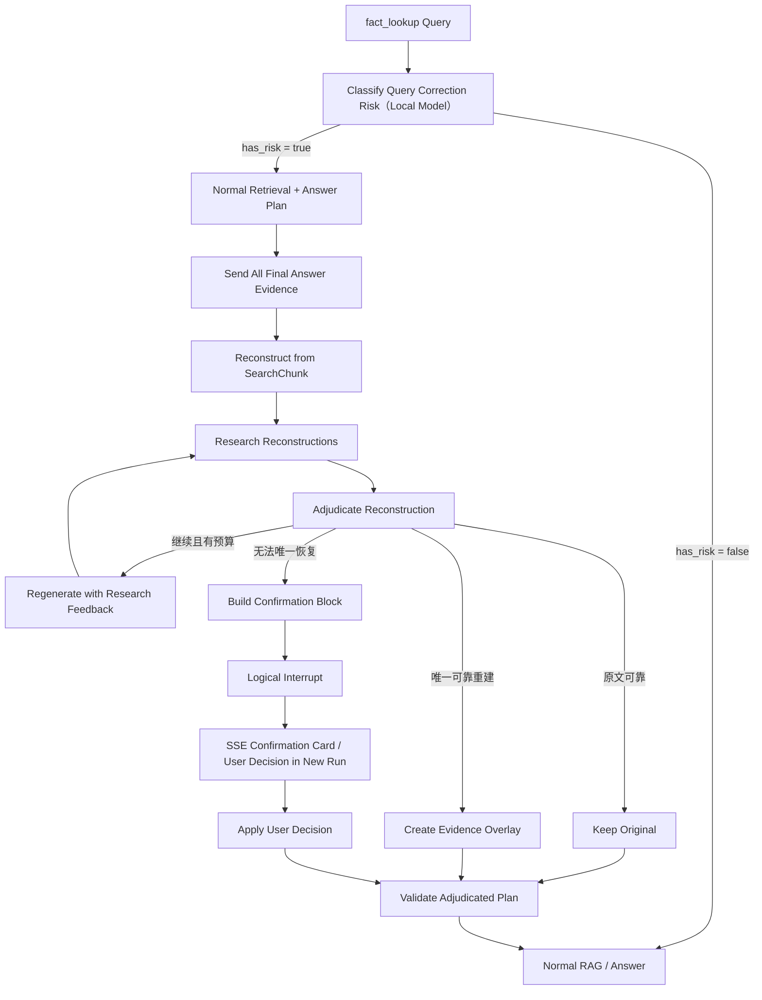

# RAG ASR Evidence Adjudication Agent 设计方案

> 文档状态：方案草案。
>
> 关联文档：[`python-backend-rag-strategy-subgraphs.md`](./python-backend-rag-strategy-subgraphs.md)、[`python-backend-rag-hybrid-search.md`](./python-backend-rag-hybrid-search.md)、[`generation-cancellation-and-rag-checkpoint-design.md`](./generation-cancellation-and-rag-checkpoint-design.md)、[`audio-processing-text-refinement-and-indexing-design.md`](./audio-processing-text-refinement-and-indexing-design.md)。

## 1. 背景

当前录音问答已经具备以下能力：

- Audio Processing 在 ASR 后执行规则、pycorrector 和 LLM 文本润色；
- Search Chunk 通过主题、上下文、向量与词法信号召回；
- `fact_lookup` 使用混合召回、上下文扩展、RRF、rerank 和 Evidence Grade；
- Answer Plan 将回答要点绑定到实际 Evidence；
- 最终 Answer 只能依据经过筛选的录音 Evidence 回答并携带引用。

实际评测表明，ASR 的关键字错误不一定导致召回失败。录音和文档通常具有较强的上下文冗余：即使 `I²C` 被识别成无关词，包含“时钟线、数据线、主从设备、地址、ACK”等上下文的 Search Chunk 仍可能通过语义检索被召回，Evidence Grade 也可能正确判断该片段与用户问题相关。

真正的失败发生在 Answer 前：

```text
正确主题的 Chunk 被召回
  → Grade 判断 Evidence 可以回答
  → Evidence 中回答所依赖的关键数字或专有名词仍然错误
  → Answer 只能忠实引用错误文本，或者依靠模型常识猜测
```

典型例子：

```text
实际语音：I²C 的最大时延是 5 微秒
ASR 文本：RF 的最大时延是 5 秒
```

该错误可能同时损坏多个文本片段。单独验证 `RF` 或 `5 秒` 都可能被错误前提带偏，固定拆成 `entity / metric / value / unit` 也无法覆盖自然语言中的任意句式。因此必须把整条关键表达视为可能损坏的对象，结合完整 SearchChunk 上下文直接生成新的完整表达，再用公开资料验证。

## 2. 设计结论

在 `fact_lookup` 中增加一个小而受限的 **ASR Evidence Adjudication Agent**，只处理本次 Answer Plan 即将使用的 Evidence。

该能力采用以下组合：

- LangGraph 承载固定流程、状态、循环上限、条件边和用户确认；
- 模型只在候选生成、研究动作选择和联网查询改写中进行受限 Agentic 决策；
- 自动裁决必须受到代码硬门槛约束，模型不能自行决定覆盖原文；
- 无法唯一恢复时，向用户展示候选和原始音频时间点；
- 修正只形成 Answer-time Evidence Overlay，不覆盖原始 ASR；
- 用户确认后从 checkpoint 继续 Grade/Plan/Answer，不重新执行录音召回。

一期采用以下已确认的简化边界：

- 公开检索与完整 SearchChunk 对新表达形成高置信度支持时，允许直接创建 Overlay；最终 Answer 必须显式说明“将 `原表达` 修正为 `新表达`”，不得静默改写；
- 不增加 `needs_confirmation` Generation 状态。需要确认时先保存 checkpoint，再让当前 Generation 以 `succeeded` 结束，并通过 SSE 返回 `adjudication_confirmation` 非文本 Content Block；
- 前端把该 Block 渲染为确认卡片。第一版只提供“使用建议修正 / 保留录音原文 / 暂不确认”按钮，不解析用户在普通聊天输入框中的自然语言确认，也不支持自定义修正文案；
- checkpoint 不保存完整 Evidence、SearchChunk 或相邻上下文正文，只保存 chunk 引用、候选、Finding、裁决和恢复所需的最小状态；恢复时重新从权威录音表 hydrate 正文；
- 不增加独立的 Critical Expression 提取节点。Gate 命中后把全部最终 `answer_evidence` 送入子图，由同一次 Review 输出与 `evidence_index/chunk_id` 绑定的原表达短片段和候选修正。

第一版只支持：

1. 数字及单位；
2. 公开专有名词，例如协议、芯片、模型、软件、公司、公开人物与标准术语。

第一版只在 `fact_lookup` 策略运行；`scope_summary`、`metadata_lookup` 和其他策略均直接绕过。第一版不做通用事实纠错，不做整篇转写改写，也不开放通用 Agent 工具调用。

## 3. 目标与非目标

### 3.1 目标

- 在召回成功后发现 Answer 依赖的可疑数字或专有名词；
- 基于完整 SearchChunk 和相邻上下文重建关键表达，不依赖固定 Claim Slot 或逐 token 穷举；
- 使用公开权威资料验证候选，必要时根据搜索结果生成新候选并继续研究；
- 在唯一候选获得充分支持时自动生成 Evidence Overlay；
- 无法安全自动裁决时，向用户发起具体、可操作的原音确认；
- 保存自动裁决和用户裁决的来源、分数、原因与完整轨迹；
- 控制每次问答增加的延迟、token、联网次数和用户打断率。

### 3.2 非目标

- 不提高或重新训练全局 ASR 模型；
- 不重复 Audio Processing 的全文自动润色；
- 不重新执行现有向量、词法、RRF 或 rerank 召回；
- 不自动修改 `transcriptions`、`utterance_segments` 或 `recording_search_chunks`；
- 不使用互联网猜测公司内部数据；
- 不把搜索结果数量、网页流行度或 LLM 自信度直接视为事实；
- 不让模型自由决定流程拓扑、循环次数、自动修正阈值或数据外发范围；
- 不在第一版处理否定词、责任人、日期关系、法律、医疗等其他高风险事实。
- 不处理 `scope_summary` 的摘要生成或摘要中的 ASR 纠偏。

## 4. 核心术语

| 术语 | 含义 |
| --- | --- |
| Critical Claim | Answer Plan 准备使用、且其精确内容会改变最终回答的原子事实。 |
| Reconstruction Hypothesis | 基于完整 SearchChunk 对可疑表达生成的一条完整替代表达，不要求符合固定业务 schema。 |
| Candidate Registry | 在 Agent 循环中保存、合并、评分和淘汰候选的受控状态。 |
| Research Action | 一次受限研究动作，例如验证原表达、验证重建表达、补充上下文线索或主动寻找反例。 |
| Adjudication | 根据录音上下文、文本改动可解释性和公开权威资料裁决原表达或重建表达。 |
| Evidence Overlay | 不修改原始转写、只在回答阶段使用的已裁决文本视图。 |
| Logical Interrupt | 图返回用户确认请求并结束当前 run；用户响应后创建新 run，从 checkpoint 继续。 |

## 5. 为什么采用具体 LangGraph，而不是自由 Agent

该能力会影响最终答案中的关键事实，并包含联网、自动修正和用户确认，因此必须满足：

- 流程可预测；
- 每一步可离线测试；
- 所有外部查询可审计；
- 搜索和模型调用有确定上限；
- 能稳定进入和恢复用户确认；
- 自动裁决失败时安全降级；
- 能够统计每一种失败发生在哪个节点。

外层使用确定性 LangGraph，内部仅允许模型决定“下一步研究什么”：

```text
模型决定：候选是什么、下一次查什么、搜索结果提示了什么新假设
图和代码决定：允许查几次、候选最多多少、何时停止、能否自动修正
```

## 6. 在现有 RAG 中的位置

一期只接入 `fact_lookup`。现有主要路径为：

```text
expand_retrieval_terms
  → chunk_evidence
  → grade
  → plan
  → validate_plan
  → select_planned_evidence
  → finalize
  → root answer
```

目标路径为：

```text
route
  ├─ strategy_id != fact_lookup → 原策略路径
  └─ strategy_id == fact_lookup
       → classify_query_correction_risk
       → expand_retrieval_terms
       → chunk_evidence
       → grade
       → plan
       → validate_plan
       → select_planned_evidence
       → asr_evidence_adjudication
       → validate_adjudicated_plan
       → finalize
       → root answer
```

一期把“是否需要纠偏”的轻量 Gate 放在 route 已确定为 `fact_lookup` 之后，只读取用户 query；真正的上下文重建仍放在 Answer Plan 和 Planned Evidence 已经确定之后。原因是：

- query Gate 可以在召回前低成本跳过绝大多数普通问答；
- 一期只用布尔 Gate 判断 query 是否要求至少一个精确专有名词或数字，不再区分具体类型，也不扫描 Evidence 判断风险；
- Gate 命中后，把 `select_planned_evidence` 产生的全部最终 Evidence 送入重建；模型输出必须绑定 `evidence_index/chunk_id`，但一期不增加独立表达抽取节点；
- 不扫描所有召回候选，只处理最终回答准备使用的 Evidence；
- 自动修正后只需重新验证计划和生成答案，不必重新召回。

`scope_summary` 不调用 query Gate、不创建 Adjudication State、不执行联网研究，也不生成 Evidence Overlay。

该设计会暂时漏掉“query 没有显式要求数字或专有名词，但回答中偶然出现关键数字或名词”的 Case。这是一期为降低触发复杂度和额外延迟而接受的召回率损失，后续是否增加 Evidence Gate 由真实评测决定。

## 7. 总体工作流



## 8. 状态模型

### 8.1 Critical Expression

```python
class CriticalExpression(BaseModel):
    id: str
    original_expression: str
    suspicious_spans: list[str] = Field(default_factory=list)
    type: Literal["number", "proper_noun", "compound"]
    answer_plan_item_index: int
    evidence_indexes: list[int]
    recording_id: UUID
    chunk_id: UUID
    start_ms: int
    end_ms: int
    query_correction_risk: bool
```

`compound` 只表示一句表达中可能有多个片段同时损坏，用于风险路由和统计，不定义表达必须包含哪些字段。`search_chunk_text` 是第一轮上下文重建的主输入，`adjacent_context` 只在权限和预算允许时补充。

上述契约是子图运行时视图，不直接按原样写入 checkpoint。一期不设置独立的 Critical Expression 提取节点。每个最终 Evidence 建立一个隔离的 Case；Review 模型一次只读取当前 Evidence 及引用它的 Plan Item，并返回与该 `evidence_index/chunk_id` 绑定的短 `original_expression` 和完整候选。Evidence 正文只从主 State 的 `answer_evidence` 读取，子 Agent State 不复制正文，checkpoint 中仍会剥离正文。

### 8.2 Reconstruction Hypothesis

```python
class ReconstructionHypothesis(BaseModel):
    id: str
    expression_id: str
    expression: str
    derived_from_id: str | None = None
    round: int
    changed_spans: list[tuple[str, str]] = Field(default_factory=list)
    origins: list[Literal[
        "original",
        "phonetic",
        "search_chunk_context",
        "adjacent_context",
        "research_feedback",
        "user",
    ]]
    status: Literal[
        "unresearched",
        "active",
        "supported",
        "contradicted",
        "duplicate",
        "rejected",
    ]
    reconstruction_reason: str
    phonetic_score: float | None = None
    context_score: float | None = None
    public_fact_score: float | None = None
    support_score: float = 0
    contradiction_score: float = 0
    searched_queries: list[str] = Field(default_factory=list)
    supporting_finding_ids: list[str] = Field(default_factory=list)
    contradicting_finding_ids: list[str] = Field(default_factory=list)
```

### 8.3 Research Finding

```python
class ResearchFinding(BaseModel):
    id: str
    expression_id: str
    candidate_id: str | None = None
    query: str
    source_url: str
    source_domain: str
    source_type: Literal[
        "standard_body",
        "official_vendor",
        "official_project",
        "paper",
        "secondary",
    ]
    published_at: datetime | None = None
    event_time: datetime | None = None
    supports_expression: bool = False
    contradicts_expression: bool = False
    applicability_notes: list[str] = Field(default_factory=list)
    extracted_fact: str
```

Finding 只保存支持裁决所需的最小事实和来源，不把整页内容写入 RAG checkpoint。

### 8.4 Adjudication State

```python
class AsrAdjudicationState(TypedDict):
    query_correction_risk: bool
    expressions: list[CriticalExpression]
    active_expression_id: str | None
    candidates: list[ReconstructionHypothesis]
    findings: list[ResearchFinding]
    research_round: int
    research_actions: list[dict[str, object]]
    adjudications: list[dict[str, object]]
    overlays: list[dict[str, object]]
    pending_confirmation: dict[str, object] | None
```

该状态作为 `RagGraphState` 的受控子结构接入，避免继续向根状态平铺大量候选字段。

## 9. 节点设计

### 9.1 `classify_query_correction_risk`

输入：

- 用户原始 query；
- route 结果，仅用于确认当前策略是 `fact_lookup`。

职责：

- 当前原型统一使用项目配置的在线 Provider，以优先保证识别和结构化决策质量；
- 只判断 query 是否要求回答至少一个精确专有名词或数字；
- 只输出 `has_risk: bool`，不再区分专名、数字或二者兼有；
- 不读取 SearchChunk，不判断 ASR 是否真的有错，不生成候选，也不联网。

一期 Gate 示例：

| Query | Gate |
| --- | --- |
| `I²C 的最大时延是多少？` | `true` |
| `这个接口的最大时延是多少？` | `true` |
| `录音里提到的芯片型号是什么？` | `true` |
| `总结一下这段录音` | `false` |

只看 query 是一期的明确边界：即使 Planned Evidence 中出现可疑数字或名词，只要 query 没有要求这两类精确信息，也不启动纠偏。

模型名称不在设计中硬编码，沿用运行环境配置的在线 Provider。Gate 的输入短、标签固定，应单独评测其 precision/recall。首轮 Evidence Review 和后续 Agent Action 选择同样先统一走在线模型，后续再根据质量、延迟和成本决定哪些节点迁回本地。

### 9.2 `select_answer_evidence_for_adjudication`

该节点不调用模型。Gate 命中且 Answer Plan 完成后，直接读取 `select_planned_evidence` 已经生成的全部 `answer_evidence`：

- 将所有最终回答准备使用的 Evidence 送入子图，不再增加表达级预筛选；
- 获取对应完整 SearchChunk、录音时间范围和必要的相邻上下文；
- 以用户问题和 Plan statement 作为 Review 提示；
- 不再额外判断 Evidence 是否“看起来有错”。

Review 输出若提出修正，必须携带 `evidence_index/chunk_id/original_expression/resolved_expression`。这只是同一次 Review 的结构化结果，不构成独立 Critical Expression 提取阶段。

query Gate 命中后，重建提示始终同时检查数字、单位、专有名词、标识符和缩写；候选仍是开放的完整表达，不恢复固定 Slot schema。

### 9.3 `reconstruct_from_context`

第一轮必须先基于本地上下文重建，不先联网。模型输入包括：

- 用户问题；
- Answer Plan 中依赖该 Evidence 的 statement；
- 可疑原始表达；
- 完整 `search_chunk_text`；
- 权限和预算允许时的相邻 SearchChunk；
- 同一录音中已经召回的相关上下文。

模型直接生成少量完整 `ReconstructionHypothesis.expression`，不先生成实体、指标、数值、单位的笛卡尔积。原表达始终作为 `original` 候选保留。音近、字母读法、数字读法和单位尺度只能作为重建提示，不能限制自然语言句式。

以 `RF 的最大时延是 5 秒` 为例，如果 SearchChunk 同时讨论总线、时钟线、数据线、主从设备和 ACK，第一轮就应该尝试生成 `I²C 的最大时延是 5 微秒` 等完整表达。联网的职责首先是验证这些上下文重建，而不是替代上下文恢复原意。

### 9.4 `select_research_action`

模型只能从有限枚举中选择下一步：

```python
ResearchActionType = Literal[
    "verify_original",
    "verify_candidate",
    "resolve_ambiguous_expression",
    "discover_from_reliable_context",
    "search_contradiction",
]
```

这些是互斥的“本轮研究动作”，不是每轮都依次执行：

| 动作 | 含义 | 适用时机 |
| --- | --- | --- |
| `verify_original` | 查询权威资料是否直接支持或反驳 ASR 原表达。 | 原表达仍可能正确，需要避免过度纠偏。 |
| `verify_candidate` | 查询权威资料是否直接支持某条重建表达。 | 已有明确候选，需要事实核验。 |
| `resolve_ambiguous_expression` | 针对两个或多个竞争表达，查询能够区分它们的条件或参数。 | 候选都看似合理，无法拉开分差。 |
| `discover_from_reliable_context` | 去掉可疑词，只用 SearchChunk 中可靠的上下文锚点寻找新表达线索。 | 原文和现有候选都缺乏支持。 |
| `search_contradiction` | 主动寻找领先候选的权威反例。 | 准备自动裁决前避免确认偏差。 |

一次研究动作最多生成一条主查询；只有上一条查询没有消除歧义时才进入下一轮。`search_contradiction` 不能单独证明候选正确，只用于发现否决证据。

每个动作必须指定：

- 目标 Critical Expression；
- 可选目标 Candidate；
- 为什么已有证据不足；
- 本轮希望验证或消除哪一处表达歧义；
- 是否允许包含原始可疑词；
- 脱敏后的搜索 query 计划。

### 9.5 `research_reconstructions`

执行本轮联网研究。查询策略包括：

1. 验证原始完整表达；
2. 验证第一轮基于 SearchChunk 生成的完整重建表达；
3. 必要时移除可疑片段，只使用 SearchChunk 中可靠的上下文锚点查询；
4. 查询表达涉及的术语、数字、单位、条件和数量级；
5. 主动寻找反例，防止只搜支持材料；
6. 检查会议时间与公开资料时间是否一致。

来源优先级：

```text
标准制定方
  > 官方厂商或官方项目文档
  > 原始论文
  > 高质量二手资料
```

自动裁决不能只依赖搜索摘要、论坛、问答网站或单一二手文章。

搜索侧保留窄接口 `GroundedSearchClient`，可切换两种实现：`GeminiGroundedSearchClient` 调用 Gemini Native Google Search Grounding；`ChromeAiOverviewSearchClient` 在 macOS 上通过 AppleScript 复用用户已经打开的有界面 Chrome，以后台专用 Tab 获取 Google SERP 实际展示的 AI Overview。通用 `LanguageModel`、Worker Contract 和 OpenAI-compatible Provider 原生支持 `tools`、`tool_choice`、assistant `tool_calls` 与 tool result message；裁决 Agent 的 function calling 继续走项目模型封装，实际搜索则由所选窄接口执行：

1. Discovery 请求启用 Gemini `google_search`，返回查询、相关事实线索和带引用 URL；
2. 程序按来源类型和域名筛选最多 1～3 个页面；
3. Verification 请求启用 Gemini `url_context`，读取指定官方页面或 PDF；
4. Verification 使用结构化输出返回 Finding，不能直接返回最终修正文本；
5. LangGraph 将 Finding 交给 Candidate Registry 和 `adjudicate`；只有后续重建节点可以生成新表达，Gemini 搜索调用本身没有自动修改权限。

现有 `httpx` 依赖足以调用 Gemini 原生 REST API。第一版无需新增通用浏览器、网页爬虫、向量 Web 索引或 Tavily、Serper、Bing 等第二套搜索凭据。若后续需要供应商冗余，再将客户端抽象为 `PublicSearchClient`。

### 9.6 `regenerate_and_prune_reconstructions`

该节点位于循环内部。第二轮及以后重新调用上下文重建模型，输入必须同时包含原始 SearchChunk、历史候选和 Research Finding：

- 根据支持、冲突和来源适用条件直接重写完整表达；
- 允许一次修改任意一个或多个文本片段；
- 不进行固定 Slot 的独立投票或字段笛卡尔积；
- 记录新表达相对父候选的 `changed_spans` 和生成依据；
- 合并重复候选；
- 标记已被权威资料否定的候选；
- 按 beam 上限保留最有希望的候选。

Candidate Registry 不得每轮清空重建。所有候选必须携带来源，已拒绝候选不能无理由重新出现。

### 9.7 `adjudicate`

模型输出结构化判断，代码应用硬门槛。最终状态：

```python
AdjudicationVerdict = Literal[
    "unchanged",
    "auto_resolved",
    "continue_research",
    "needs_confirmation",
    "unverifiable",
]
```

含义：

- `unchanged`：原表达获得充分支持；
- `auto_resolved`：存在唯一、完整、可解释且获得充分支持的 Reconstruction Hypothesis；
- `continue_research`：仍有具体可执行研究动作且未耗尽预算；
- `needs_confirmation`：确认有风险或很可能有错，但无法唯一恢复；
- `unverifiable`：表达涉及内部事实或没有可用公开权威来源。

### 9.8 `create_evidence_overlay`

自动裁决或用户裁决成功后生成 Overlay：

```python
class EvidenceOverlay(BaseModel):
    expression_id: str
    recording_id: UUID
    chunk_id: UUID
    start_ms: int
    end_ms: int
    original_statement: str
    resolved_statement: str
    status: Literal["auto_resolved", "user_confirmed"]
    confidence: float
    candidate_id: str | None = None
    finding_ids: list[str] = Field(default_factory=list)
    user_decision_id: UUID | None = None
```

Answer Context 渲染时同时保留：

- 原始录音 Evidence；
- Overlay 后的解释文本；
- Overlay 的裁决状态和来源；
- 原始录音的时间范围和 source URL。

最终引用仍指向录音，不把互联网网页伪装成录音说过的内容。

高置信度自动 Overlay 不能静默应用。Answer Context 必须携带明确披露指令，最终答案需要以自然语言说明“系统结合上下文和公开资料，将 `original_statement` 修正为 `resolved_statement`”。来源详情同时保留 Finding URL 和裁决状态，原始录音引用仍定位到对应时间范围。

### 9.9 `validate_adjudicated_plan`

Overlay 可能改变 Plan statement，因此 Answer 前必须重新验证：

- 每个 statement 仍绑定合法 Evidence；
- `changed_spans` 与完整重建表达之间可以追溯；
- 每一处会改变答案含义的改写均有上下文依据或 Finding，模型没有顺带润色无关内容；
- `auto_resolved` 满足代码硬门槛；
- 用户裁决与 pending confirmation 精确对应；
- Answer Context 清楚区分录音原文与系统归一化解释。

验证失败时不进入 Answer，降级为 `needs_confirmation` 或 `not_found`。

## 10. Agent 循环

实现采用原生 tool-calling，而不是让模型输出一个“下一步 action” JSON 后由固定代码循环。每个 Evidence Case 都维护自己的工具历史，主 State 只保存候选、Finding、工具调用参数和精简结果，不保存 Evidence 正文。每次恢复执行时，从 `answer_evidence` 重新注入当前 Evidence。

模型每轮必须且只能选择一个工具：

- `web_search`：首次基于当前 Evidence 的可疑原表达和上下文检索，后续也可核验指定候选，并把 Finding 作为 tool result 回填同一模型会话；
- `reconstruct_candidates`：调用在线模型，结合当前 Evidence 上下文和已有联网 Finding 生成候选；后续可再次调用以重建或收敛候选；
- `resolve`：在已有联网 Finding、高置信度且无冲突时结束并生成 Overlay；
- `request_confirmation`：无法唯一裁决时生成确认卡片；
- `no_issue`：确认无需修正。

控制器只负责工具参数校验、预算、数据边界和终止门槛，不替模型选择正常的下一步。联网启用时，每个 Case 第一步硬性要求为 `web_search`，随后硬性要求 `reconstruct_candidates` 结合首次 Finding 生成候选；完成这两个启动步骤后，由模型根据完整工具历史自行继续检索、重建候选或终止。未启用联网时，第一步降级为 `reconstruct_candidates`。每次模型选择和工具执行后都写 checkpoint；超过最大循环次数时，有候选则请求确认，没有候选则保留原文。

诊断日志在每次重建后记录当前 Evidence 的原始文本、`recording_id`、`chunk_id` 和候选完整字段；即使候选为空也记录这些 Evidence 信息。Web Search 只记录 Finding summary 归一化后的前 50 个字符，不记录网页正文。

### 10.1 第一轮联网发现，随后结合研究反馈重建

第一轮直接依据完整 SearchChunk 中的可疑原表达和上下文联网发现相关术语、参数或单位，随后把 Finding 与同一 SearchChunk 一并交给重建模型生成完整替代表达：

```text
SearchChunk + 可疑原句 + 用户问题
  → 首次联网发现
  → SearchChunk + Finding 生成完整 Reconstruction Hypotheses
  → 必要时继续联网核验候选
  → 裁决
```

如果第一轮没有正确答案或证据不足，后续轮次把研究结果作为反馈，再基于同一个 SearchChunk 重新生成完整表达：

```text
第 1 轮：SearchChunk + 原表达 + 用户问题 → 联网 Finding
第 2 轮：上述输入 + Finding → 首批候选
第 3 轮：上述输入 + 历史候选 + 新的搜索支持/冲突证据
```

`web_search` 与 `reconstruct_candidates` 共同位于有界循环中；每个 Case 的首次研究反馈不再为空。这样让互联网先提供发现线索，再由当前 Evidence 上下文约束“恢复原意”，后续检索继续承担候选验证。

### 10.2 循环预算

建议默认值：

```yaml
asr_evidence_adjudication:
  enabled: false
  supported_expression_types:
    - number
    - proper_noun
    - compound
  max_expressions_per_answer: 3
  max_research_rounds_per_expression: 4
  max_queries_per_round: 2
  max_total_candidates_per_expression: 12
  max_active_candidates_per_expression: 5
  max_new_candidates_per_round: 3
  max_findings_per_candidate: 3
  auto_resolve_confidence: 0.95
  minimum_candidate_margin: 0.20
  on_budget_exhausted: needs_confirmation
```

### 10.3 停止条件

```python
if original_expression_is_strongly_supported:
    return "unchanged"

if unique_candidate_passes_hard_policy:
    return "auto_resolved"

if no_safe_public_research_is_available:
    return "unverifiable"

if research_round >= max_research_rounds:
    return "needs_confirmation"

if no_promising_research_action_remains:
    return "needs_confirmation"

return "continue_research"
```

## 11. 自动裁决策略

### 11.1 不允许仅凭模型判断自动修改

模型可以输出：

- 候选及理由；
- 语义、音近和事实支持分数；
- 来源支持或反驳了完整表达的哪些部分；
- 是否存在冲突；
- 推荐 verdict。

代码负责最终门槛：

```python
auto_resolved = (
    result.confidence >= settings.auto_resolve_confidence
    and result.candidate_margin >= settings.minimum_candidate_margin
    and result.official_source_found
    and result.independent_evidence_type_count >= 2
    and result.complete_expression_supported
    and result.conditions_matched
    and not result.contradiction_found
)
```

多次调用同一个模型不构成多份独立证据。

### 11.2 专有名词自动裁决

专有名词候选综合：

- 音素或拼音相似度；
- 字母与数字读法，例如 `I2C -> eye two c`；
- 周围上下文语义；
- 官方实体是否存在；
- 会议发生时间内该实体是否存在；
- 同一录音中是否出现其他规范写法；
- 第一候选相对第二候选的领先幅度。

重建模型必须同时利用两类信号：

```text
可疑文本自身 → 音近、字母读法和数字单位线索
完整 SearchChunk → 不依赖可疑词表面的语义重建
```

这样才能覆盖 `爱吐西 -> I²C`，也能覆盖 `RF -> I²C` 这类文本上不相似但上下文指向明确的错误。

### 11.3 数字自动裁决

数字自动裁决需要比专有名词更保守。公开互联网适合：

- 判断公开技术参数的数量级；
- 验证标准、数据手册和公开指标；
- 发现单位错误；
- 为用户确认准备合理候选。

只有同时满足以下条件才自动修正：

- 权威来源讨论的是同一实体和同一指标；
- 适用模式、速率、版本、负载等条件一致；
- 数值或确定性换算后数值精确匹配；
- 新表达中所有会改变答案的内容均获得支持；
- 只有一个合理 Reconstruction Hypothesis。

若只能证明“5 秒不合理”，但无法唯一确定是 5 毫秒还是 5 微秒，返回 `needs_confirmation`，不能自动选择。

### 11.4 完整表达裁决

当多个片段可能同时损坏时，不进行独立字段投票。候选必须以完整自然语言表达参加竞争，例如：

```text
RF 的最大时延是 5 秒
RF 的最大时延是 5 微秒
I²C 的最大时延是 5 微秒
I2S 的最大时延是 5 微秒
```

这些示例只展示模型可能生成的完整表达，不定义系统必须穷举的字段组合。其他任意句式也使用同一个 `expression` 契约。

最终排序可以综合：

```text
candidate_score =
    context_score
  + phonetic_score
  + public_fact_score
  + source_authority_score
  + cross_occurrence_score
  - contradiction_score
```

具体权重通过离线评测校准，不在 Prompt 中固定为业务真理。

## 12. 公开与内部事实边界（后续阶段）

本次实现暂不增加 `public_verifiability` Gate。当前行为是：Evidence-only 首轮只要提出候选，就强制进行第一次联网检索；Finding 回写当前 Evidence Case 后，Agent 才能选择继续搜索、解决、确认或判定无问题。

后续增加公开性校验时，再采用以下策略：

| 类型 | 策略 |
| --- | --- |
| 公开协议、标准、公开产品、论文、开源项目 | 允许联网并尝试自动裁决。 |
| 公开技术参数 | 允许联网，但必须匹配具体指标和条件。 |
| 公司内部性能、预算、排期、客户数据 | 不向公网发送，不允许互联网自动裁决。 |
| 无法判断是否公开 | 默认按私有事实处理。 |

互联网可以发现内部数字的量级看起来异常，但不能知道真实内部值。内部事实若没有可信内部数据源，直接进入用户确认。

联网 query 必须脱敏：

- 移除 workspace、客户、内部项目和人员标识；
- 不发送整段录音原文；
- 只保留公开实体、指标、单位和必要上下文概念；
- 记录脱敏前后的字段映射，但不在普通日志输出敏感原文。

## 13. 用户确认

### 13.1 SSE 确认 Block

```python
class AdjudicationConfirmationBlock(BaseModel):
    type: Literal["adjudication_confirmation"] = "adjudication_confirmation"
    request_id: UUID
    source_generation_id: UUID
    items: list[AdjudicationConfirmationItem]


class AdjudicationConfirmationItem(BaseModel):
    id: str
    evidence_index: int
    recording_id: UUID
    chunk_id: UUID
    start_ms: int
    end_ms: int
    original_expression: str
    candidates: list[AdjudicationCandidate]
    reason: str


class AdjudicationCandidate(BaseModel):
    id: str
    expression: str
    confidence: float
    source_urls: list[str] = Field(default_factory=list)
```

该 Block 通过现有 SSE `content.delta.blocks` 和最终 `output.content_blocks` 传输，前后端 `ContentBlock` 改为以 `type` 为 discriminator 的联合类型。前端将其渲染为确认卡片，并提供：

- 播放对应原始音频；
- 使用建议修正；
- 保留录音原文；
- 暂不确认。

第一版不解析用户在普通聊天输入框中输入的“确认”类自然语言，也不提供自定义修正文案，避免无法稳定绑定 request、item 和 candidate。后续若确有需要，在卡片内增加结构化自定义输入，而不是复用普通聊天消息。

### 13.2 用户决定

```python
class ClaimConfirmationDecision(BaseModel):
    request_id: UUID
    client_request_id: UUID
    decisions: list[ClaimConfirmationItemDecision]


class ClaimConfirmationItemDecision(BaseModel):
    item_id: str
    action: Literal["accept_candidate", "keep_original", "unresolved"]
    candidate_id: str | None = None
```

- `accept_candidate`：使用指定 Reconstruction Hypothesis；
- `keep_original`：保留原表达，并保存本次确认；
- `unresolved`：最终回答必须显式保留不确定性或不回答该事实。

建议增加窄接口：

```text
POST /api/conversations/{conversation_id}/generations/{source_generation_id}/adjudication-decisions
```

服务端必须验证 request 所属用户/workspace/source generation、candidate 是否属于 checkpoint、请求是否过期或已消费，并使用 `client_request_id` 保证按钮重复提交幂等。

### 13.3 逻辑暂停与恢复

不让 Generation Worker 或 LangGraph 进程长时间等待用户。需要用户确认时：

1. 提交当前节点 checkpoint；
2. 构造并持久化 `adjudication_confirmation` Content Block；
3. 当前 Generation 以正常 `succeeded` 状态结束，`output_payload.interaction` 记录 `type/request_id/status=pending`；不增加新的 Generation 状态；
4. SSE 和消息持久化层把确认 Block 交给前端卡片；
5. 用户通过卡片按钮提交 decision；
6. 创建新的 Generation run，并关联来源 run；
7. 加载旧 run 的有效 RAG checkpoint；
8. 从 `apply_user_decision` 继续执行 `validate_adjudicated_plan` 和 Answer。

该流程复用 checkpoint 和“新 Generation run”机制，但不复用当前仅允许 failed/cancelled run 的通用 resume API。确认 Generation 虽然是 `succeeded`，checkpoint 仍必须按正常 RAG checkpoint TTL 保留，不能按普通成功 Generation 的短交付 TTL 提前过期。

## 14. Overlay 与原型状态

### 14.1 第一版原则

- 原始 ASR 永不被自动覆盖；
- 自动裁决与用户裁决保存为独立记录；
- Answer 使用 Overlay 后的上下文；
- Source 仍链接到原始录音时间点；
- 自动裁决必须能够从最终回答追溯到 Finding 和 Candidate；
- 原型阶段不新增业务表，不建立跨问答长期记忆。

### 14.2 不新增数据表

原型阶段只复用现有状态载体：

- `RagGraphState.adjudication` 在运行时保存 hydrated Evidence 视图、Reconstruction Hypothesis、Finding 和 Overlay；
- 现有 Redis RAG checkpoint 只保存 recording/chunk/evidence 引用、原表达短片段、候选、Finding、裁决和 Overlay；完整 Evidence、SearchChunk 与相邻上下文正文必须在序列化时删除并在恢复时重新 hydrate；
- `generation_runs.output_payload` 保存最终 verdict、引用 URL、确认请求和必要诊断摘要；
- 用户确认通过下一次 Generation 的 `input_payload` 传入，并携带来源 generation ID；
- observability span 保存轮数、候选数、来源类型、阈值结果和延迟，不保存整页正文。

原型允许的状态：

```text
auto_resolved
user_confirmed
original_confirmed
unresolved
```

原型不承诺：

- 在无父子关系的新问答中复用历史裁决；
- 把 `original_confirmed` 沉淀为永久事实；
- 更新转写展示层或 Search Chunk；
- 建立 workspace 术语 alias。

只有自动裁决和用户确认的真实指标证明有价值后，再设计长期存储。后续候选包括：

- 独立 resolution 表；
- 组织级术语 alias；
- 对搜索索引的异步回填；
- 原始展示文本的显式人工修订；
- resolution 版本冲突和撤销。

## 15. Prompt 与工具边界

Agent 可使用：

- 基于 Answer Plan 定位关键 Evidence 表达；
- 基于完整 SearchChunk 的受约束表达重建；
- 音近、字母和数字读法作为重建提示；
- 单位尺度和确定性换算；
- 公开互联网搜索；
- 权威来源事实抽取；
- Candidate Registry 更新；
- 用户确认请求。

Agent 不可使用：

- 数据库自由 SQL；
- 不受权限约束的录音检索；
- 任意文件或内部系统访问；
- 原始转写写入；
- 无预算的递归搜索；
- 将模型参数知识当作独立来源；
- 由模型自行提高自动修正阈值或扩大支持类型。

所有模型输出使用严格 Pydantic 外层契约，但 `expression` 本身是开放自然语言文本，不要求符合固定语义 Slot。解析失败、字段缺失、来源不可访问或工具异常时，当前 Critical Expression 降级为 `needs_confirmation`，不得默认接受候选。

### 15.1 Prompt 设计硬约束

本功能新增的所有 Prompt 必须满足：

- 领域无关，不写入 I²C、RF、芯片、医疗等具体领域示例或专用规则；
- 静态指令短小，单个 Prompt 原则上不超过 120 个中文字符；
- Prompt 只描述当前节点的单一职责，流程、阈值和循环预算由代码控制；
- query、SearchChunk、候选、Finding 作为结构化运行时字段传入，不拼成长篇说明；
- 第一轮最多生成 3 个候选，每轮最多生成 1 条主查询；
- 后续轮次只传候选摘要和新增 Finding，不重复堆叠完整历史；
- 输出格式交给 JSON Schema 约束，不在 Prompt 中重复字段定义；
- 首轮和后续轮次复用同一重建 Prompt，通过可选 `research_feedback` 区分，避免维护两套领域化模板。

### 15.2 最小 Prompt 模板

`classify_query_correction_risk`：

```text
判断问题是否要求精确专有名词或数字。仅按 schema 输出；只依据 query。
```

`reconstruct_from_context`：

```text
结合问题、计划表达和上下文，给出最多 3 条可能原意。只检查指定风险类型，最少改写；无依据保留原文。
```

`select_research_action`：

```text
从允许动作中选择最能减少当前歧义的一项，并生成一条脱敏查询。不得泄露内部信息。
```

`extract_research_finding`：

```text
仅依据给定来源判断其支持或反驳哪个完整表达，并记录适用条件；无直接依据则返回 unknown。
```

`regenerate_reconstruction` 复用 `reconstruct_from_context`，只额外传入结构化 `research_feedback`，不新增静态说明。

`adjudicate_reconstruction`：

```text
比较原文与候选的上下文和来源支持，按 schema 给出 verdict。不得仅凭常识自动修正。
```

Prompt 中不嵌入动作解释、来源优先级、评分公式或自动裁决门槛；这些由枚举、代码配置和 policy 实现。

## 16. 可观测性

新增节点与操作建议：

```text
classify_query_correction_risk
select_answer_evidence_for_adjudication
reconstruct_from_context
select_research_action
research_reconstructions
regenerate_and_prune_reconstructions
adjudicate_reconstruction
create_evidence_overlay
build_confirmation_request
apply_user_decision
validate_adjudicated_plan
```

操作级 span：

```text
adjudication.query.classify
adjudication.search_chunk.select
adjudication.reconstruction.generate
adjudication.reconstruction.regenerate
adjudication.web.search
adjudication.source.extract
adjudication.reconstruction.grade
adjudication.overlay.create
adjudication.user.request
adjudication.user.apply
```

日志不得记录整段录音文本和未脱敏搜索 query。应记录：

- expression/candidate/finding ID；
- 录音和 chunk 引用；
- query Gate 标签与表达类型；
- 查询轮数、候选数量和来源类型；
- verdict、硬门槛结果和降级原因；
- 用户是否确认、选择候选或自定义输入；
- token、延迟、联网次数和总成本。

## 17. 评测方案

### 17.1 数据集

从真实录音建立带标注 Case：

- 原 ASR 与正确原音文本；
- 用户问题；
- 召回 Evidence；
- Answer Plan；
- Critical Expression、完整 SearchChunk 与可疑 span；
- 是否应触发；
- 正确 Reconstruction Hypothesis；
- 是否允许自动裁决；
- 期望用户确认行为。

第一版至少覆盖：

- 专有名词单字段错误；
- 数字或单位单字段错误；
- 实体与单位同时错误；
- 原文反常但实际正确；
- 公司内部事实；
- 多个公开候选均合理；
- 公开资料时间与会议时间不一致；
- 搜索无结果或来源冲突。

### 17.2 指标

| 指标 | 含义 |
| --- | --- |
| Critical Expression trigger precision | 触发的表达中真正存在风险的比例。 |
| Critical Expression trigger recall | 应触发的表达中被发现的比例。 |
| Auto-resolution precision | 自动裁决中真正正确的比例，第一优先级。 |
| Wrong auto-resolution rate | 错误自动修改比例，必须单独监控。 |
| Reconstruction coverage | 正确完整表达是否进入 Candidate Registry。 |
| User interruption rate | 正常问答被用户确认打断的比例。 |
| User confirmation success rate | 用户能够从候选或原音完成确认的比例。 |
| Critical fact error rate | 最终 Answer 中数字和专有名词错误率。 |
| Added latency P50/P95 | Adjudication 增加的延迟。 |
| Web queries per triggered expression | 每个触发表达的平均联网次数。 |

上线前不以总体回答主观评分替代上述分阶段指标。

### 17.3 上线门槛建议

- 初期通过功能开关整体关闭或开启，不设置 Shadow/Active 两套运行模式；
- 达到目标 trigger precision 后再逐步调整自动修正置信度门槛；
- Auto-resolution precision 在真实集上稳定达到高门槛后，仅对公开专有名词开放自动裁决；
- 数字自动裁决单独开关，晚于专有名词开放；
- 任何类型的错误自动修改超过告警阈值时，自动退回 `needs_confirmation`。

## 18. 分阶段实施

不设置独立 Phase 0。评测 Case、原音时间定位和联网隐私检查仍然需要，但作为 Phase 1 的并行工作和验收条件，不阻塞原型代码开始。

### Phase 1：Query-gated Prototype

1. 增加 `classify_query_correction_risk`，当前与首轮 Evidence Review、后续 Agent Action 选择统一使用在线 Provider，输入只包含 query；
2. Gate 只输出布尔字段 `has_risk`；`true` 统一检查专有名词、数字和单位，`false` 不启动子 Agent；
3. 在图路由上硬限制 `strategy_id == fact_lookup`，`scope_summary` 和其他策略不创建该子图状态；
4. 将 `select_planned_evidence` 生成的全部最终 Evidence 建成独立 Case；每次模型调用只读取一个 Evidence 和引用它的 Plan Item；
5. 使用在线模型原生 function calling 驱动子 Agent；联网启用时，每个 Case 强制先调用 `web_search`，再调用 `reconstruct_candidates`，结合当前 Evidence 与首次 Finding 生成绑定 `evidence_index/chunk_id` 的完整替代表达；
6. 完成首次检索和候选重建后，模型可根据 Finding 与工具历史自主调用 `web_search / reconstruct_candidates / resolve / request_confirmation / no_issue`；
7. 为所有新增 Prompt 增加长度、领域词泄漏和结构化解析测试；
8. 通过统一功能开关启停；启用后直接按置信度门槛自动修正或请求用户确认，不保留独立 Shadow 模式；
9. 并行建立最小真实 Case 集，标注正确表达、是否应触发、是否允许自动裁决；
10. 验证原音时间范围、联网脱敏、运行 span、延迟和成本。

### Phase 2：用户确认与受限自动裁决

1. 同时实现 confirmation request/decision、Evidence Overlay 和自动裁决硬门槛；
2. 检索发现新的完整说法、裁决置信度达到配置门槛且未发现冲突时自动裁决；不再增加 margin、权威来源等独立硬门槛；
3. 不满足自动门槛时保存 checkpoint，并以正常 `succeeded` Generation 通过 SSE 返回 `adjudication_confirmation` Block；前端提供原音播放、候选选择、保留原文和暂不确认，不使用普通聊天输入解析确认；
4. 通过专用 decision endpoint 创建新 Generation run，从 RAG checkpoint 恢复，并使用现有 input/output payload 保存必要状态；
5. Answer 使用自动或用户确认的 Overlay，在正文明确说明“原表达修正为新表达”，并在 source 详情中展示纠偏轨迹；
6. 专有名词和数字使用同一 Agent 循环，由 query risk 控制检查范围；
7. 支持按 workspace、表达类型和来源类型动态关闭。

### Phase 3：知识沉淀（验证效果后再决定）

1. 评估是否需要独立 resolution 表；
2. 将用户确认的公开实体沉淀为 workspace 术语 alias；
3. 避免相同录音片段重复触发；
4. 评估是否异步更新 Search Chunk 辅助字段；
5. 设计人工撤销、冲突 resolution 和版本管理。

## 19. 建议代码落点

```text
backend/packages/l2_core/rag/
  adjudication/
    agent.py
    contracts.py
    prompts.py
    candidate_registry.py
    phonetics.py
    numeric_units.py
    web_research.py
    policy.py
    overlays.py
  strategies/
    fact_lookup.py
```

建议职责：

- `contracts.py`：Critical Expression、Reconstruction Hypothesis、Finding、Verdict 与用户确认契约；
- `adjudication/agent.py`：独立可启动的内部 LangGraph，包含原生 tool-calling 循环、模型调用、工具执行、节点埋点、checkpoint 边界、顺序约束和 Case 状态转移；
- `rag/graph.py`：构造 Agent 并将其 `start` 方法接入主 RAG，不感知 Agent 内部的 step、tool execution 或循环边；
- `prompts.py`：风险表达定位、SearchChunk 上下文重建、动作选择、Finding 抽取和模型评分；
- `candidate_registry.py`：候选去重、状态、beam 和 provenance；
- `phonetics.py`：拼音、字母、数字读法与音近评分；
- `numeric_units.py`：数值解析、单位尺度、范围和确定性换算；
- `web_research.py`：脱敏查询、来源策略和网页事实抽取；
- `policy.py`：自动裁决硬门槛与公开/内部边界；
- `overlays.py`：Answer-time Evidence Overlay 渲染与持久化映射。

`fact_lookup.py` 只负责接入子图和返回统一 StrategyResult，不复制 adjudication 业务实现。

## 20. 验收标准

- 只有 `fact_lookup` 可以进入 query Gate 和 Adjudication 子图；`scope_summary`、`metadata_lookup` 和其他策略的调用次数必须为零；
- query Gate 仅根据用户 query 输出 `has_risk: bool`，`false` 不触发 Adjudication；
- Gate 命中后处理全部最终 `answer_evidence`，不扫描未进入最终答案的其他召回候选；
- 原表达、完整 SearchChunk、重建候选、研究查询、Finding、裁决和 Overlay 全链路可追溯；
- 联网启用时，每个 Case 第一轮必须先基于完整 SearchChunk 执行 `web_search`，随后才允许生成候选；
- 首次 Finding 不包含正确答案时，后续轮次能够结合 SearchChunk 与研究反馈重新生成候选；
- 多片段错误以完整 Reconstruction Hypothesis 裁决，不进行固定 Slot 的独立投票或字段拼接；
- 联网前完成公开/内部判断与 query 脱敏；
- 公司内部事实不会发送到公网，也不会被互联网自动裁决；
- 自动裁决只能由代码执行置信度门槛，并要求已有检索 Finding 且未发现冲突；
- 搜索预算耗尽、来源冲突、解析失败和工具异常均进入用户确认；
- 用户可以播放原音、保留原文、选择候选或暂不确认；一期不解析普通聊天输入中的确认，也不提供自定义 Claim；
- 待确认 run 正常 `succeeded` 并返回 `adjudication_confirmation` Block；用户决定通过专用 endpoint、新 Generation run 和 checkpoint 恢复，不重新执行录音召回；
- checkpoint 不保存完整 Evidence、SearchChunk 或相邻上下文正文，恢复时按 chunk 引用重新 hydrate；
- Overlay 不修改原始 ASR，最终引用仍能定位到原始录音；
- 自动或用户确认的修正必须在 Answer 正文明确说明“原表达修正为新表达”，不得静默应用；
- 所有新增静态 Prompt 领域无关、职责单一且不超过约定长度，运行时上下文通过结构化字段传入；
- 可独立统计触发精度、自动裁决精度、错误自动修改率、用户打断率、延迟和联网成本。

## 21. 参考资料

- [NXP I²C-bus specification and user manual](https://www.nxp.com/docs/en/user-guide/UM10204.pdf)：公开技术数字必须匹配具体指标、模式与适用条件，不能只按数量级自动改写。
- [Google Research: Contextual Recovery of Out-of-Lattice Named Entities in Automatic Speech Recognition](https://research.google/pubs/contextual-recovery-of-out-of-lattice-named-entities-in-automatic-speech-recognition/)：使用上下文线索、音素假设和命名实体候选恢复 ASR 未正确识别的实体。
- [Microsoft Research: Improving Contextual Spelling Correction by External Acoustics Attention and Semantic Aware Data Augmentation](https://www.microsoft.com/en-us/research/publication/improving-contextual-spelling-correction-by-external-acoustics-attention-and-semantic-aware-data-augmentation/)：纯文本上下文对相似发音实体存在局限，音频或发音信息可作为独立信号。
- [Corrective Retrieval Augmented Generation](https://openreview.net/pdf?id=HHeDtTQibwg)：对检索结果进行评估，并在证据不足时触发受控的外部研究与纠正动作。
- [Adaptive-RAG](https://aclanthology.org/2024.naacl-long.389.pdf)：根据问题复杂度动态选择不同成本的检索与推理策略。

## 22. 待确认问题

1. 第一批互联网搜索只允许哪些域名和来源类型；
2. （已决定）自动裁决结果必须在回答正文显式说明“原表达修正为新表达”，并同时写入 source 详情；
3. （已决定）confirmation request 使用 succeeded Generation 的 `adjudication_confirmation` 结构化 Content Block，不增加消息或 Generation 状态；
4. 原型指标达到什么门槛后才引入长期 resolution 和 workspace alias；
5. （已决定）不设置 Shadow/Active 模式；功能只做整体启停；
6. 当前原始 ASR 与润色后文本的 artifact 是否需要增加面向 RAG 的稳定追溯接口；
7. 联网工具的调用、缓存、来源快照和网络失败策略采用何种基础设施。
