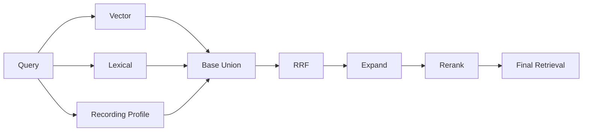
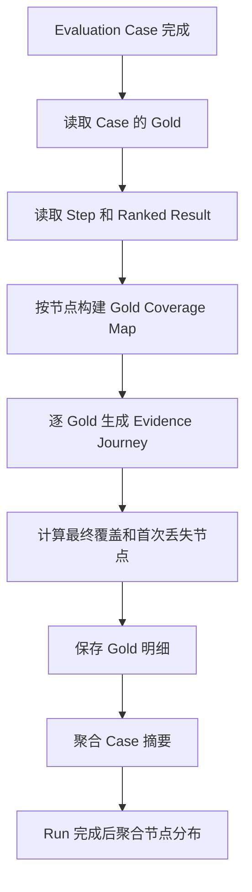

# RAG 评测 Gold 级节点丢失分析技术方案

## 1. 文档目标

本文档定义 RAG 离线评测中的确定性节点丢失分析：针对每个 Case 下的每条 Gold Evidence，基于评测运行已经保存的检索 Trace，计算它在各检索节点是否被召回、最佳排名是多少，以及它在哪个节点首次丢失。

本次只解决以下问题：

> 某个 Case 的某条 Gold Evidence，经过检索链路时在哪些节点可见，在哪个节点首次不可见？

本文档是《RAG 离线评测平台技术方案》的增量设计，复用现有 Dataset Version、Corpus Snapshot、Pipeline Version、Evaluation Run、Step Result、Ranked Result 和 Evidence Matcher。

## 2. 范围

### 2.1 本次范围

- 分析粒度精确到 `Case × Gold Evidence`；
- 记录每条 Gold 在各检索节点的命中状态；
- 记录命中节点中的最佳排名、匹配方式和来源 operation；
- 确定每条 Gold 的首次丢失节点；
- 正确处理 Expand 一个结果覆盖多条 Gold 的情况；
- 聚合 Case 级和 Run 级节点丢失统计；
- 在评测前端展示 Gold 级节点轨迹；
- 支持按首次丢失节点筛选 Case。

### 2.2 不在本次范围内

- 分析 Gold 为什么在某个节点丢失；
- 执行扩大 Top K、关闭节点等对照实验；
- 自动判断 embedding、关键词、融合权重或 reranker 的能力问题；
- 自动修改检索参数或生产 Pipeline；
- 答案生成质量和引用质量评测。

## 3. 核心定义

### 3.1 Gold Evidence

Gold Evidence 是本次分析的最小单位。一个 Case 可以包含多条 Gold，它们必须独立分析：

```text
Case A
├── Gold 1：RRF 命中，Rerank 命中
├── Gold 2：Expand 命中，Rerank 丢失
└── Gold 3：所有基础召回节点均未命中
```

不能只为 Case 生成一个丢失节点，否则会掩盖同一 Case 内不同 Gold 的实际路径。

### 3.2 节点命中

如果某节点保存的结果中，至少一个结果通过当前 Evidence Matcher 匹配到指定 Gold，则该 Gold 在此节点命中。

命中结果保存：最佳排名、匹配方式、来源 operation、结果 ID，以及可选的检索分支和分数。

### 3.3 首次丢失节点

Gold 在某节点的输入候选中仍然可见，但在该节点输出中不再可见，则该节点是丢失节点。

本方案定位的是最终有效覆盖路径上的“首次持续丢失”：如果 Gold 在中间暂时不可见，但被 Expand 的相邻上下文重新合法覆盖，则不把中间节点认定为最终丢失节点。

节点定位是确定性事实，不代表已经确定丢失原因。

## 4. 检索节点模型



| 分析节点 | Trace operation | 判定方式 |
|---|---|---|
| Vector | `retrieve.vector.*` | 取所有 Vector 分支中的最佳匹配排名 |
| Lexical | `retrieve.lexical.*` | 取所有逻辑关键词召回中的最佳匹配排名 |
| Recording Profile | 对应画像召回 operation | 取画像召回及其关联 chunk 中的最佳匹配排名 |
| Base Union | 派生节点 | Vector、Lexical、Profile 结果覆盖并集 |
| RRF | `retrieve.rrf` | 使用 RRF 输出匹配 Gold |
| Expand | `retrieve.expand` | 使用展开结果的完整覆盖集合匹配 Gold |
| Rerank | `retrieve.rerank` | 使用重排输出匹配 Gold |
| Final Retrieval | 最后一个启用的检索节点 | 由 Pipeline 配置确定 |

Pipeline 未启用的节点记为 `skipped`，不能记为丢失。

## 5. Gold Evidence Journey

### 5.1 数据结构

每次 Evaluation Run 中，每个 Case 下的每条 Gold 生成一条 `EvidenceJourney`：

```json
{
  "case_result_id": "case-result-uuid",
  "evaluation_case_id": "case-uuid",
  "evidence_id": "gold-uuid",
  "recording_id": "recording-uuid",
  "final_covered": false,
  "first_loss_node": "rerank",
  "last_visible_node": "expand",
  "stages": {
    "vector": {
      "status": "hit",
      "best_rank": 18,
      "match_kind": "time_overlap",
      "operation": "retrieve.vector.expanded",
      "result_id": "chunk-uuid"
    },
    "lexical": {"status": "miss", "best_rank": null},
    "base_union": {"status": "hit", "best_rank": null},
    "rrf": {"status": "hit", "best_rank": 9},
    "expand": {"status": "hit", "best_rank": 6},
    "rerank": {
      "status": "miss",
      "best_rank": null,
      "input_visible": true
    }
  }
}
```

### 5.2 节点状态

| 状态 | 含义 |
|---|---|
| `hit` | 保存范围内存在匹配该 Gold 的结果 |
| `miss` | 节点已执行且完整输出中没有匹配结果 |
| `skipped` | 当前 Pipeline 未启用该节点 |
| `unknown` | Trace 缺失、截断或不足以判断 |

`unknown` 不能作为首次丢失的确定结论。

### 5.3 多分支节点

Vector 和 Lexical 可能存在多个 operation 或查询分支。Gold 在任意分支命中，节点状态即为 `hit`，同时保存所有命中分支以及全局最佳排名。

数字归一化产生的多个关键词变体属于同一个逻辑关键词召回，不应在节点统计中被当作多个独立通道。

## 6. 首次丢失判定

### 6.1 基础召回节点

Vector、Lexical 和 Recording Profile 是并行通道：

```text
base_union_hit = vector_hit OR lexical_hit OR profile_hit
```

- 至少一个已启用基础通道命中：Base Union 为 `hit`；
- 所有已启用基础通道都确定为 `miss`：首次丢失节点为 `base_retrieval`；
- 必要 Trace 为 `unknown`，且其他通道均未命中：结果为 `unknown`。

某一个并行通道 miss 不代表 Gold 已从完整链路丢失。

### 6.2 串行节点

RRF、Expand、Rerank 按 Pipeline 的实际顺序判定。先生成全部节点状态，再计算最终有效覆盖路径：

1. 最终节点为 `hit`：`first_loss_node=null`；
2. 最终节点为 `miss`：从 Base Union 向后查找最后一次 `hit -> miss` 的连续丢失起点；
3. Base Union 命中但 RRF 首次变为 miss：丢失节点为 `rrf`；
4. Expand 命中但 Rerank 变为 miss：丢失节点为 `rerank`；
5. 中间 miss 后被 Expand 合法重新覆盖：不把该中间 miss 记为最终丢失；
6. 任一关键节点为 `unknown` 且影响结论：`first_loss_node=unknown`。

示例：

```text
Vector miss + Lexical hit -> RRF hit -> Expand hit -> Rerank miss
首次丢失节点：Rerank

Base Union hit -> RRF miss -> Expand hit -> Rerank hit
最终召回成功，不记录丢失节点

Vector miss + Lexical miss + Profile miss
首次丢失节点：Base Retrieval
```

### 6.3 Trace 保存上限

如果节点实际处理 Top 200，但评测只保存 Top 50，则 Gold 未出现在已保存结果中只能表述为“已保存 Top 50 内未观察到”，节点状态应为 `unknown`。

只有 Trace 覆盖节点完整输出时，才能确定为 `miss`，避免把保存截断误判成节点丢失。

## 7. Expand 多 Gold 覆盖

Context Expansion 可能把多个相邻 chunk 合并成一个结果，一个 Expanded Result 可以同时覆盖同一 Case 的多条 Gold：

```text
Expanded Result #2
├── Gold A：checksum
├── Gold B：time_overlap
└── Gold C：quote
```

诊断器必须读取 Ranked Result 中的完整覆盖集合：

```json
{
  "matched_evidences": [
    {"evidence_id": "gold-a", "match_kind": "checksum"},
    {"evidence_id": "gold-b", "match_kind": "time_overlap"}
  ]
}
```

判定规则：

- Gold 出现在任一结果的 `matched_evidences` 中，Expand 即为 `hit`；
- `best_rank` 是第一个覆盖该 Gold 的 Expanded Result 排名；
- 同一个 Expanded Result 可以使多条 Gold 同时命中；
- 不复制 Ranked Result，也不改变实际排名；
- 历史 Matcher v1 只有 primary match，无法准确恢复多 Gold 覆盖时，Expand 状态标为 `unknown`，不能判定丢失。

## 8. 聚合结果

### 8.1 Gold 级

每条 Gold 输出：

- `final_covered`；
- `first_loss_node`；
- `last_visible_node`；
- 各节点 `status` 和 `best_rank`；
- `match_kind` 和来源 operation。

### 8.2 Case 级

Case 只聚合其 Gold Journey，不生成单一的“Case 首次丢失节点”：

```json
{
  "gold_count": 3,
  "covered_gold_count": 1,
  "coverage_status": "partial_coverage",
  "first_loss_node_counts": {
    "base_retrieval": 1,
    "rerank": 1
  }
}
```

| Case 状态 | 条件 |
|---|---|
| `full_coverage` | 所有 Gold 最终均被覆盖 |
| `partial_coverage` | 至少一条但非全部 Gold 被覆盖 |
| `no_hit` | 所有 Gold 最终均未覆盖 |
| `not_applicable` | Unanswerable Case 或没有 Gold |

### 8.3 Run 级

Run 按 Gold 数量聚合：

```text
节点丢失占比
= 首次丢失在该节点的 Gold 数量
/ 最终未覆盖的有效 Gold 总数
```

展示有效 Gold、已覆盖 Gold、未覆盖 Gold、各节点丢失 Gold 数量与占比，以及 `unknown` 数量。各节点丢失数量加 `unknown` 必须等于最终未覆盖 Gold 总数。

## 9. 数据存储

建议新增 Gold 级评测诊断明细表：

```text
rag_evaluation_evidence_diagnostics

id                    uuid PK
evaluation_run_id     uuid FK evaluation_runs
case_result_id        uuid FK rag_evaluation_case_results
evaluation_case_id    uuid FK rag_evaluation_cases
evidence_id           uuid FK rag_evaluation_evidence
diagnostic_version    text
final_covered         boolean
last_visible_node     text nullable
first_loss_node       text nullable
stage_journey         jsonb
created_at            timestamptz
```

唯一约束为 `(case_result_id, evidence_id, diagnostic_version)`，常用索引为 `(evaluation_run_id, first_loss_node)` 和 `(case_result_id)`。

这里新增的是评测诊断结果存储，不修改生产检索表，也不为关键词归一化新增字段。

Case 列表所需摘要可保存到 `rag_evaluation_case_results.details.evidence_diagnosis`，但 Gold Journey 明细是事实来源。

## 10. 计算流程



Coverage Map 结构为：

```text
node -> evidence_id -> best_match
```

对 Case 的每条 Gold 独立生成 Journey。相同 `case_result_id + evidence_id + diagnostic_version` 必须得到相同结果，重复执行使用 upsert。诊断失败单独记录，不修改已经完成的 Retrieval Run 状态。

## 11. API 设计

### 11.1 Run 概览

```http
GET /api/rag-evaluation/runs/{run_id}/evidence-diagnosis
```

返回 Gold 总数、覆盖数、未覆盖数、unknown 数量，以及各首次丢失节点的 Gold 数量和占比。

### 11.2 Case Gold Journey

```http
GET /api/rag-evaluation/runs/{run_id}/cases/{case_result_id}/evidence-journeys
```

返回 Case 覆盖摘要及其每条 Gold 的最终覆盖状态、首次丢失节点和完整节点 Journey。

### 11.3 Case 筛选

```text
coverage_status=full_coverage|partial_coverage|no_hit
first_loss_node=base_retrieval|rrf|expand|rerank|unknown
```

`first_loss_node` 表示 Case 中至少有一条 Gold 在指定节点丢失。

## 12. 前端设计

### 12.1 Run 概览

在现有 Hit@5、Recall@10、MRR、nDCG@10 之外，增加 Gold 首次丢失节点分布。

### 12.2 Case 列表

每个 Case 展示：

- Hit@5 和 Recall@10；
- Gold 覆盖数，例如 `2/3`；
- 覆盖状态；
- Gold 丢失节点摘要，例如 `Base ×1，Rerank ×1`。

### 12.3 Case 详情

按 Gold 展示节点轨迹：

```text
Gold 1  最终覆盖
Vector #18 -> RRF #9 -> Expand #6 -> Rerank #4

Gold 2  首次丢失：Rerank
Vector Miss | Lexical #3 -> RRF #7 -> Expand #5 -> Rerank Miss

Gold 3  首次丢失：Base Retrieval
Vector Miss | Lexical Miss | Profile Miss -> Base Union Miss
```

点击节点可查看最佳排名、匹配方式、来源 operation、结果文本与时间范围，以及节点是否因 Trace 不完整而为 `unknown`。

## 13. 测试策略

单元和集成测试至少覆盖：

- 单 Gold 全节点命中；
- 多 Gold 分别在不同节点丢失；
- Vector miss、Lexical hit 不判定为基础召回丢失；
- 所有基础通道 miss 判定为 `base_retrieval`；
- RRF hit、Expand miss 判定为 `expand`；
- Expand hit、Rerank miss 判定为 `rerank`；
- RRF miss、Expand 重新覆盖且最终命中时不记录丢失；
- 一个 Expanded Result 覆盖多条 Gold；
- 节点未启用时为 `skipped`；
- Trace 截断或缺失时为 `unknown`；
- 每个有效 Gold 恰好生成一条 Journey；
- Case 和 Run 聚合结果与 Gold Journey 守恒；
- 诊断失败不影响 Retrieval Run 状态。

## 14. 实施内容

后端：

- 定义 operation 到分析节点的映射；
- 从 Ranked Result 构建 Gold Coverage Map；
- 实现逐 Gold Evidence Journey；
- 实现首次持续丢失节点判定；
- 保存 Gold 明细及 Case、Run 聚合；
- 增加 Run 和 Case 诊断 API。

前端：

- Run 页面增加 Gold 节点丢失分布；
- Case 列表增加 Gold 覆盖数和丢失节点摘要；
- Case 详情增加逐 Gold Journey；
- 增加覆盖状态和首次丢失节点筛选。

## 15. 验收标准

1. 每个 Answerable Case 的每条 Gold 都有独立 Evidence Journey；
2. Journey 展示每个已执行节点的命中状态和最佳排名；
3. 每条最终未覆盖 Gold 都有确定的首次丢失节点或 `unknown`；
4. 并行基础通道中的单路 miss 不会被误判为整条链路丢失；
5. Expand 一个结果覆盖多条 Gold 时，每条 Gold 均正确命中；
6. Expand 吸收相邻 Gold 不会导致该 Gold 被错误判定为未召回；
7. Case 展示其全部 Gold 的独立节点轨迹；
8. Case 可按覆盖状态和 Gold 首次丢失节点筛选；
9. Run 节点丢失数量与最终未覆盖 Gold 数量一致；
10. Trace 不完整时返回 `unknown`，不产生伪确定结论；
11. 诊断不改变生产检索结果、排序和现有评测指标；
12. 本次实现仅产出确定性的 Gold 级节点命中轨迹和首次丢失节点。
