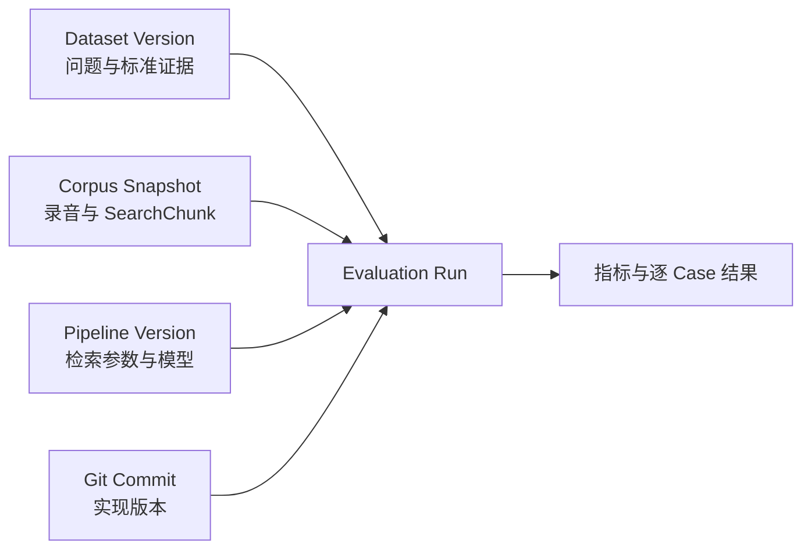
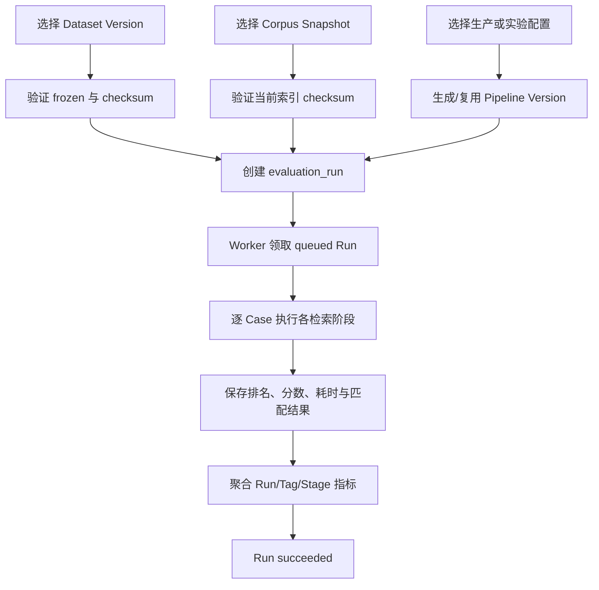
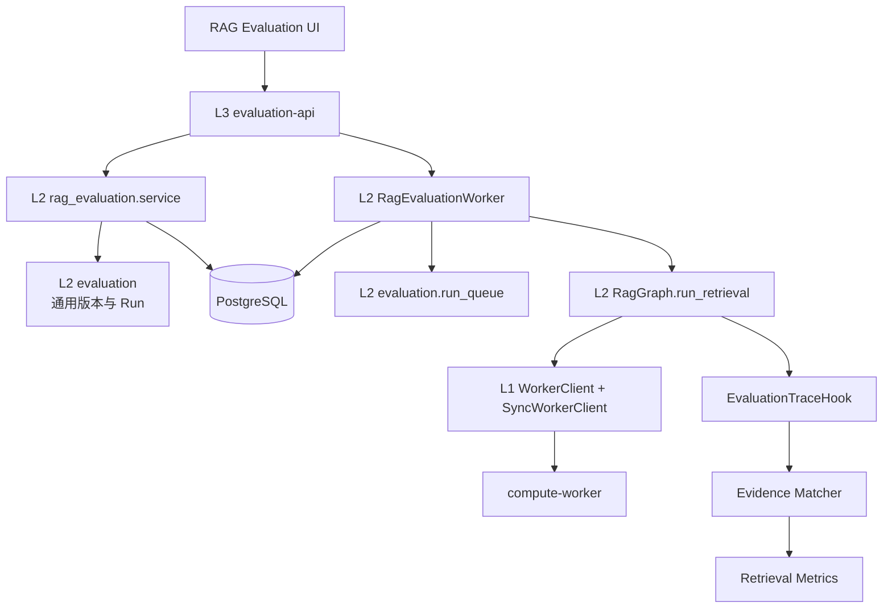

# RAG 离线评测平台技术方案

## 1. 文档目标

本文档定义录音问答 RAG 的离线评测平台，包括：

- 如何复用现有 `sql/evaluation.sql` 中已经实现的评测基础设施；
- 如何管理可编辑标注、不可变评测集版本和可复现实验；
- 如何冻结录音、SearchChunk 和检索配置的版本关系；
- 如何评估 vector、lexical、RRF、context expansion 和 rerank 各阶段；
- 如何在前端完成标注、运行、对比和失败分析；
- 第一阶段的实施边界和后续扩展方向。

第一阶段只建设 `rag_retrieval` 检索评测，不评判最终自然语言答案。核心问题是：

> 给定用户问题和检索范围，包含答案的录音证据能否被召回，并排在足够靠前的位置。

答案正确性、引用准确性、拒答能力和模型裁判后续作为 `rag_answer` 任务接入，不阻塞检索评测闭环。

## 2. 核心结论

### 2.1 复用原则

RAG 评测不新建一套完全独立的平台，而是复用现有评测系统的控制面：

- Dataset 生命周期；
- 不可变 Dataset Version；
- Run 队列、进度、取消、失败和幂等机制；
- Workspace 权限隔离；
- 统一的 API 和前端导航框架。

ASR 和 RAG 的 Case、Ground Truth 与 Result 结构不同，不强行共用任务明细表：

```text
共享控制面
├── evaluation_datasets
├── evaluation_dataset_versions
└── evaluation_runs

ASR 任务明细
├── evaluation_source_assets
├── evaluation_annotations
├── evaluation_cases
├── evaluation_run_models
├── evaluation_case_results
└── evaluation_metric_values

RAG 任务明细
├── rag_evaluation_case_drafts
├── rag_evaluation_evidence_drafts
├── rag_evaluation_cases
├── rag_evaluation_evidence
├── rag_corpus_snapshots
├── rag_corpus_snapshot_chunks
├── rag_pipeline_versions
├── rag_evaluation_run_specs
├── rag_evaluation_case_results
├── rag_evaluation_step_results
├── rag_evaluation_ranked_results
└── rag_evaluation_metric_values
```

### 2.2 为什么不直接复用 ASR Case

ASR Case 表示：

```text
一个音频区间 -> 一段人工参考转写
```

RAG Retrieval Case 表示：

```text
一个 Query
+ 一个检索范围 Scope
+ 零到多个标准证据 Evidence
+ 每个证据不同的相关度
```

当前 `evaluation_cases` 强制要求 `source_annotation_id`、`source_asset_id`、音频区间和参考文本。将 RAG Query 和 Evidence 全部塞进 `metadata` 会失去数据库约束、查询能力和前端可维护性，因此新增 RAG 专用明细表。

### 2.3 RAG 比较的是 Pipeline，不是单个模型

一次 RAG 检索结果共同取决于：

- SearchChunk 构建版本；
- embedding 模型；
- vector/lexical 候选数量；
- RRF 参数；
- context expansion 策略；
- rerank 模型与 Top K；
- 相关代码版本。

因此正式比较对象是 `rag_pipeline_versions`，不能为了复用 `model_versions`，把整条 Pipeline 伪装成单个模型。

## 3. 范围与非目标

### 3.1 第一阶段范围

- 创建和维护 RAG Retrieval 评测集；
- 为 Query 标注检索 Scope、标签、可回答性和标准证据；
- 冻结不可变评测集版本；
- 创建录音与 SearchChunk 语料快照；
- 自动生成不可变 RAG Pipeline Version；
- 异步执行评测并保存每个检索阶段的有序结果；
- 计算 Hit@K、Recall@K、MRR、nDCG@K 和延迟；
- 对无答案问题计算错误证据率；
- 按标签分析问题类型；
- 两个 Run 与基线对比；
- 下钻查看改善、退化和失败 Case。

### 3.2 第一阶段不做

- 最终答案的 LLM-as-a-Judge；
- 自动生成未经人工确认的 Ground Truth；
- 在线 A/B 实验和流量自动放量；
- 自动阻断生产发布；
- 保存所有历史 embedding 向量副本；
- 通用低代码评测工作流；
- 多人复杂审批流。

## 4. 版本模型

一次结果只有同时固定以下版本才可比较：



### 4.1 Dataset Version

表示本次使用哪些问题、Scope、标签和标准证据。

状态沿用现有设计：

```text
building -> frozen
```

`frozen` 后禁止修改。需要纠正问题或证据时，从原数据集标注区生成下一个 `version_number`。

以下变化必须产生新的 Dataset Version：

- 增删 Query；
- 修改 Query 或 Scope；
- 修改 answerability；
- 增删标准证据；
- 修改证据 relevance；
- 修改标签、expected facts 或 split；
- 修改 Evidence Matcher 规则。

### 4.2 Corpus Snapshot

表示评测时使用的录音和 SearchChunk 状态。

当前 `recording_search_chunks` 在重新索引时会删除旧行并重新插入，导致：

- `chunk_id` 变化；
- chunk 边界变化；
- `normalized_text` 变化；
- metadata 和 embedding 变化。

因此不能只在标准证据中引用线上 `recording_search_chunks.id`。标准证据使用“录音 + 时间范围 + quote”作为跨切块版本稳定的事实锚点；语料快照至少复制：

- recording ID；
- 原 SearchChunk ID；
- chunk index；
- 原文与检索文本；
- start/end 时间；
- metadata；
- embedding 模型标识；
- 内容 checksum；
- SearchChunk 和录音处理 Pipeline 版本。

第一阶段不复制 embedding 向量。执行 Run 前校验当前检索索引与快照 checksum 一致；不一致时拒绝执行并提示创建新快照。后续如果需要完全复现已经被替换的历史索引，再引入独立评测向量索引或向量 Artifact。

### 4.3 Pipeline Version

Pipeline Version 由规范化后的配置自动计算哈希，不要求管理员手工递增版本号：

```text
config_snapshot -> canonical JSON -> SHA-256 -> config_hash
```

相同 Workspace 下相同 `config_hash` 复用已有版本。管理员可以为版本添加可读名称，但名称不是身份依据。

配置至少包含：

```json
{
  "retrieval_contract_version": "1",
  "embedding": {
    "provider": "sentence_transformers",
    "model": "Qwen/Qwen3-Embedding-4B",
    "dimensions": 2560
  },
  "vector_top_k": 40,
  "lexical_top_k": 40,
  "rrf_k": 60,
  "context_expansion": {
    "enabled": true,
    "before": 1,
    "after": 1
  },
  "rerank": {
    "enabled": true,
    "model": "Qwen/Qwen3-Reranker-0.6B",
    "top_k": 10
  }
}
```

### 4.4 Evaluation Run

每次点击运行产生一个不可变实验记录。Run 身份不使用人工版本号，使用 UUID，并记录：

- Dataset Version；
- Corpus Snapshot；
- Pipeline Version；
- Git Commit；
- evaluator 和 metric 版本；
- 发起人、状态和时间；
- 每个 Case 的逐阶段结果。

## 5. 现有数据库复用评估

| 现有表 | 决策 | 改动 |
|---|---|---|
| `evaluation_datasets` | 复用 | 扩展 `task_type` |
| `evaluation_dataset_versions` | 复用 | 增加通用任务定义快照 |
| 冻结版本触发器 | 复用 | 增加 RAG Case 对应触发器 |
| `evaluation_runs` | 复用 | 通过 1:1 扩展表保存 RAG Run 参数 |
| `evaluation_source_assets` | ASR 专用 | RAG 使用 Corpus Snapshot |
| `evaluation_annotations` | ASR 专用 | RAG 使用 Case Draft 与 Evidence Draft |
| `evaluation_cases` | ASR 专用 | RAG 使用独立冻结 Case |
| `model_versions` | 部分复用 | 可登记组件模型，不代表 Pipeline |
| `evaluation_run_models` | ASR 专用 | RAG Run 指向 Pipeline Version |
| `evaluation_case_results` | ASR 专用 | RAG 保存逐阶段有序检索结果 |
| `evaluation_metric_values` | ASR 专用保持不变 | RAG 指标使用独立表 |
| `training_runs` | 不涉及 | 保持 ASR 训练用途 |

### 5.1 `evaluation_datasets` 调整

将任务类型扩展为：

```text
asr
rag_retrieval
rag_answer（预留，第一阶段不提供创建入口）
```

数据集归档、Workspace 隔离、名称唯一性和审计字段保持不变。

### 5.2 `evaluation_dataset_versions` 调整

现有 `normalization_name` 和 `normalization_version` 暂时保留，避免影响 ASR。新增：

```sql
definition_snapshot jsonb not null default '{}'::jsonb
```

RAG 版本示例：

```json
{
  "task_type": "rag_retrieval",
  "query_normalization": "unicode_trim_v1",
  "evidence_matcher": "recording_time_overlap_or_quote_v1",
  "relevance_scale": [0, 1, 2, 3]
}
```

Dataset Version 的 checksum 必须覆盖 RAG Case、证据、split、标签和 `definition_snapshot`。

### 5.3 `evaluation_runs` 扩展方式

不向公共 Run 表持续增加 RAG 专用列。新增 1:1 扩展表：

```text
rag_evaluation_run_specs
- evaluation_run_id PK/FK
- corpus_snapshot_id
- pipeline_version_id
- baseline_run_id nullable
- query_timeout_ms
- created_at
```

这样未来摘要或答案评测也可以采用各自的 Run Spec，而不会把公共表变成大量 nullable 字段。

## 6. RAG 领域模型

### 6.1 可编辑标注与冻结 Case 分离

RAG 标注工作区允许持续修改：

```text
draft -> reviewed -> approved
          \-> draft
approved  \-> draft（修改后必须重新审核）
```

冻结时只选择 `approved` 的 Case Draft，并复制为不可变 Case。冻结版本不得直接读取持续变化的 Draft。

### 6.2 `rag_evaluation_case_drafts`

建议字段：

```text
id                    uuid
dataset_id            uuid FK evaluation_datasets
query                 text
scope                 jsonb
answerability         answerable / unanswerable
expected_facts        jsonb array
tags                  text[]
group_key             text
status                draft / reviewed / approved
revision              integer
reviewed_by_user_id   uuid nullable
reviewed_at           timestamptz nullable
approved_by_user_id   uuid nullable
approved_at           timestamptz nullable
created_by_user_id    uuid
created_at            timestamptz
updated_at            timestamptz
```

`revision` 用作乐观锁。Query、Scope、answerability 或标准证据变化后，状态必须回到 `draft`。

可编辑 Evidence 单独保存到 `rag_evaluation_evidence_drafts`。选择当前 SearchChunk 时立即复制 recording、quote、start/end、relevance 和 content checksum；`source_chunk_id` 只用于来源追踪，不设置强外键。这样重新索引不会删除人工标注，冻结时再复制到 `rag_evaluation_evidence`。

### 6.3 `rag_evaluation_cases`

冻结 Case 保存 Draft 的不可变快照：

```text
id                    uuid
dataset_version_id    uuid FK evaluation_dataset_versions
source_draft_id       uuid FK rag_evaluation_case_drafts
query                 text
query_normalized      text
scope                 jsonb
answerability         answerable / unanswerable
expected_facts        jsonb array
tags                  text[]
split                 validation / test
group_key             text
metadata              jsonb
created_at            timestamptz
```

同一个 `group_key` 不得跨 split。多个同义问法如果指向同一事实，应使用相同 `group_key`，防止指标被大量近似 Query 放大。

### 6.4 `rag_evaluation_evidence`

标准证据与冻结 Case 为一对多关系。Evidence 不绑定某个 Corpus Snapshot，否则调整切块策略后，同一个 Dataset Version 将无法用于公平比较不同语料版本：

```text
id                     uuid
evaluation_case_id     uuid FK rag_evaluation_cases
source_recording_id    uuid FK recordings
source_chunk_id        uuid nullable（仅标注来源追踪）
quote                  text
start_ms               integer nullable
end_ms                 integer nullable
content_checksum       text
relevance              integer 1..3
metadata               jsonb
created_at             timestamptz
```

相关度定义：

```text
3 直接包含答案
2 提供必要背景或部分答案
1 主题相关但不能单独回答
0 无关，不作为 Ground Truth 保存
```

`unanswerable` Case 必须没有 relevance 大于零的 Evidence；`answerable` Case 至少有一个 Evidence。该规则由冻结服务校验。

`source_chunk_id` 不能设置到 `recording_search_chunks` 的强外键，因为重新索引会删除并重建线上 Chunk。它只是标注时的来源追踪信息；正式命中由 recording、时间区间、quote 和版本化 Evidence Matcher 决定。

### 6.5 `rag_corpus_snapshots`

建议字段：

```text
id                           uuid
workspace_id                 uuid
name                         text
status                       building / frozen
recording_pipeline_version   text nullable
search_chunk_version         text
embedding_model_id           uuid FK embedding_models
config_snapshot              jsonb
recording_count              integer
chunk_count                  integer
checksum                     text nullable
created_by_user_id           uuid
frozen_at                    timestamptz nullable
created_at                   timestamptz
```

冻结后禁止修改快照和快照 Chunk。

### 6.6 `rag_corpus_snapshot_chunks`

建议字段：

```text
id                    uuid
corpus_snapshot_id    uuid FK rag_corpus_snapshots
source_chunk_id       uuid nullable
recording_id          uuid（弱来源引用）
chunk_index           integer
text                  text
normalized_text       text
start_ms              integer
end_ms                integer
metadata              jsonb
content_checksum      text
created_at            timestamptz
```

评测领域不得阻止生产录音的生命周期删除，也不得让 `RecordingService` 感知评测表。Evidence、Corpus Snapshot Chunk 和 Ranked Result 中的 `recording_id` 保存为弱来源 UUID，不建立指向 `recordings` 的外键。

`evaluation-api` 启动时执行孤儿清理：移除引用已删除录音的 Draft Evidence 并重置 Draft；删除受影响的冻结 Dataset Version、Corpus Snapshot、Run 及其派生结果。该清理完全属于评测服务边界，录音删除链路不直接操作评测数据。

### 6.7 `rag_pipeline_versions`

建议字段：

```text
id                    uuid
workspace_id          uuid
name                  text nullable
config_hash           text
config_snapshot       jsonb
code_commit           text nullable
created_by_user_id    uuid
created_at            timestamptz
```

唯一约束：

```text
(workspace_id, config_hash)
```

Pipeline Version 创建后不允许修改 `config_snapshot` 和 `config_hash`。允许修改可读名称，但不影响版本身份。

### 6.8 `rag_evaluation_case_results`

保存单个 Case 的执行终态：

```text
id                    uuid
evaluation_run_id     uuid FK evaluation_runs
evaluation_case_id    uuid FK rag_evaluation_cases
status                succeeded / failed
query_used            text nullable
latency_ms            integer nullable
stage_timings         jsonb
error_message         text nullable
details               jsonb
created_at            timestamptz
updated_at            timestamptz
```

唯一约束：

```text
(evaluation_run_id, evaluation_case_id)
```

### 6.9 `rag_evaluation_step_results`

保存一次 Case 中每个 Graph/Pipeline Step 的统一执行结果：

```text
id                    uuid
case_result_id        uuid FK rag_evaluation_case_results
operation             text
operation_version     text
sequence              integer
attempt               integer
output_kind           text
status                running / succeeded / failed / cancelled
latency_ms            integer nullable
input_summary         jsonb
output                 jsonb
error_message         text nullable
details               jsonb
created_at            timestamptz
updated_at            timestamptz
```

唯一约束：

```text
(case_result_id, sequence)
```

`operation` 和 `output_kind` 都使用开放字符串，不使用数据库封闭枚举。第一阶段使用：

```text
operation:
retrieve.vector
retrieve.lexical
retrieve.rrf
retrieve.expand
retrieve.rerank

output_kind:
ranked_candidates
```

后续执行完整 Graph 时可以增加：

```text
operation=route              output_kind=routing
operation=rewrite            output_kind=query
operation=grade              output_kind=evidence_grade
operation=plan               output_kind=plan
operation=answer             output_kind=answer
operation=validate.claims    output_kind=claim_validation
```

`sequence` 表示一次 Case 内的实际执行顺序，`attempt` 表示循环或重试次数。例如：

```text
sequence=3, attempt=0, operation=retrieve.rrf
sequence=7, attempt=1, operation=rewrite
sequence=9, attempt=1, operation=retrieve.rrf
```

因此 Graph 新增循环后不会覆盖第一次检索结果。`input_summary` 和 `output` 必须是经过脱敏和大小限制的评测快照，禁止默认保存完整 Prompt、History 或敏感原始 State。

### 6.10 `rag_evaluation_ranked_results`

只有 `output_kind=ranked_candidates` 的 Step 才保存有序候选：

```text
step_result_id             uuid FK rag_evaluation_step_results
rank                       integer
corpus_snapshot_chunk_id   uuid nullable
recording_id               uuid
source_chunk_id            uuid nullable
score                      numeric nullable
vector_score               numeric nullable
lexical_score              numeric nullable
rrf_score                  numeric nullable
rerank_score               numeric nullable
matched_relevance          integer 0..3
match_kind                 time_overlap / quote / checksum / none
details                    jsonb
```

主键：

```text
(step_result_id, rank)
```

新排序节点产生新的 Step Result，不需要修改 Ranked Result 表。节点特有分数放入 `details`，避免每新增一个算法就增加固定列。

未来可直接扩展：

```text
retrieve.recording
retrieve.multi_query.vector
retrieve.multi_query.lexical
retrieve.diversity
retrieve.context_packing
```

### 6.11 `rag_evaluation_metric_values`

RAG 指标的比较主体是 Pipeline，并且需要 Run、标签、Case、Stage 多种粒度，因此不复用绑定 ASR Model Result 的 `evaluation_metric_values`。

建议字段：

```text
id                    uuid
evaluation_run_id     uuid FK evaluation_runs
evaluation_case_id    uuid nullable FK rag_evaluation_cases
step_result_id        uuid nullable FK rag_evaluation_step_results
scope                 run / tag / case / operation / step
scope_key             text nullable
operation             text nullable
metric_name           text
metric_version        text
value                 numeric
sample_count          integer nullable
details               jsonb
created_at            timestamptz
```

例如：

```text
scope=run,   metric_name=hit_at_5
scope=tag,   scope_key=口语省略, metric_name=hit_at_5
scope=operation, operation=retrieve.rerank, metric_name=mrr
scope=step, step_result_id=..., metric_name=reciprocal_rank
scope=case,  evaluation_case_id=..., metric_name=reciprocal_rank
```

## 7. Ground Truth 与命中规则

### 7.1 证据匹配优先级

评测结果按以下顺序匹配标准证据：

1. 同一录音且时间范围达到指定重叠比例；
2. 同一录音且结果文本包含标准 quote；
3. 标注来源 Chunk 仍存在时，使用其内容 checksum 辅助确认；
4. 未匹配。

匹配规则自身必须版本化，例如：

```text
recording_time_overlap_or_quote_v1
```

避免修改匹配算法后，在同一 Run 上得到不同指标。

### 7.2 时间重叠

建议第一版采用：

```text
intersection / ground_truth_duration >= 0.5
```

时间重叠只作为 chunk 边界变化后的容错。不同录音绝不能仅凭相似文本判定为同一证据。

### 7.3 Context Expansion 的归属

扩展后的父候选或相邻 Chunk 如果覆盖标准 Evidence，应判定 expanded 阶段命中，并在 `details` 中记录：

- 原始召回 Chunk；
- 被扩展的相邻 Chunk；
- 最终命中 Evidence 的 Chunk；
- expansion 前后 Token/字符数量。

这样可以判断命中来自粗召回本身，还是由上下文扩展补足。

## 8. 指标定义

### 8.1 Answerable Case

第一阶段正式指标：

- `Hit@1`、`Hit@5`、`Hit@10`；
- `Recall@5`、`Recall@10`、`Recall@20`；
- `MRR`；
- `nDCG@10`；
- Recording Recall@K；
- P50/P90 Case latency；
- 各 stage P50/P90 latency。

Hit@K 表示 Top K 是否至少出现一个 relevance 大于零的证据。Recall@K 表示 Top K 命中的标准证据数占全部标准证据数的比例。MRR 使用第一个相关证据的排名。nDCG 使用 relevance 1～3 作为 graded relevance。

### 8.2 Unanswerable Case

无答案 Case 不进入普通 Recall 和 MRR 分母，单独计算：

- `false_evidence_rate`：无答案问题仍返回高置信度证据的比例；
- `empty_retrieval_rate`：没有返回候选的比例；
- 后续接入 Grade 时增加 `abstention_accuracy`。

第一阶段只评检索时，必须在 Pipeline 配置中明确“高置信度证据”的阈值及版本。

### 8.3 Vector 与 Lexical 的含义

当前代码中的 `vector` 使用 Query Embedding 与 `recording_search_chunks.embedding` 的 cosine similarity 排序，适合召回语义相似但用词不同的内容。

当前代码中的 `lexical` 不是 BM25，而是 PostgreSQL `pg_trgm` 的 `word_similarity(query, normalized_text)` 和 GiST KNN 距离排序，适合原词、专有名词、数字和相近字符串命中。文档和前端统一称为 lexical，不能标记成 BM25。

如果未来接入 BM25，它应作为新的实现或 operation version。BM25 基于词频、逆文档频率和文档长度归一化，仍输出有序候选，因此可以复用相同 Ranked Result 和检索指标。

Vector 和 Lexical 的原始 score 不在同一量纲，不能直接比较“谁的 score 更高”。质量统一通过它们各自的排名与人工 Evidence Ground Truth 计算：

- Hit@K：Top K 是否至少找到一个正确 Evidence；
- Recall@K：Top K 找回了多少标准 Evidence；
- MRR：第一个正确 Evidence 排名是否足够靠前；
- nDCG@K：高 relevance Evidence 是否排在低 relevance Evidence 前；
- P50/P90 latency：质量提升的时间成本。

还需要计算渠道增量：

```text
vector_only_hit       只有 Vector 找到
lexical_only_hit      只有 Lexical 找到
overlap_hit           两者都找到
union_recall          两个候选集的理论联合召回
fusion_lift           RRF 相对最佳单路的提升
```

分标签分析通常会呈现不同优势：Vector 更可能改善同义表达和口语省略；Lexical 更可能改善原词、数字与专业名词。结论必须以评测集结果为准，不能作为硬编码规则。

### 8.4 分阶段指标

同一 Case 至少保存以下阶段：

```text
vector -> lexical -> rrf -> expanded -> reranked
```

指标同时按阶段计算，才能回答：

- embedding 粗召回是否漏掉证据；
- lexical 是否产生增量；
- RRF 是否改善融合；
- context expansion 是否补全证据或引入噪声；
- rerank 是否将正确证据提前；
- 增加的延迟是否值得。

### 8.5 标签分组

第一批建议标签：

```text
原词命中
同义表达
口语省略
ASR 专业词错误
时间范围
人物范围
跨录音
数字事实
无答案
```

总体指标之外必须展示标签维度，否则容易被大量简单问题掩盖真实缺陷。

## 9. 评测执行流程



### 9.1 创建 Run

API 在一个事务内：

1. 验证 Dataset Version 属于当前 Workspace 且为 `frozen`；
2. 验证 Dataset 的 `task_type=rag_retrieval`；
3. 验证 Corpus Snapshot 为 `frozen`；
4. 验证快照覆盖所有 Case Scope 与 Evidence 所引用的录音；
5. 规范化配置并生成/复用 Pipeline Version；
6. 插入 `evaluation_runs`；
7. 插入 `rag_evaluation_run_specs`；
8. 提交后由 worker 异步领取。

### 9.2 Worker 执行

第一阶段复用现有 RAG Retriever 的领域实现，但必须提供可观测的阶段结果，而不是只调用返回最终 Evidence 的高层接口。

每个 Case：

1. 使用冻结 Query 和 Scope；
2. 执行 vector 和 lexical 粗召回；
3. 保存各自 Top N；
4. 执行 RRF 并保存排名；
5. 执行 context expansion 并保存来源关系；
6. 按配置执行 rerank；
7. 将结果映射到 Corpus Snapshot Chunk；
8. 计算 Case 指标；
9. 幂等写入 Case Result、Ranked Results 和 Metric Values。

单个 Case 失败不立即终止整个 Run。更新 `failed_case_count` 后继续；超过可配置失败比例时将 Run 标记为 `failed`。

### 9.3 可复现性校验

Run 开始前再次校验：

- Dataset Version checksum；
- Corpus Snapshot checksum；
- 当前检索索引 checksum；
- Pipeline Version config hash；
- evaluator/metric 版本。

任何不一致都不应静默继续执行。

## 10. 包架构设计

### 10.1 总体依赖方向

RAG 评测采用“共享评测控制面 + 独立 RAG 评测领域包 + 复用生产检索内核”的结构：

```text
evaluation-api
    ↓
rag_evaluation
   ↙          ↘
evaluation    rag
    ↓          ↓
       l1_foundation
```

依赖约束：

- `l3_app` 只负责 HTTP、进程生命周期和依赖装配；
- `rag_evaluation` 可以依赖 `evaluation` 和 `rag`；
- `rag` 不得反向依赖 `rag_evaluation`；
- `asr_lab` 与 `rag_evaluation` 不得互相依赖；
- L1 不包含 Dataset、Evidence、Metric 等评测业务语义；
- 前端、路由和 Worker 不得分别实现一套检索或指标算法。

评测必须调用生产使用的同一套 Retrieval Pipeline，禁止复制 vector、lexical、RRF、context expansion 或 rerank 实现。否则离线指标验证的不是生产链路。

### 10.2 L1 Foundation

第一阶段不新增 L1 业务包，继续复用：

```text
backend/packages/l1_foundation/
├── infrastructure/db
├── settings
├── worker
├── task_runtime
└── observability
```

L1 为 RAG 评测提供：

- PostgreSQL Engine；
- `SyncWorkerClient`；
- Settings；
- 基础日志和监控；
- 通用任务运行能力。

RAG Evaluation Worker 是后台同步任务，使用 `SyncWorkerClient` 调用 Compute Worker，不占用 FastAPI request event loop。Embedding 和 rerank 模型仍由 Compute Worker 管理，evaluation-api 不直接加载模型。

### 10.3 通用 `l2_core/evaluation`

建议整理为：

```text
backend/packages/l2_core/evaluation/
├── __init__.py
├── contracts.py
├── datasets.py
├── versions.py
├── run_queue.py
├── checksums.py
├── metrics.py
└── errors.py
```

职责：

| 模块 | 职责 |
|---|---|
| `contracts.py` | Dataset、Version、Run 的通用状态和协议 |
| `datasets.py` | Dataset 查询、归档和 Workspace 校验 |
| `versions.py` | 版本号分配、冻结和不可变校验 |
| `run_queue.py` | 按 evaluator type 领取、取消、回队和完成 Run |
| `checksums.py` | Canonical JSON、稳定 checksum |
| `metrics.py` | 现有 ASR 通用指标兼容；不新增 RAG 指标 |
| `errors.py` | 通用评测异常 |

这个包不能出现 RAG Query、SearchChunk、Recall@K、ASR 音频区间或 CER/WER 的任务编排。任务专用行为分别留在 `asr_lab` 和 `rag_evaluation`。

### 10.4 新增 `l2_core/rag_evaluation`

建议目录：

```text
backend/packages/l2_core/rag_evaluation/
├── __init__.py
├── contracts.py
├── service.py
├── repository.py
├── datasets.py
├── corpus_snapshots.py
├── pipeline_versions.py
├── evidence_matcher.py
├── metrics.py
├── executor.py
├── comparisons.py
└── worker.py
```

#### `contracts.py`

保存纯数据契约：

```text
RagCaseDraft
FrozenRagCase
EvidenceAnchor
CorpusSnapshot
PipelineVersion
RetrievalStageResult
RankedCandidate
CaseEvaluationResult
RunComparison
```

本模块不写 SQL、不调用模型。

#### `service.py`

作为 API 的应用服务，负责：

- Case Draft CRUD；
- review/approve；
- 冻结 Dataset Version；
- 创建 Corpus Snapshot；
- 创建和取消 Evaluation Run；
- 查询 Run 和执行 Run 对比；
- Workspace 权限与事务边界。

Service 不在 HTTP 请求内执行真实检索。

#### `repository.py`

集中维护 RAG 评测专用 SQL。第一阶段使用单文件，超过约 500～700 行后再拆为：

```text
repositories/
├── datasets.py
├── corpus.py
├── runs.py
└── results.py
```

#### `datasets.py`

负责 Draft 状态流转、冻结 Case、split/group_key 校验、answerability/evidence 一致性以及 Dataset checksum。

#### `corpus_snapshots.py`

负责从 `recording_search_chunks` 创建快照、计算 checksum、校验录音覆盖范围和冻结快照，不执行检索。

#### `pipeline_versions.py`

负责：

- 从当前 Settings 生成生产配置；
- 校验自定义实验配置；
- Canonical JSON 和 `config_hash`；
- 创建或复用 Pipeline Version；
- 两个配置的结构化 Diff。

自定义实验配置必须经过服务端白名单校验，不能允许前端传入任意模型路径、服务地址或未受控参数。

#### `evidence_matcher.py`

提供纯函数，将召回结果按“录音 + 时间重叠 + quote”匹配到 Evidence Anchor，返回：

```text
match_kind
matched_evidence_id
matched_relevance
```

#### `metrics.py`

提供纯指标计算：

- Hit@K；
- Recall@K；
- MRR；
- nDCG@K；
- Recording Recall@K；
- false evidence rate；
- 标签和 Stage 聚合；
- P50/P90。

该模块只消费 Case 与 Ranked Result，不查询数据库、不调用模型。

#### `executor.py`

执行单个 Case：

```text
冻结 Query/Scope
→ 生产 RagGraph.run_retrieval
→ EvaluationTraceHook
→ Evidence Matcher
→ Case Metrics
```

Executor 不领取队列、不循环整个数据集。

#### `comparisons.py`

比较两个已完成 Run，输出：

- 总指标和标签指标变化；
- 成功变失败；
- 失败变成功；
- 排名上升或下降；
- Pipeline Config Diff。

#### `worker.py`

负责领取 `rag_retrieval` Run、版本校验、遍历 Case、调用 Executor、幂等落库、更新进度、响应取消、聚合指标以及失败恢复。

### 10.5 直接执行生产 `RagGraph` 的检索路径

离线评测不再自行调用 `RagRetriever` 编排 Vector、Lexical、RRF、Expand 和 Rerank。`RagGraph` 只编译一个 `StateGraph`，对外提供两种运行方式：

- `run()`：完整线上路径，继续进入 grade、rewrite、plan 和 answer；
- `run_retrieval()`：执行相同的 route、retrieve、expand context、rerank 节点，在实际检索终点结束。

两种运行方式在初始 State 中分别写入 `execution_mode=answer/retrieval`。现有条件边读取该字段，在检索模式的实际终点转向 `END`；它不是 `RagGraph` 实例上的可变开关，因此同一个 Graph 可以并发运行线上回答和评测。所有调用复用同一份 Builder、节点函数和 `RagRetriever` 实例，不存在第二套 Graph 拓扑或检索顺序。独立 LangGraph 节点边界保持不变：

```text
backend/packages/l2_core/rag/
├── retrieval.py
├── graph.py
└── hooks.py
```

评测 Worker 的调用方式：

```python
hook = EvaluationTraceHook()
state = await graph.run_retrieval(
    query=case.query,
    limit=config.fused_top_k,
    scope_recording_ids=case.scope_recording_ids,
    hook=hook,
)
```

`run_retrieval()` 按真实路径停止：

```text
route unresolved             → END
scope_summary                → retrieve → END
chunk_search，无候选         → retrieve → END
chunk_search，关闭 rerank    → retrieve → expand_context → END
chunk_search，开启 rerank    → retrieve → expand_context → rerank → END
```

这会把 route 质量纳入最终检索指标。例如问题被错误路由成 `scope_summary` 或 `unresolved` 时，最终 Hit/Recall 会真实下降，而不是绕过 route 后得到虚高结果。

### 10.6 Run-scoped Hook 与 Evaluator Registry

`RagExecutionHook` 使用 `ContextVar` 按单次运行注入，支持同一个 `RagGraph` 并发执行不同请求，不把 Hook 写入可持久化的 LangGraph State。

Hook 包含两类事件：

```python
class RagExecutionHook(Protocol):
    def on_node_completed(self, event: RagNodeCompleted) -> None: ...
    def on_operation_completed(self, event: RagOperationCompleted) -> None: ...
```

节点事件记录 route、retrieve、expand context、rerank 的状态、耗时和 attempt；操作事件携带可评测的排名输出：

```text
retrieve.vector
retrieve.lexical
retrieve.rrf
retrieve.scope
retrieve.expand
retrieve.rerank
```

Graph 只发出内存事件，不依赖评测数据库。线上未注入 Hook 时使用 No-op Hook；评测 Worker 注入 `EvaluationTraceHook`，执行结束后统一完成 Evidence 匹配、指标计算和落库。

```text
RagEvaluationWorker
→ RagGraph.run_retrieval
→ EvaluationTraceHook
→ EvidenceMatcher
→ Metrics
```

以后增加新的检索节点或节点内操作时，只需发出一个新的 `RagOperationCompleted`，并在 Evaluator Registry 注册对应输出类型。未来做 answer 评测时，可以继续复用节点 Hook，但本期不会执行 grade/plan/answer，也不会产生回答模型 token。

Observability Trace 和 Evaluation Trace 可以共用节点钩子与 operation 命名，但不能共用事实表：

- Observability 保存线上真实执行、Token 和故障信息；
- Evaluation 保存固定 Case 下经过版本控制、可计算指标的输出快照；
- 原始 Prompt、完整 History 和未经脱敏的 Graph State 默认不进入评测表。

指标扩展采用 `output_kind` Registry，不按节点名称写不断增长的条件分支：

```python
registry.register("ranked_candidates", RetrievalMetricsEvaluator())
registry.register("routing", RoutingEvaluator())
registry.register("answer", AnswerEvaluator())
registry.register("claim_validation", ClaimValidationEvaluator())
```

例如新增 `retrieve.diversity` 时，只要输出 `output_kind=ranked_candidates`，即可直接复用 Hit@K、Recall@K、MRR 和 nDCG，无需新增数据库表或指标实现。只有出现全新的输出语义时，才新增对应 Evaluator。

前端使用同样的 Renderer Registry：

```typescript
const renderers = {
  routing: RoutingResultPanel,
  query: QueryRewritePanel,
  ranked_candidates: RankedCandidatesTable,
  evidence_grade: EvidenceGradePanel,
  plan: PlanPanel,
  answer: AnswerEvaluationPanel,
  claim_validation: ClaimValidationPanel,
  generic: JsonResultPanel,
}
```

未知 `output_kind` 降级为只读 JSON，不导致整个 Run 详情页无法显示。

### 10.7 L3 Evaluation API

第一阶段不新增独立 L3 服务，继续使用：

```text
backend/packages/l3_app/evaluation-api/
├── main.py
├── app_factory.py
└── dependencies.py
```

L3 负责：

- FastAPI 和 CORS；
- 构造 `RagEvaluationService`；
- 构造数据库、Storage 和 Worker Client；
- 在 lifespan 中启动和停止 `RagEvaluationWorker`；
- 注册 Router；
- 将 L2 异常映射为 HTTP 状态。

运行结构：

```text
evaluation-api
├── HTTP API
└── RagEvaluationWorker
    ├── PostgreSQL
    └── SyncWorkerClient → compute-worker
```

Compute Worker 暂时不可用时，evaluation-api 仍应允许查询和编辑评测数据，不能因 Worker readiness 检查导致整个 API 启动失败。后台 Run 可以保留 queued、进行有界重试或记录明确失败原因。

当出现以下情况时，再将相同 L2 Worker 无损装配到独立的 `l3_app/rag-evaluation-worker`：

- 评测任务经常持续几十分钟；
- evaluation-api 需要多副本部署；
- 评测并发需要独立扩容；
- 需要专门的资源配额；
- 评测与线上 Compute Worker 完全隔离。

### 10.8 Run 领取隔离

当前 `AsrEvaluationWorker._claim()` 只检查 `status='queued'`。新增 RAG Run 后，它可能抢到 RAG 任务并按 ASR Case 执行，因此实现 RAG 评测前必须修复。

通用 `run_queue.py` 提供按 evaluator type 领取的接口：

```python
claim_next(evaluator_type="asr")
claim_next(evaluator_type="rag_retrieval")
```

底层查询继续使用：

```sql
for update skip locked
```

ASR Worker 只能领取：

```sql
where status = 'queued' and evaluator_type = 'asr'
```

RAG Worker 只能领取：

```sql
where status = 'queued' and evaluator_type = 'rag_retrieval'
```

算法版本不编码到 `evaluator_type`，而是保存在 Run 配置：

```json
{
  "evaluator_version": "1",
  "metric_version": "1"
}
```

### 10.9 Route 与前端包

后端路由新增：

```text
backend/packages/l3_app/evaluation-api/
├── asr_lab.py
└── rag_evaluation.py
```

`rag_evaluation.py` 只包含 HTTP Request/Response、用户依赖、Service 调用和异常映射，不写 SQL、不计算指标、不执行检索。

前端建议目录：

```text
app/evaluation/rag/
├── layout.tsx
├── page.tsx
├── datasets/
├── corpus-snapshots/
├── pipelines/
├── runs/
└── compare/

components/rag-evaluation/
├── case-editor.tsx
├── evidence-editor.tsx
├── recording-evidence-browser.tsx
├── corpus-snapshot-panel.tsx
├── pipeline-config-editor.tsx
├── pipeline-config-diff.tsx
├── run-progress.tsx
├── metric-summary.tsx
├── stage-ranking-table.tsx
└── run-comparison.tsx

app/sdk/rag-evaluation/
├── client.ts
├── types.ts
├── queries.ts
└── formatters.ts
```

RAG 前端不复用 `app/sdk/asr-lab` 的 Case 类型，只复用通用鉴权和 HTTP Client。

### 10.10 测试与架构约束

建议测试目录：

```text
backend/tests/unit/rag_evaluation/
backend/tests/integration/rag_evaluation/
backend/tests/architecture/
```

必须覆盖：

- ASR Worker 不能领取 RAG Run；
- RAG Worker 不能领取 ASR Run；
- `rag` 不能导入 `rag_evaluation`；
- 冻结 Dataset Version 和 Corpus Snapshot 不可修改；
- 相同配置产生相同 Pipeline hash；
- 同一 Evidence Anchor 可匹配不同切块版本；
- Run 重试不会重复插入 Case Result；
- Workspace 之间无法读取评测数据；
- 生产回答与离线评测执行同一组 `RagGraph` 检索节点。

总体运行关系：



## 11. API 设计

继续使用现有 evaluation API 边界，按任务类型增加 RAG 路由。

### 11.1 Dataset 与标注

```text
GET    /evaluation/datasets?task_type=rag_retrieval
POST   /evaluation/datasets
GET    /evaluation/datasets/{dataset_id}

GET    /evaluation/datasets/{dataset_id}/rag-cases
POST   /evaluation/datasets/{dataset_id}/rag-cases
PATCH  /evaluation/rag-cases/{case_id}
POST   /evaluation/rag-cases/{case_id}:review
POST   /evaluation/rag-cases/{case_id}:approve
DELETE /evaluation/rag-cases/{case_id}

POST   /evaluation/rag-cases/{case_id}/evidence
PATCH  /evaluation/rag-evidence/{evidence_id}
DELETE /evaluation/rag-evidence/{evidence_id}

GET    /evaluation/rag/recordings
GET    /evaluation/rag/chunks?recording_id=...&limit=50&offset=0
GET    /evaluation/rag/chunks?query=...
```

### 11.2 版本与快照

```text
POST /evaluation/datasets/{dataset_id}/versions:preview
POST /evaluation/datasets/{dataset_id}/versions:freeze

GET  /evaluation/rag-corpus-snapshots
POST /evaluation/rag-corpus-snapshots
GET  /evaluation/rag-corpus-snapshots/{snapshot_id}
POST /evaluation/rag-corpus-snapshots/{snapshot_id}:freeze

GET /evaluation/rag-pipeline-versions
GET /evaluation/rag-pipeline-versions/{version_id}
```

### 11.3 Run 与对比

```text
GET  /evaluation/rag-runs
POST /evaluation/rag-runs
GET  /evaluation/rag-runs/{run_id}
POST /evaluation/rag-runs/{run_id}:cancel

GET /evaluation/rag-runs/{run_id}/cases
GET /evaluation/rag-runs/{run_id}/cases/{case_id}
GET /evaluation/rag-runs/{run_id}/metrics
GET /evaluation/rag-runs:compare?baseline={id}&candidate={id}
```

所有查询必须限定当前 `workspace_id`。第一阶段沿用现有权限策略，当前 Workspace 已登录用户均可访问；后续再收紧为管理员。

## 12. 前端设计

建议在现有评测平台增加 RAG Retrieval 子模块，不新建完全分离的产品入口。

```text
评测平台
├── ASR Lab
│   ├── 数据集
│   ├── 模型评测
│   └── 训练记录
└── RAG Retrieval
    ├── 概览
    ├── 评测集
    ├── 语料快照
    ├── Pipeline 版本
    └── 评测 Run
```

### 12.1 概览页

展示：

- 当前基线；
- Hit@5、Recall@10、MRR、nDCG@10；
- 无答案错误证据率；
- P50/P90 延迟；
- 最近 Run；
- 相对基线的改善或退化；
- 按标签的薄弱项。

### 12.2 评测集与 Case 标注页

评测集页面提供版本选择器：

```text
核心检索集 [v2 frozen ▼]
```

已冻结版本只读。编辑时从最新版本对应 Draft 继续维护，重新冻结生成 v3。

Case 标注页面包含：

- Query、Scope、answerability、标签和 expected facts；
- 选择录音并按时间顺序分页浏览其全部 SearchChunk；
- 关键词搜索只作为辅助入口，不能成为 Ground Truth 候选的唯一来源；
- 音频跳转和区间播放；
- 当前 RAG 试搜；
- 将检索结果标记为 relevance 1～3；
- 正确证据未召回时仍可从录音完整 Chunk 列表中定位；
- 审核和批准状态。

### 12.3 新建 Run

支持：

- 使用当前生产配置；
- 复制基线配置后修改参数；
- 选择 Dataset Version；
- 选择 Corpus Snapshot；
- 选择对比基线；
- 显示自动生成的 Pipeline Version 和 config diff。

Run 使用轮询或 SSE 展示进度：

```text
已完成 32 / 48
失败 1
当前阶段 reranked
```

### 12.4 Run 详情

默认先展示失败和退化 Case，而不是只展示平均分。

Case 详情按阶段展示：

```text
vector -> lexical -> rrf -> expanded -> reranked
```

每个候选显示：

- 排名；
- 原文和录音时间；
- vector/lexical/RRF/rerank score；
- 是否命中标准证据；
- 匹配方式；
- 前后阶段排名变化。

### 12.5 Run 对比

对比页必须同时展示质量与成本：

| 指标 | Baseline | Candidate | 变化 |
|---|---:|---:|---:|
| Hit@5 | 82% | 86% | +4% |
| MRR | 0.71 | 0.79 | +0.08 |
| P90 | 310 ms | 420 ms | +110 ms |

Case 分组：

- 从失败变成功；
- 从成功变失败；
- 排名提升；
- 排名下降；
- 无变化。

“从成功变失败”必须置顶，避免总体指标上涨掩盖关键场景退化。

## 13. Baseline 与质量门禁

建议新增 Workspace 级 Baseline：

```text
rag_evaluation_baselines
- workspace_id
- name
- evaluation_run_id
- created_by_user_id
- created_at
```

一个 Workspace 可以维护：

```text
production-retrieval
oral-query-specialist
cross-recording
```

第一阶段只显示检查结果，不自动阻止发布：

```text
Hit@5 不得下降
MRR 下降不得超过 1%
口语省略 Hit@5 不得下降
无答案错误证据率不得上升
P90 延迟增长不得超过 20%
```

门禁规则也应保存版本化配置，不能写死在前端。

## 14. 与现有 Observability 的关系

离线评测与线上 RAG Observability 使用不同事实表：

```text
Observability
回答线上真实 Run 发生了什么
数据来源：rag_execution_spans / model_invocations

Offline Evaluation
回答固定数据集上某个 Pipeline 是否优于基线
数据来源：evaluation_* / rag_evaluation_*
```

二者通过以下方式形成闭环：

1. Observability 发现 rewrite、grade 失败、无引用或高 Token 问题；
2. 管理员脱敏后导入 RAG Case Draft；
3. 人工标注标准 Evidence；
4. 发布新的 Dataset Version；
5. 优化 Pipeline 并离线运行；
6. 与生产 Baseline 对比；
7. 通过后将新配置发布为生产版本。

第一阶段不直接复制线上 Query，必须经过人工确认和隐私检查。

## 15. 分阶段实施

### 阶段一：最小检索评测闭环

数据库：

- 扩展 Dataset task type；
- 扩展 Dataset Version definition snapshot；
- 新增 RAG Draft、Case 和 Evidence；
- 新增 Corpus Snapshot；
- 新增 Pipeline Version 和 Run Spec；
- 新增 Case Result、Ranked Result 和 Metric Value。

后端：

- Case Draft CRUD；
- 审核、批准和冻结；
- Corpus Snapshot 创建与校验；
- Pipeline 配置规范化和 hash；
- 异步评测 worker；
- Hit@K、Recall@K、MRR、nDCG；
- Run 详情和比较 API。

前端：

- 评测集列表；
- Case 标注；
- Dataset Version 冻结；
- 新建 Run；
- Run 详情；
- 两个 Run 对比。

### 阶段二：失败采样与质量门禁

- 从 Observability 导入失败 Query；
- 标签级趋势；
- Baseline 管理；
- 可配置质量门禁；
- CI 运行小型核心集；
- JSONL 导入导出。

### 阶段三：答案评测

- 新增 `rag_answer` Dataset；
- expected facts；
- 引用 precision/recall；
- 答案 completeness、faithfulness；
- 无证据拒答；
- 人工评分与模型裁判对照；
- 检索指标和答案指标联合分析。

## 16. 第一版验收标准

第一版满足以下条件即可形成有效闭环：

1. 能维护至少一个包含 30～50 个 Case 的 `rag_retrieval` 数据集；
2. 已冻结版本无法通过 API 或数据库修改；
3. 标准证据不依赖可被重新索引删除的线上 Chunk ID；
4. 一次 Run 能固定 Dataset、Corpus、Pipeline 和 Git Commit；
5. 能保存 vector、lexical、RRF、expanded、reranked 的 Top N；
6. 能计算 Hit@5、Recall@10、MRR 和 nDCG@10；
7. 能按“口语省略”等标签查看指标；
8. 能比较两个 Run，并列出改善和退化 Case；
9. Pipeline 配置变化会自动产生不同 `config_hash`；
10. Run 或 Case 失败时保留错误信息，且不覆盖历史成功结果；
11. 所有 API 均受 Workspace 隔离；
12. 不影响现有 ASR Lab 的数据、评测和训练流程。

## 17. 待确认事项

实现前需要结合当前部署规模确认：

1. Corpus Snapshot 第一阶段是覆盖整个 Workspace，还是只覆盖评测 Case 所涉及的录音；
2. 当前索引 checksum 不一致时，是拒绝运行，还是自动创建新快照并要求用户确认；
3. RAG Evaluation Worker 未来是否需要从 evaluation-api lifespan 拆成独立进程；
4. Ranked Result 每个 stage 保存 Top 20、Top 50，还是按 Pipeline 候选上限保存；
5. 第一阶段是否需要 `validation/test` split，还是统一使用 `test`；
6. 是否允许普通用户查看评测数据中的其他用户录音内容，或从第一版就限制管理员权限。

建议默认选择：

- Snapshot 只覆盖评测集涉及的录音；
- checksum 不一致时拒绝运行并创建新快照；
- 第一阶段由 evaluation-api lifespan 托管 RAG Evaluation Worker；
- 每阶段最多保存 Top 50；
- 第一版保留 split 字段，默认全部为 `test`；
- 权限接口预留 admin 校验，第一版沿用当前 Workspace 登录用户可访问策略。
